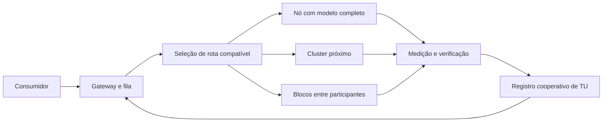

# NETWORK AI

**Inferência de IA descentralizada, capacidade cooperativa e uma economia de tokens de uso verificável.**

Concepção e direção: [Dev-Encrypted](https://github.com/Dev-Encrypted).

[Aplicação privada](docs/implementation/README.md) · [Artigo completo](docs/ARTICLE.md) · [Documentação](docs/README.md) · [Resultados F0](docs/execution/README.md) · [Releases](https://github.com/Dev-Encrypted/Network_AI/releases)

> **Estado: aplicação privada v0.2 executável e pesquisa F0.** Interface, controle, PostgreSQL, gateway e nó já executam inferência real com créditos de laboratório. A rede pública e a economia cooperativa não estão aprovadas. A configuração econômica F0 foi reprovada; LAB_TU não é dinheiro nem promessa de capacidade.

## Abrir a aplicação

Com Node.js 24, pnpm 10.33.0, Rust 1.93.1 e Docker/Compose:

```powershell
pnpm install --frozen-lockfile
pnpm lab:init
pnpm lab:start
```

Acesse `http://127.0.0.1:43100`. O inicializador informa onde encontrar as credenciais privadas. O perfil de inferência inicial espera o modelo LM Studio já usado nesta bancada; o sistema não baixa pesos nem descarrega modelos. Para configurar outro servidor, consulte [Instalação e operação](docs/implementation/OPERATIONS.md).

A interface em PT-BR oferece chat com streaming, catálogo, sessões, saldos, chaves de API, usuários e gestão de nós. O gateway e o agente são escritos em Rust; o NestJS controla metadados e o PostgreSQL registra reservas e liquidações. Há idempotência, cancelamento, época de nó, recibos assinados e restauração de backup verificável. Veja [API](docs/implementation/API.md), [contabilidade](docs/implementation/ACCOUNTING.md) e [cobertura real](docs/implementation/STATUS.md).

## A proposta

Participantes poderão publicar ofertas de modelos e contribuir com GPUs compatíveis. A capacidade útil contratada e verificada gera **tokens de uso (TU)**, que permitem consumir inferência na rede. O projeto busca cooperação mesmo sem compradores em dinheiro; vender capacidade por API será uma atividade opcional, com contabilidade financeira separada.

GPUs e modelos diferentes exigem perfis diferentes. Uma GPU menor pode atender um modelo compatível, enquanto modelos grandes podem exigir um cluster próximo ou uma execução repartida que tenha sido validada. A soma da VRAM anunciada não demonstra que um modelo pode ser executado.

Quando sobra capacidade utilizável em uma rota, limites temporários de uso podem aumentar. Esse benefício depende de compatibilidade, fila e orçamento real; não cria saldo permanente nem disponibilidade ilimitada.

## O que já foi executado

Resultados de 14/09/2026, com escopo e limitações registrados.

| Frente | Evidência | Limite |
|---|---|---|
| Inferência local | 30/30 respostas visíveis corretas; TTFT p50 1,09 s e p95 1,87 s | Modelo comunitário Qwen3.8-27B/Q4 no LM Studio; GPU compartilhada |
| Modelo repartido | BLOOM-560m em dois servidores CPU; 30 comparações com logits idênticos; retomada após falha em 5,50 s | Dois processos no mesmo computador; não é prova de WAN |
| Transporte | libp2p/QUIC e Iroh/QUIC; rejeição de replay, identidade incorreta, peer não autorizado e payload excessivo | Loopback, identidades efêmeras |
| Economia | 5.600 simulações de 90 dias; invariantes contábeis preservadas | Zero casos passaram em todos os critérios econômicos implementados |
| Qwen3-8B | Artefatos oficiais verificados e cargas E01 preparadas | Inferência BF16 ainda não executada |
| Kimi K3 | Cabeçalhos de seis shards e seis tensores de um expert carregados em CPU | Sem forward do expert ou inferência completa |

**A reprovação econômica é um resultado central.** No cenário básico, a variante v6 concluiu 15,75% dos pedidos compatíveis com saldo na fase madura, abaixo da meta de 95%. Os parâmetros eram fictícios. Esse ensaio rejeita a configuração testada; não demonstra que toda forma de cooperação seja inviável. [Análise e dados](docs/execution/ECONOMY_V1_RESULTS.md).

A bancada possui 21 testes Python e dois testes Rust que passaram localmente. A automação deste repositório verifica código de bancada; testes sem GPU não qualificam hardware, fraude, privacidade ou operação pública.

## Desenho proposto



Este é o desenho de destino. A v0.2 implementa identidade, catálogo e scheduler persistente em um coordenador privado. Consenso distribuído, operadores independentes, todos os modos de execução e faturamento comercial ainda exigem implementação e validação.

## Executar a bancada F0

Pré-requisitos da bancada: Python 3.12 e Rust 1.93.1. Os testes abaixo não baixam modelos nem exigem GPU.

```bash
git clone git@github.com:Dev-Encrypted/Network_AI.git
cd Network_AI
```

No Windows/PowerShell:

```powershell
py -3.12 -m venv .venv
.venv\Scripts\python -m pip install -e .
.venv\Scripts\python -m unittest discover -s benchmarks/tests -v
cargo test --locked
```

No Linux:

```bash
python3.12 -m venv .venv
.venv/bin/python -m pip install -e .
.venv/bin/python -m unittest discover -s benchmarks/tests -v
cargo test --locked
```

Os passos para engines, inferência, transporte e simulação estão em [Reprodução](docs/execution/REPRODUCE.md). Pesos e runtimes são preparados separadamente, com suas próprias licenças. Os [artefatos da release F0](docs/publication/README.md) permitem conferir os experimentos completos.

## Organização

| Caminho | Conteúdo |
|---|---|
| [docs/ARTICLE.md](docs/ARTICLE.md) | Artigo: proposta, arquitetura, economia, resultados e lacunas |
| [docs/README.md](docs/README.md) | Índice e sequência de leitura dos capítulos técnicos |
| [docs/planning/](docs/planning/) | Pesquisa de 13/09/2026, preservada como corte histórico |
| [docs/execution/](docs/execution/) | Medições, análise econômica, reprodução e critérios pendentes |
| [benchmarks/python/](benchmarks/python/) | Harness HTTP, cargas, ledger experimental e simulador de eventos |
| [benchmarks/scripts/](benchmarks/scripts/) | Preparação, execução, verificação e empacotamento |
| [benchmarks/tests/](benchmarks/tests/) | Testes da bancada Python |
| [crates/transport-bench/](crates/transport-bench/) | Bancada Rust de transporte autenticado |
| [apps/](apps/) | Interface Next.js e controle NestJS/Fastify |
| [crates/gateway/](crates/gateway/) · [crates/node/](crates/node/) | Gateway de inferência e agente Rust |
| [packages/contracts/](packages/contracts/) | Manifestos, schemas e aritmética inteira compartilhados |
| [infra/](infra/) | PostgreSQL isolado e migrações versionadas |
| [scripts/](scripts/) · [tests/](tests/) | Operação do produto e testes de integração / navegador |
| [docs/implementation/](docs/implementation/) | Contratos, operação e evidências da aplicação privada |
| [outputs/explanations/](outputs/explanations/) | Ilustrações históricas com números hipotéticos |

## Próximos critérios de avanço

1. Executar Qwen3-8B em GPU disponível e em um segundo host físico.
2. Revisar cobertura, demanda financiada e circulação por grupo; validar novos parâmetros com novas sementes.
3. Medir LAN/WAN, NAT, relay, outras GPUs e restauração de sessões.
4. Expandir a persistência e a verificação locais para operadores independentes e continuidade distribuída.
5. Concluir os pilotos e o custeio antes de abrir a operação cooperativa ou comercial.

Consulte os [gates FC01–FC06](docs/execution/GATES.md) e o [plano operacional v6](docs/planning/24_CLOSURE_PROGRAM_AND_LAUNCH_GATES.md). TU é uma unidade de uso proposta, não uma criptomoeda lançada ou uma promessa de retorno financeiro.

## Autoria, contribuição e licenças

O projeto foi concebido e dirigido por **Dev-Encrypted**. Consulte [AUTHORS.md](AUTHORS.md), [NOTICE](NOTICE) e [CITATION.cff](CITATION.cff) para atribuição. A implementação foi produzida com assistência de ferramentas de IA; os resultados indicam o que foi efetivamente verificado.

Código original sob [Apache 2.0](LICENSE). Artigo e documentação originais sob [CC BY 4.0](LICENSES/CC-BY-4.0.txt). Componentes, metadados e modelos de terceiros mantêm seus termos: [escopo das licenças](docs/LICENSING.md) e [referências de terceiros](THIRD_PARTY_NOTICES.md).

Contribuições seguem [CONTRIBUTING.md](CONTRIBUTING.md). Relatos de segurança seguem [SECURITY.md](SECURITY.md).
