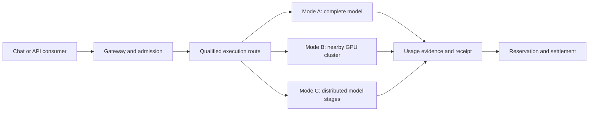

# NETWORK AI

**A cooperative AI inference network designed to make large models accessible through contributed computing power.**

Created and directed by [Dev-Encrypted](https://github.com/Dev-Encrypted).

[Start here](docs/GETTING_STARTED.md) · [Full article](docs/ARTICLE.md) · [Models above 27B](docs/MODEL_SCALING.md) · [Documentation](docs/README.md) · [Private application](docs/implementation/README.md) · [Releases](https://github.com/Dev-Encrypted/Network_AI/releases)

> **Current software: v0.5 private readiness preview, alongside the preserved F0 research bench.** The application includes real inference, signed nodes, authenticated private QUIC links, temporary admission quotas and verified model acquisition. An official 32B model runs through a complete route with two guarded CPU stages on one computer. Sponsors can now fund one readiness budget for that entire route, with all-provider consent, physical-capacity exclusion and protected component obligations. Public decentralized operation, cooperative issuance, independent multi-host qualification and the paid marketplace remain under development. See the [implementation matrix](docs/implementation/STATUS.md).

## What is NETWORK AI?

NETWORK AI is a project for people who want to use AI models that are difficult to run on their own computers. Participants contribute compatible GPUs and other required resources. The network coordinates that capacity, accepts inference requests, and accounts for contributions and consumption.

**Inference** means using an already trained model to generate an answer. Training a new model is outside this project's current scope.

The intended exchange is straightforward: contribute useful capacity when your equipment is available, earn usage credits under an accepted contract, and spend those credits on qualified models available through the network. A participant could contribute to one model and use another. Prices must account for their different resource costs.

The community should be able to propose models, run nodes, and eventually sell qualified capacity to buyers who want a competitively priced API. Publishing a model proposal does not make it executable: the exact model, license, engine, hardware, and route must first be qualified.

## Why the focus on models above 27B parameters?

**The recommended focus of NETWORK AI is models with more than 27 billion parameters**, especially configurations whose memory or service requirements exceed one participant's equipment. Larger models are a central objective. Smaller models remain useful for affordable requests, development, qualification, and contributions from less powerful hardware.

A parameter is a learned numerical value stored in a model. Increasing the number of parameters generally increases the memory needed to store its weights at the same precision. More demanding configurations therefore tend to require more contributed capacity, often from more participants. There is no fixed conversion from billions of parameters to people: one participant may own several GPUs, and another may contribute only part of one GPU.

The 27B boundary is a **project focus**, not a universal hardware limit or a claim that every larger model needs multiple computers. A quantized model above 27B might fit on one suitable machine. A smaller model with a long context and many simultaneous users may need substantial capacity.

### A concrete memory example

The table is arithmetic for idealized model weights, **not a benchmark or a hardware recommendation**. `B` means one billion parameters; `GiB` means 2³⁰ bytes. Real deployment needs additional memory.

| Total parameters | Weights at 16 bits | Weights at 8 bits | Weights at 4 bits |
|---|---:|---:|---:|
| 27B | 50.29 GiB | 25.15 GiB | 12.57 GiB |
| 32B | 59.60 GiB | 29.80 GiB | 14.90 GiB |
| 70B | 130.39 GiB | 65.19 GiB | 32.60 GiB |
| 120B | 223.52 GiB | 111.76 GiB | 55.88 GiB |
| 235B | 437.72 GiB | 218.86 GiB | 109.43 GiB |
| 405B | 754.37 GiB | 377.19 GiB | 188.59 GiB |

If each compatible device could reserve **20 GiB specifically for weights after all other memory needs were covered**, an idealized 70B model at 4 bits would need at least two such devices by memory alone. A 405B model at the same precision would need at least ten. Those counts do not prove that the engine can split the model across those devices, that the connection is fast enough, or that enough redundancy exists.

The [model scaling guide](docs/MODEL_SCALING.md) explains the formula, quantization overhead, session memory, heterogeneous GPUs, mixture-of-experts models, and the difference between fitting one model and serving more users.

## How contributed machines could work together

A **route** is a complete, compatible set of resources that can finish a request. NETWORK AI distinguishes three execution modes:

| Mode | What happens | Intended role | Current product status |
|---|---|---|---|
| A: complete model on one node | One node sends the request to its configured inference engine | Models that fit one suitable host; independent replicas | Implemented in the private local profile |
| B: a nearby GPU cluster | An operator offers a model served by a tightly connected group of GPUs | Larger models requiring several nearby GPUs | Trusted two-process CPU prototype executed; multi-GPU qualification remains |
| C: model split across participants | Different nodes execute successive parts of the same model | Models requiring capacity from several participants | Real 32B route with separately signed stage agents on one host; independent-provider qualification remains |



This diagram describes the target architecture. Modes B and C are not enabled merely by starting additional private-preview agents. Two agents serving complete models provide more request destinations; they do not automatically become two halves of a larger model.

The [complete-route guide](docs/implementation/COMPLETE_ROUTES.md) explains the implemented local configuration, operator consent, shared physical capacity, stage receipts and payout arithmetic. The measured campaign completed three requests and refunded a fourth after a deliberate stage failure. Its one operator account and one physical host are explicitly recorded.

Dividing a model requires a compatible inference engine and communication between its parts. A slow or unavailable stage can delay the entire route. We plan capacity by measured memory, speed, connectivity, and reliability, rather than adding advertised VRAM figures. [Architecture](docs/planning/03_ARCHITECTURE.md).

## Credits, fairness, and the optional API market

Three units must stay distinct:

| Unit | Meaning | Availability today |
|---|---|---|
| Text tokens | Pieces of input and output processed by a model | Reported by the private inference engine |
| Usage tokens (`TU`) | Proposed internal accounting unit for cooperative contribution and consumption | Design and simulation only |
| Laboratory usage tokens (`LAB_TU`) | Test balances for holds, settlement, and refunds | Implemented; no cash redemption |

In the proposed cooperative economy, compensation comes from **useful capacity that the network explicitly contracts and verifies**. An accepted readiness window can be compensated even if no request arrives during that window. Opening an application, registering more identities, or downloading weights does not create an unlimited right to credits.

When compatible capacity is idle, temporary usage allowances may increase. These allowances should contract when demand returns, preserve accepted sessions, and stay within funded capacity. They do not create permanent balances or a promise that every model will always be available.

The private preview retains an explicit initial grant, charges for completed inference, the experimental 80/20 provider/working-account split, and refunds on failure. It now also supports **fully funded readiness contracts** using existing LAB_TU: a sponsor reserves the maximum cost, the provider accepts, observed ready intervals earn payments, and unused funds return to the sponsor. Temporary admission quotas adjust between 1, 2 and 4 requests according to available capacity and competing demand. These are private executable rules, not approval of the candidate cooperative issuer or its economic parameters. [Contracts and quotas](docs/implementation/AVAILABILITY.md).

Version 0.5 extends readiness funding to **complete routes**: all providers accept one immutable budget, no physical domain can earn overlapping readiness payments, and healthy components retain their accepted window if another stage fails. In the real 30-second campaign, 25,483 of 30,000 reserved microcredits were paid and 4,517 returned. Readiness payments are explicitly additional to per-inference compensation. This one-account, one-computer result establishes contract behavior, not sustainable exchange between independent people. [Terms, arithmetic and measured evidence](docs/implementation/ROUTE_AVAILABILITY.md).

The optional paid API market would have its own payments, liabilities, refunds, and provider payouts. Cheaper API access is an objective to validate against complete operating costs, not an established price advantage. Purchases and payouts have not been activated.

**The tested economic configuration failed.** Across 5,600 simulated 90-day runs, accounting invariants held, but no run passed every implemented economic gate. In the baseline holdout, candidate v6 completed 15.75% of compatible funded demand during the mature period, below the 95% target. These fictional parameters need revision before public use. [Results and causes](docs/execution/ECONOMY_V1_RESULTS.md).

## Run the private application

You need Git, Node.js 24.13.0, pnpm 10.33.0, Rust 1.93.1, and a running Docker installation with Compose. Real inference also needs a separately prepared compatible model server. Models and their licenses are not bundled.

```bash
git clone https://github.com/Dev-Encrypted/Network_AI.git
cd Network_AI
pnpm install --frozen-lockfile
pnpm lab:init
pnpm lab:start
```

Open `http://127.0.0.1:43100`. Initialization prints the location of the private credentials file. It creates the project's isolated PostgreSQL service and an explicit 100 `LAB_TU` administrator grant. New user accounts start at zero.

The supplied model profile refers to the original lab's LM Studio model. On a different machine, follow [installation and model registration](docs/implementation/OPERATIONS.md) to publish and qualify your own exact artifact. An unavailable backend leaves inference unavailable; the launcher does not silently download or substitute a model.

The current application interface is in Brazilian Portuguese. Maintained repository documentation is in English; the UI language is reported explicitly so readers know what to expect. The [beginner walkthrough](docs/GETTING_STARTED.md) includes translations of navigation labels.

Use `pnpm lab:status` to inspect services and `pnpm lab:stop` to stop the managed application processes. The database and private configuration are retained. [API reference](docs/implementation/API.md) · [Operations and recovery](docs/implementation/OPERATIONS.md).

## What has actually been demonstrated?

Evidence recorded on September 14, 2026:

| Workstream | Observed result | Boundary |
|---|---|---|
| Private application | Real chat/API inference, signed nodes, transactional accounting, cancellation, outbox recovery, backup restoration | One physical host; trusted private coordinator |
| Existing local model | 30/30 visible answers correct; first visible token p50 1.09 s, p95 1.87 s | Community `Qwen3.8-27B / Q4` in LM Studio on a shared RTX 4090 |
| Split-model reference | BLOOM-560m across two CPU processes; 30 matching-logit comparisons and recovery after failure | Same host, separate harness; not a large-model WAN deployment |
| Authenticated transport | libp2p/QUIC and Iroh/QUIC negative controls | Loopback, separate F0 harness |
| Private QUIC integration | Real enrollment, inference, signed settlement and availability payment through two authenticated peers | One physical host; direct transport; relay disabled |
| Official Qwen3-32B Q4_K_M | Full inference locally and on two CPU RPC workers; 3/3 token sequences equal with repacking disabled; completed through the Network AI API | 32.8B, one physical host, 2,048 context, three short prompts; initial default-repacking comparison was 2/3 |
| Official Qwen3-8B | Artifacts verified and exact-token workloads prepared | BF16 inference not executed in the recorded campaign |
| Kimi K3 inspection | Six expert tensors loaded into CPU memory | No expert computation or complete model inference |
| Economy | 5,600 event simulations with preserved accounting invariants | Tested parameters rejected; no real market validation |

The 27B profile remains a development reference. The later official 32B experiment demonstrates a complete larger model and a trusted CPU partition on one host. It does not qualify a public multi-participant network. [32B results and numerical limits](docs/implementation/MODEL_ARTIFACTS.md); [remaining roadmap](docs/planning/12_ROADMAP_AND_BACKLOG.md).

See [private-preview validation](docs/implementation/STATUS.md), [F0 evidence](docs/execution/README.md), and [open launch gates](docs/execution/GATES.md). Local automated checks and public GitHub CI do not certify a public inference network.

## Find your way around the repository

| If you want to... | Read or inspect |
|---|---|
| Understand the idea without a systems background | [Getting started](docs/GETTING_STARTED.md), [glossary](docs/GLOSSARY.md) |
| Understand the complete argument and its limitations | [Full article](docs/ARTICLE.md) |
| Understand how larger models need more contributions | [Model scaling](docs/MODEL_SCALING.md) |
| Study architecture, credits, security, and the roadmap | [English technical handbook](docs/planning/README.md) |
| Operate the current application | [Private application guides](docs/implementation/README.md) |
| Reproduce an experiment | [F0 reproduction](docs/execution/REPRODUCE.md), [benchmark code](benchmarks/README.md) |
| Inspect frontend and control code | [apps/](apps/) |
| Inspect the gateway and node agent | [crates/gateway/](crates/gateway/), [crates/node/](crates/node/) |
| Inspect schemas, migrations, and operational scripts | [contracts](packages/contracts/), [infra](infra/), [scripts](scripts/) |
| Check historical sources and preserved hashes | [Publication and archive provenance](docs/publication/README.md) |

## Contribute and credit the author

Useful contributions include additional hardware profiles, reproducible large-model experiments, fault recovery, engine adapters, and economic studies with independently reserved validation data. Identify a specific problem and measurable acceptance criterion. Start with [CONTRIBUTING.md](CONTRIBUTING.md).

Original code is licensed under [Apache 2.0](LICENSE). Original article and documentation text are licensed under [CC BY 4.0](LICENSES/CC-BY-4.0.txt). Attribute **Dev-Encrypted** and preserve applicable notices. Third-party models, libraries, and evidence retain their own terms. [Authorship](AUTHORS.md) · [License scope](docs/LICENSING.md) · [Third-party notices](THIRD_PARTY_NOTICES.md) · [Security reporting](SECURITY.md).
