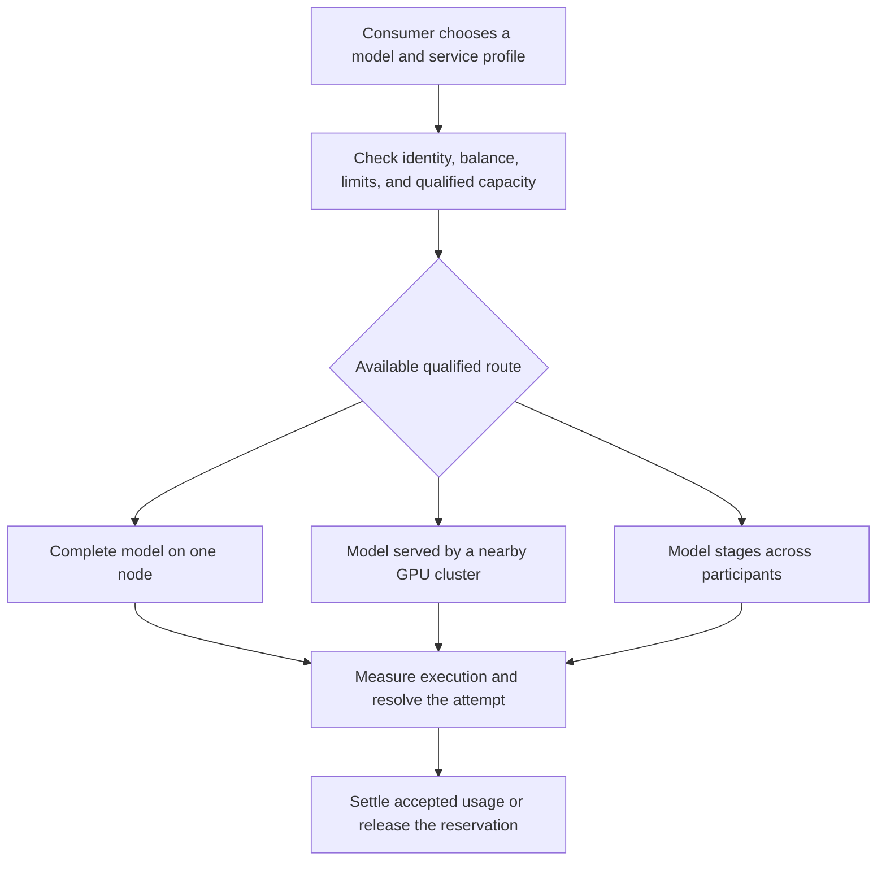

# NETWORK AI: cooperative inference for models beyond one computer

> Implementation update: [version 0.12](implementation/HETEROGENEOUS_CONTRIBUTORS.md) executes the official 32B model across a selected NVIDIA CUDA contributor and a CPU contributor with unequal layer weights and observed allocation budgets. Both retain participant-owned workers, authenticated control/data peers, signed receipts and Windows crash containment. Actual requests serialize against the same resources used by the existing GPU model and CPU route; CUDA worker failure, refund and reloaded recovery are measured. The evidence uses one computer and one operator. Independent hardware, public trust, measured exchange prices and economic qualification remain separate requirements. [Results and limitations](implementation/STATUS.md).

> Implementation update: the [cooperative guide](implementation/COOPERATIVE_FUNDS.md) documents the private credit cycle, and [bounded renewal](implementation/BOUNDED_RENEWALS.md) adds continuation within finite manager and provider permissions. The [v0.8 expansion guide](implementation/DEMAND_BACKED_EXPANSION.md) implements additional complete-route windows gated by funded demand, essential protection and recorded private evidence. Positive activation is tested in isolated fixtures; the real one-host 32B campaign continued useful inference while correctly refusing expansion. The research and candidate policies below retain their evidence classifications and remaining economic/public-network gates.


**Concept, direction, and authorship:** [Dev-Encrypted](https://github.com/Dev-Encrypted)

**English edition:** September 14, 2026

**Original prose license:** [CC BY 4.0](../LICENSES/CC-BY-4.0.txt)

This article explains the proposed network, the private application already implemented, and the evidence that separates the two. The recommended project focus is **models above 27 billion parameters**. Historical Portuguese planning sources and experimental artifacts remain available through [archive provenance](publication/README.md). This English edition incorporates later implementation results; it is not a claim that the original research predicted them.

## Abstract

NETWORK AI investigates a cooperative inference network in which participants contribute compatible computing resources and receive usage tokens under explicit, funded contracts. They can spend those tokens on qualified models offered through the network. An optional API marketplace could let participants sell capacity, while keeping cash liabilities separate from cooperative credits.

The main motivation is access to models whose resource requirements exceed one participant's equipment. Increasing a model's parameters generally increases weight memory at a fixed precision, so larger configurations tend to require more contributed resources and, often, more participants. Memory alone does not establish a usable service: the engine must support the partition, every stage must fit, communication must be adequate, and the route must handle failures.

The repository includes an executable private application, local inference and transport experiments, and economic simulations. The private application demonstrates account isolation, signed nodes, streaming, reservations, settlement, and recovery on one physical host. The tested cooperative economic configuration failed its service and circulation criteria despite preserving accounting invariants. A public decentralized service remains an engineering and validation objective.

## 1. The problem: individual resources and collective access

Many people have access to a GPU for only part of the day, or own hardware with insufficient memory for a desired model. Other people want intermittent inference without maintaining a dedicated machine. A cooperative network could connect these needs: participants contribute usable capacity when available and consume capacity when needed.

This is an inference project. It starts from already trained models and executes requests such as a chat conversation or an API call. Training foundation models would introduce different communication, scheduling, and economic requirements and is outside the current scope.

Consider three participants. Alice can reserve a suitable GPU for an evening. Bruno wants a model that does not fit his laptop. Carla has a larger machine and needs occasional API capacity during her own peak hours. A useful cooperative network lets each of them describe an offer or a request, matches compatible resources, records the accepted terms, and resolves what happens if work succeeds, fails, or is interrupted.

That exchange cannot rely on a universal rule such as one GPU-hour equals one million text tokens. Different devices, engines, models, contexts, and precision levels produce different service. The network needs qualified profiles and a shared accounting unit with profile-specific prices.

## 2. Why models above 27B are the recommended focus

A model's parameters are learned numerical values. More parameters at the same storage precision generally require more memory for weights. When one person's equipment cannot hold or serve a profile efficiently, coordinated contributions become more useful.

NETWORK AI therefore prioritizes **models above 27B total parameters**, including larger dense and mixture-of-experts architectures. This is a direction for research and product development. It does not prohibit smaller models or establish 27B as a universal threshold for distribution.

For idealized uniform storage, weight memory is calculated as follows:

```text
weight_GiB = total_parameters × bits_per_parameter / 8 / 2^30
```

A 70B model would have approximately 130.39 GiB of weights at 16 bits or 32.60 GiB at 4 bits. A 405B model would have approximately 754.37 GiB or 188.59 GiB respectively. These figures exclude quantization metadata, tensors retained at another precision, session state, and runtime memory. They describe arithmetic, not a measured deployment.

Suppose each compatible device has 20 GiB available specifically for weights after all other requirements are covered. The weight-only lower bound for 70B at 4 bits would be two devices; for 405B at 4 bits, ten. If each participant supplies one such device, more participants are needed as the model grows. A participant with several larger devices changes that count. Engine partition restrictions can increase it further or make the route unusable.

The [scaling guide](MODEL_SCALING.md) contains the complete table, reproducible calculations, and assumptions. The practical admission rule is to inspect the exact artifact and measure the complete request profile before promising capacity.

## 3. More users can mean three different requirements

The number of model parameters, the number of simultaneous consumers, and the number of contributors answer different questions.

| Question | Required resource |
|---|---|
| Can we execute this larger model at all? | A complete supported assignment of weights and execution state |
| Can we serve more people at once? | More measured concurrency or complete replicas |
| Can we keep serving after a node leaves? | Independent replacement capacity and a working recovery mechanism |

Several full copies of a smaller model improve its aggregate service capacity; they do not become a larger model. Several contributors hosting parts of one large model form one route; they do not necessarily increase per-session speed. A standby copy increases resilience but cannot also be sold as uncommitted peak capacity without an explicit sharing policy.

The same distinction applies to physical inventory. Ten node identities are not proof of ten GPUs. The private application groups agents into administrator-defined physical domains and locks their shared admission capacity. That is useful for trusted operation and testing, but an open network also needs defenses against duplicate or fraudulent resource claims.

## 4. Three execution modes behind one consumer interface

**Mode A** assigns a request to a node serving a complete model. This is one of the private application's current execution paths. It is also useful in a future network for models that fit one host and for independent replicas.

**Mode B** treats a nearby group of GPUs as one participating service. The operator's engine handles the internal model distribution. This is a candidate path for large models on suitable local interconnects.

**Mode C** distributes parts of one model among participants. The route needs a partition map, compatible tensor interfaces, per-stage memory budgets, communication, session-state handling, and recovery. It is a central research objective for larger models, not a feature automatically provided by installing multiple agents.

The version 0.4 implementation is a concrete local step toward this mode: an official 32B model runs through a root and two guarded CPU stage agents. The route requires all providers' acceptance, reserves its complete resource set, collects separate signed receipts and divides one provider pool. Actual generation, serialized concurrent calls and refund after stage loss were observed on one computer with one operator account. Independent participants and WAN qualification remain open. The [complete-route manual](implementation/COMPLETE_ROUTES.md) explains the boundaries and payment example.



For a fully resident split route, enough aggregate memory is a necessary starting condition. It is not sufficient. An indivisible component may exceed one device's budget; tensors may be replicated; a slow stage can dominate latency; or transfer overhead can defeat the intended interactive experience.

The architecture keeps the network's policy and accounting outside the numerical engine. Integrating a tested engine is preferable to writing new GPU kernels without a demonstrated need. Engine-specific behavior still needs a pinned version and a qualification campaign.

## 5. Four responsibilities that should stay distinct

The **control plane** manages identities, catalog entries, admission, scheduling, and authorization. It decides which work may start and which resources are committed.

The **inference plane** carries prompts, intermediate values where applicable, output streams, cancellation, and runtime state. Numerical computation belongs here. The current Rust gateway and agent call a separately configured local engine.

The **artifact plane** describes, verifies, distributes, and caches model files. Downloading a shard is not executing a shard. The private application records artifact metadata but does not automatically install weights or run code from a model repository.

The **accounting and audit plane** reserves balances, records obligations, validates receipts under the selected trust policy, settles consumption, and handles authorized reversals. It needs durable records and transactional rules even when the network or engine fails.

The current implementation combines control and accounting in a NestJS/Fastify service backed by PostgreSQL. That is an implementation boundary, not a claim of decentralized consensus. The [technical handbook](planning/README.md) explains the intended evolution and the [private architecture](implementation/README.md) shows actual content paths.

## 6. A community catalog without unsupported promises

The goal is an open catalog: participants can propose models and offers, including new architectures. A proposal must identify an exact revision, source, license, hashes, engine requirements, modality, context, output limit, and trust policy.

A name in a catalog can represent several materially different configurations. A quantized model is not interchangeable with its higher-precision source. A tokenizer or chat-template change can affect token counts and output. A model that works on one engine version may require a new qualification after a runtime change.

Use separate states for a proposal, a verified artifact, an engine-compatible profile, a measured route, and a currently available offer. The private preview implements a smaller lifecycle: immutable text manifests enter as `CANDIDATE`, an administrator can qualify them as `LOCAL_PREVIEW`, and a fresh ready node is required for availability.

An open catalog cannot promise to execute every submitted model immediately. The community can supply adapters and evidence for new profiles. An unpopular large model may need scheduled availability or a group willing to fund its readiness window instead of permanent coverage paid by everyone.

## 7. Usage tokens are an accounting unit

A **text token** measures part of a model request. A **usage token**, abbreviated `TU`, is the proposed cooperative accounting unit. Their relationship depends on the model profile and tariff. One TU is not universally one text token.

The intended contribution reward is for accepted useful capacity over a verified readiness interval:

```text
contribution_reward = verified_READY_duration × accepted_assignment_rate
```

A funded readiness contract can pay for availability even when no request arrives. This matters for a service that should be ready when participants need it. The rule does not pay every advertised GPU or every open application indefinitely. An offer needs an accepted assignment, a duration, a purpose, a budget, and evidence.

The private v0.5 implementation now applies this to a complete route. A sponsor holds one existing LAB_TU budget; all providers accept its immutable terms; each component has a fixed maximum and earns only observed eligible time. A missing stage cannot receive more readiness pay, while healthy peers keep the remainder of their accepted window. A shared-domain claim prevents duplicate readiness compensation through additional identities. This is additional to normal per-inference compensation, with no automatic common-fund financing or new issuance. [Executable contract and measured example](implementation/ROUTE_AVAILABILITY.md).

A split route receives an overall resource plan and compensation budget. Creating more node identities or subdividing the same physical GPU cannot multiply that budget. Providers should understand which obligations they accept and which failure risks they bear.

Consumers receive a quote and a maximum reservation before work starts. Settlement charges authorized completed usage and releases the unused part. Retry behavior must prevent a second charge while making clear whether the original answer can be recovered. The private preview keeps metadata rather than answer bodies, so an idempotent retry returns the existing session ID instead of replaying stored text.

## 8. Keep stocks, obligations, and actual service in view

The candidate cooperative ledger tracks issued balances `S`, promised future issuance `L`, and approved but unapplied reversals of burned units `J`. Its exposure is:

```text
E = S + L + J
```

Held balances remain in `S`; moving existing units between accounts does not mint them again. `L` is reserved when future issuance is promised, rather than only when the eventual payout happens. This prevents an apparently conservative ledger from hiding future commitments.

Candidate v6 separates a working fund from a protected continuity reserve. Finalized consumption replenishes the essential renewal floor first, then the protected reserve, then the remaining normal working target; only the excess is burned. A reserve can buy recovery time, but it cannot turn a recurring deficit into a sustainable business or cooperative service.

Three independent questions must pass:

1. **Accounting:** do balances, holds, obligations, and reversals obey the rules?
2. **Circulation:** does recurring funded consumption support normal commitments without hidden new issuance or depletion?
3. **Service:** can participants spend their credits on compatible routes with acceptable completion and waiting times?

The [candidate policy](planning/24_CLOSURE_PROGRAM_AND_LAUNCH_GATES.md) retains its experimental constants and explains the accounting order. Those constants are hypotheses. They are not approved production economics.

## 9. What happens without cash buyers or with little demand?

No cash buyers is different from no cooperative users. If participants contribute and consume useful service, a cooperative exchange can operate without selling API calls for money. It still needs electricity, connectivity, verification, coordination, and a defined source for external operating costs.

If there is little compatible demand, idle capacity can support temporary larger allowances. The planned 1×/2×/4× policy concerns new per-profile concurrency allowances. It does not automatically enlarge context, lower prices, create permanent credit bonuses, or consume standby capacity already committed to continuity.

The controller should grant extras gradually from recent measured headroom, remove new extras when queues return, and honor sessions already accepted. When there is no complete route for a model, spare hardware elsewhere does not help until it becomes compatible capacity for that route.

Version 0.8 implements a separate private decision for paying another complete-route readiness window. A temporary concurrency allowance uses already covered capacity; expansion commits additional credits and therefore needs additional safeguards. The controller preserves the six-hour essential floor and complete 72-hour reserve, requires all essential groups to be covered, and compares current funded pressure with actual covered free slots. A waiting request can justify expansion only once, under finite manager and provider limits.

The private controller excludes known affiliated or unclassified consumers, grants and direct contributions from its qualifying flow. It counts retained settled consumption and refund outflows in a rolling 24-hour window. Classification is evaluated at the original settlement time, preventing a later declaration from turning earlier unknown use into accepted historical flow. The identities and support declarations remain trusted administrative evidence: public ownership verification, cash backing, mature economic behavior and independent operations still need qualification. [Exact predicates, equations and failure behavior](implementation/DEMAND_BACKED_EXPANSION.md).

If there is no useful demand at all, paying permanent readiness from newly issued credits would accumulate obligations without proving redemption. The response is to reduce future coverage, schedule specific windows, or pause new commitments while preserving existing rights. The policy must make that possibility visible to participants before they contribute.

## 10. Fairness across different GPUs

Equal treatment does not mean identical payment per device. A smaller GPU and a multi-GPU server can offer different amounts and types of useful service. Reward should follow accepted contribution under a qualified profile, and the selection policy should expose who gets opportunities to contribute.

At the same time, the most powerful providers should not absorb all opportunities or accumulate credits that never circulate. The network must measure selection frequency, wait time, earnings, funded demand, and consumption by hardware class and participant cohort.

A useful user-facing measure is how many reference requests one accepted contribution hour can buy. The reference must fix the model, precision, tokenizer, context, output length, and service profile. A global average can hide that a contributor earns a balance yet cannot access the model they want.

The private queue implements a limited operational fairness rule: among executable requests, the least recently served account receives priority, with FIFO order inside that account. This does not solve person-level identity, open-network fairness, or the economic distribution problem.

## 11. An optional market needs a separate complete cost model

The paid API path is intended to be optional. A seller would make a priced offer for a qualified route and accept responsibility for the customer's service, while separately funding any subcontracted components.

Revenue must be measured after service finalization. Unused customer deposits are liabilities, and cooperative TU are not cash revenue. A useful unit-cost comparison includes provider compensation, energy responsibility, payment processing, gateways and relays, verification, support, failure losses, refunds, and reserve requirements.

A lower headline token price is meaningful only when comparing the same model configuration, quality, workload, latency, and completion expectations. The repository does not establish that NETWORK AI is already cheaper than a specific commercial API.

The historical plan names a test payment adapter, but no production settlement, custody, or payout service is active. Commercial readiness has its own gate and must not be used to claim that an unqualified cooperative route is ready. [Open network and market design](planning/18_OPEN_NETWORK_AND_COMPUTE_MARKET.md).

## 12. Trust: signatures have a limited job

A valid node signature proves which registered key signed a message. It does not prove that the node owns a unique GPU, holds the claimed model, counted tokens honestly, or computed a correct answer.

The private preview uses Ed25519 node identities, one-time invitations, timestamps, nonces, epochs, bounded capabilities, and durable receipt retries. PostgreSQL protects accounting projections and committed journals from the runtime role. The database owner remains a trusted administrator.

Version 0.3 added authenticated private QUIC links to the actual node protocol, portable operator profiles, pre-funded availability contracts and temporary 1/2/4 admission limits. Version 0.4 added a real 32B route with one root and two independently signed stage agents on the same physical host. Version 0.5 extends funding to complete-route readiness windows with protected component obligations. These steps advance the private implementation without approving independent-provider trust or the failed candidate economic parameters. [Current implementation and evidence](implementation/STATUS.md).

An open deployment must add independent operator qualification, resource and work verification, bounded exposure to new participants, dispute handling, and recovery from malicious or correlated failures. Verification also consumes resources and needs a budget.

Transport encryption does not hide a prompt from the machine executing it. The current gateway, node, and engine see request content in memory; the engine's own logging policy is controlled by its operator. Confidential inference requires a separate demonstrated mechanism. Users should choose a trust profile appropriate to their data.

## 13. Decentralization is a sequence of concrete responsibilities

The intended network lets participants run nodes and publish offers. It also aims for alternative gateways, portable identities, inspectable protocols, and continuity beyond one operator.

Running an inference node and validating the shared accounting record are separate roles. The historical cooperative ledger candidate uses four independent organizations with a three-operator quorum. That is a federated trust model, not Bitcoin-style permissionless proof-of-work consensus.

The current product has one coordinator. Multiple processes on one computer do not become independent organizations. Before calling the service operationally decentralized, the project must demonstrate independent operators, partition behavior, recovery, authority rotation, and the ability to continue without the original gateway.

## 14. What the experiments actually showed

The F0 campaign used one physical Windows/WSL2 host with an RTX 4090 and roughly 128 GiB of RAM. The GPU was shared with a previously loaded LM Studio model.

| Experiment | Result | Permitted conclusion |
|---|---|---|
| Existing LM Studio endpoint | 30/30 visible answers correct; first visible token p50 1.085 s and p95 1.870 s | A specific community `Qwen3.8-27B / Q4` local profile performed the tested requests |
| Petals CPU reference | 30 identical-logit forwards and three equal generated token sequences | Numerical parity for the small model, engine, and inputs tested |
| Petals failure/replacement | Recovery after 5.50 seconds with equal logits | Same-host recovery under a trusted experimental controller |
| libp2p and Iroh | Identity, replay, and oversize-message controls exercised | Limited transport behavior in loopback |
| Official Qwen3-8B | Pinned artifacts and exact-token fixtures prepared | Preparation, not BF16 inference qualification |
| Kimi K3 inspection | Six expert tensors loaded into CPU memory | Partial artifact inspection, not expert or full-model execution |

The corrected HTTP run distinguishes visible output from reasoning. Earlier insufficient-output and integration attempts remain in the record. Preserving failures makes it possible to understand what changed instead of rewriting the experiment as a continuous success.

The later private application adds real browser/API journeys, PostgreSQL accounting tests, signed settlement, cancellation, node epoch recovery, an outbox during control outages, and isolated backup restoration. Its public [validation report](implementation/validation.json) records 18 PostgreSQL integration tests, six Rust tests across runtime and F0, 21 Python F0 tests, and four browser tests. The real-model acceptance campaign remains a single-host result.

## 15. Why the tested economy failed

The event study fixed five variants, 16 scenarios, 20 calibration seeds, and 50 distinct holdout seeds, for 5,600 runs of 90 simulated days. Speeds, prices, readiness rates, demand behavior, and external funding were fictional inputs.

Every run preserved the implemented accounting and reservation invariants. No run passed all implemented economic gates. In the baseline holdout, v6 completed 15.75% of compatible funded requests in the mature period, against a 95% target.

The fictional essential coverage cost 168 TU per day: one compact route and one large route requiring three providers. Payments and consumption did not return TU to operations at a sufficient rate. Large-model providers accumulated balances while other groups lacked spending liquidity. Ending ordinary issuance exposed the weakness of the flow.

Giving essential renewals payment priority fixes a sequencing problem but does not create funded demand. The next study must revisit coverage windows, cohort access, funded consumption, and costs. Because the existing holdout has been observed, any policy tuned to its results needs fresh validation seeds.

The result rejects that tested configuration; it does not prove every cooperative design impossible. The event study also lacks full elastic-limit integration and a complete evaluator for the 24-hour recovery predicate. [Detailed analysis and original data](execution/ECONOMY_V1_RESULTS.md).

## 16. The next decisions require evidence

The next technical priority is to qualify a pinned model above 27B on a supported multi-device route, then measure a real multi-host configuration. The existing smaller baseline remains useful for isolating engine and transport errors. Each larger profile needs explicit memory, quality, latency, availability, and cost evidence.

Economic work can proceed independently with new parameters and full lifecycle coverage. Independent operator and continuity campaigns follow once the executable contracts and capacity are sufficiently stable. Commercial payments remain a separate path.

The project should publish which gates pass, which fail, and which have not been exercised. It should reduce scope or pause new promises when resources do not support them. The [launch gates](execution/GATES.md) and [roadmap](planning/12_ROADMAP_AND_BACKLOG.md) make those decisions reviewable.

## References, reuse, and citation

Technical sources for memory and distribution are linked beside the relevant explanations in the [scaling guide](MODEL_SCALING.md). The [research register](planning/13_REFERENCES_AND_EVIDENCE.md) distinguishes upstream documentation, historical snapshots, local observations, arithmetic, and simulation.

To cite or adapt this article, credit **Dev-Encrypted**, include the title and consulted version or commit, link to the [original repository](https://github.com/Dev-Encrypted/Network_AI), link to CC BY 4.0, and indicate changes. [CITATION.cff](../CITATION.cff) supplies repository citation metadata. [Third-party notices](../THIRD_PARTY_NOTICES.md) preserve the attribution and terms of reused components.
