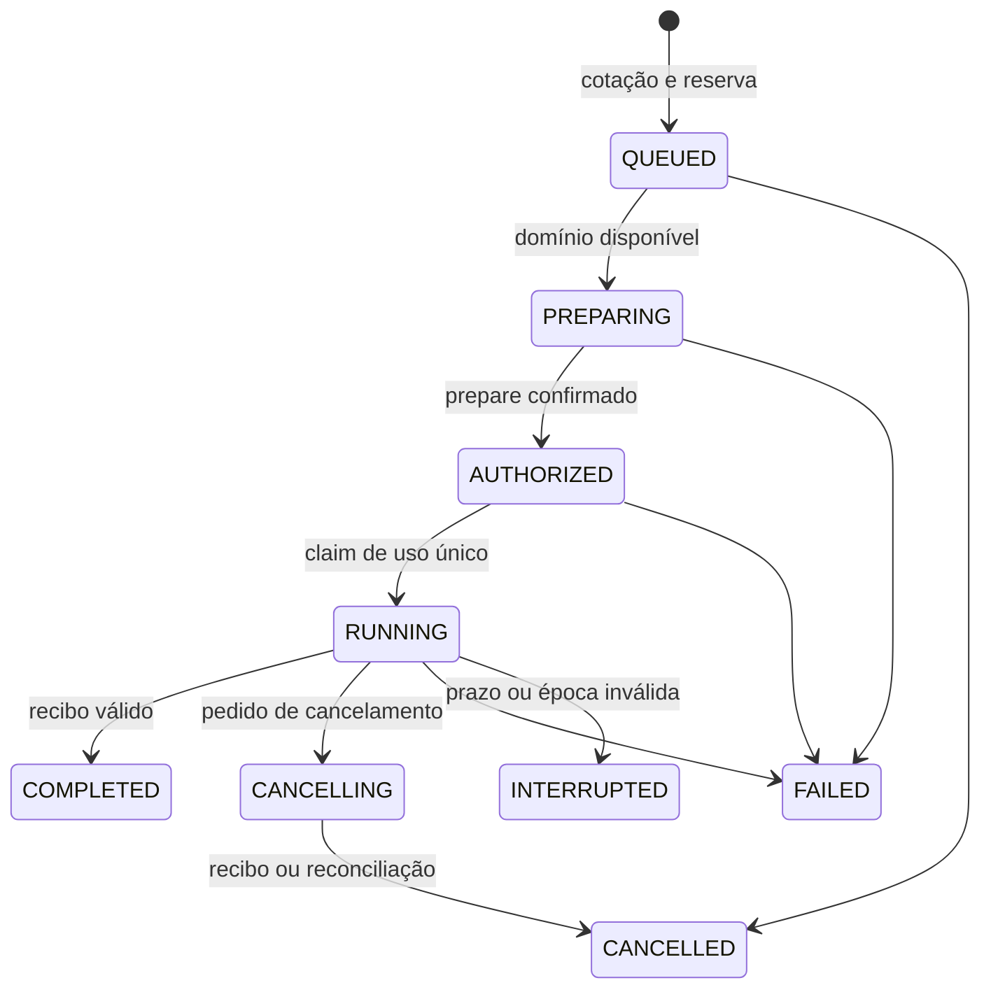

# Contratos da aplicação privada

Versão do protocolo: `network-ai.private.v1`. Todos os exemplos pressupõem o perfil local. Nomes de campo, estados e erros são estáveis dentro desta versão privada; ainda podem mudar antes de uma versão pública estável.

## Autenticação e metadados

A API de controle começa em `http://127.0.0.1:43101/api/v1`. Chaves `nai_…` usam `Authorization: Bearer <chave>`. São armazenadas como SHA-256, com prefixo para identificação, e retornadas por inteiro somente na criação. Login usa scrypt e cookie HttpOnly, SameSite=Strict, com duração de 12 horas. O cookie é HTTP apenas porque o perfil obriga loopback; mutações por cookie exigem a origem exata da interface.

| Método | Rota | Autorização / função |
|---|---|---|
| POST | `/auth/login`, `/auth/logout` | Entrar e sair; limite específico de tentativas de login |
| GET | `/me` | Identidade da conta autenticada |
| GET / POST | `/models` | Catálogo com disponibilidade / publicar candidato |
| POST | `/quotes` | Cotação com reserva máxima e expiração em 60 s |
| GET | `/wallet` | Saldos e até 100 linhas recentes da própria conta |
| GET | `/sessions`, `/sessions/:id` | Até 100 sessões próprias / detalhes e eventos |
| POST | `/sessions/:id/cancel` | Cancelamento de sessão própria |
| GET / POST | `/keys` | Listar / criar chave da própria conta |
| DELETE | `/keys/:id` | Revogar chave própria |
| GET | `/nodes` | Nós do operador; administrador vê todos |
| POST | `/nodes/:id/state` | Operador ou administrador: READY, PAUSED ou REVOKED |
| GET / POST | `/admin/users` | Administrador: listar / criar usuário com saldo zero |
| POST | `/admin/grants` | Administrador: concessão explícita LAB_TU |
| GET / POST | `/admin/domains` | Administrador: domínio e slots físicos |
| POST | `/admin/node-invites` | Administrador: convite de 24 h, uso único |
| POST | `/admin/models/:id/qualify` | Administrador: habilitar teste local ou revogar |
| GET | `/admin/metrics` | Contagens e soma do ledger |

O manifesto e os schemas executáveis estão em [contracts](../../packages/contracts/src/index.ts). O manifesto não pode ser editado sob o mesmo ID. Uma revisão diferente exige outro identificador. A marcação de qualificação muda sem substituir o conteúdo do manifesto, com evento de auditoria.

## Inferência

Gateway: `http://127.0.0.1:43102/v1`. `GET /models` retorna apenas modelos utilizáveis. `POST /chat/completions` aceita o subconjunto de texto:

```json
{
  "model": "qwen-local",
  "messages": [{"role": "user", "content": "Olá!"}],
  "max_tokens": 128,
  "temperature": 0.7,
  "stream": true
}
```

Campos opcionais: `top_p`, `stop`, `n: 1`, `stream_options.include_usage`. Papéis: `system`, `user`, `assistant`, todos com conteúdo string. Campos desconhecidos, ferramentas, arquivos, imagens e múltiplas escolhas são rejeitados. Limite HTTP: 128 KiB; até 64 mensagens, respeitando o limite menor do manifesto. O envelope conservador usa bytes UTF-8 e margem por mensagem; não é um tokenizer independente certificado.

Envie `Idempotency-Key` para identificar a tentativa. Sem esse cabeçalho, cada chamada recebe uma identidade nova. A cotação é automática; `X-Quote-Id` permite usar uma cotação previamente criada para o mesmo modelo e limite. A resposta inclui `X-Network-AI-Session-Id`.

Com streaming, o gateway envia SSE de texto e eventos nomeados `network_ai_status` e `network_ai_receipt`; clientes devem ignorar eventos desconhecidos. `[DONE]` indica conclusão do fluxo da engine. `receipt_pending` informa que a liquidação ainda aguarda o controle. Consulte a sessão para confirmar o estado contábil. Uma resposta parcialmente entregue pode terminar com `error`; conteúdo recebido não equivale a uma sessão concluída.

Sem streaming, o gateway monta uma resposta `chat.completion` com `usage` e `network_ai.session_id`. Este é um subconjunto compatível de Chat Completions, sem suporte completo a todas as APIs ou opções de SDKs.

Repetir o mesmo identificador e bytes de requisição retorna HTTP 409 com a sessão existente, sem nova inferência nem cobrança. Alterar o corpo com o mesmo identificador também é conflito. Como respostas não são retidas, esse comportamento não permite recuperar conteúdo anterior. A idempotência pertence à conta inteira, inclusive entre suas chaves de API.

## Estados e transações



Falhas em outras fases também encerram a sessão com motivo explícito. Reserva, projeção de saldo e criação da sessão acontecem em transação serializável. A admissão usa exclusão transacional e capacidade agregada por domínio. Entre filas executáveis, o usuário atendido há mais tempo tem precedência; dentro da conta, vale a ordem de chegada. Cada conta pode manter no máximo quatro sessões ativas. Esse limite e a fila não são uma prova anti-Sybil entre pessoas.

## Identidade do agente

Registro: prova Ed25519 sobre `network-ai/register/v1`, hash do convite, nonce, chave pública, boot ID e timestamp. O convite vincula operador, modelo, domínio físico e endpoint; o agente não escolhe esses dados na requisição de registro.

Mensagens subsequentes assinam a sequência exata, separada por quebras de linha:

```text
network-ai/node/v1
METHOD
PATH
TIMESTAMP
NONCE
BODY_SHA256
```

Cabeçalhos: `X-Node-Timestamp`, `X-Node-Nonce`, `X-Node-Signature`. Janela temporal de 30 s e nonces persistidos por 5 minutos. Novo boot incrementa a época, invalidando tentativas anteriores. Registro revogado não pode ser retomado. Heartbeats chegam a cada 2 s; após 15 s sem presença, o nó perde elegibilidade.

O coordenador assina capabilities Ed25519 para `prepare` e `execute`, ligadas a rede, público destinatário, nó, época, sessão, tentativa, manifesto, hash dos bytes da solicitação, limites, prazo e prepare ID. O nó reserva um semáforo local e o controle consome o claim uma única vez antes de chamar a engine. Reenvio de recibo é idempotente; recibo divergente é rejeitado.

As rotas `/internal` exigem segredo do gateway e não são expostas pelo proxy da interface. Rotas de heartbeat/claim/recibo aceitam exclusivamente assinaturas do nó cadastrado. Esse protocolo prova identidade e vínculo da mensagem; não prova que um operador desconhecido executou o modelo ou declarou tokens honestamente.
