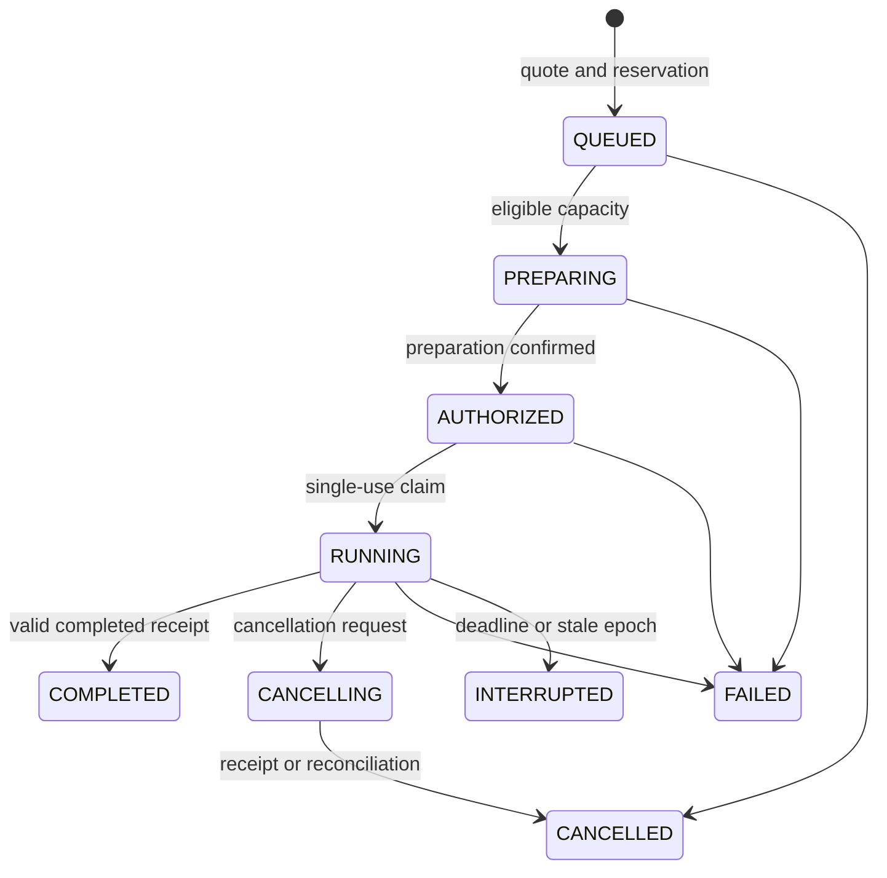

# Private API and node protocol

Protocol: `network-ai.private.v1`. All addresses below refer to the local private profile. Fields, states and errors are defined for this private version and may change before a stable public API.

## Authentication

Control base URL: `http://127.0.0.1:43101/api/v1`. Personal keys use `Authorization: Bearer <key>`, have an `nai_` prefix, are stored as SHA-256 digests, and are returned in full only when created. Key identifiers and prefixes support later inspection and revocation.

Login verifies a scrypt password hash and creates a 12-hour HttpOnly, SameSite=Strict cookie. HTTP cookies are limited to this mandatory loopback profile. Cookie-authenticated mutations require the exact interface origin. Do not carry this local transport configuration into a public deployment.

## Control endpoints

| Method | Route | Authorization and purpose |
|---|---|---|
| POST | `/auth/login`, `/auth/logout` | Sign in/out; login has a dedicated attempt limit |
| GET | `/me` | Current authenticated account |
| GET / POST | `/models` | Catalog and availability / submit immutable candidate |
| POST | `/quotes` | Maximum cost quote, valid for 60 seconds |
| GET | `/wallet` | Own balances and up to 100 recent entries |
| GET | `/capacity/:model` | Temporary model/account request allowance and aggregate slot state |
| GET / POST | `/availability/leases` | Inspect own contracts / reserve an offer's complete funding |
| POST | `/availability/leases/:id/accept` | Only the provider accepts a ready-capacity contract |
| POST | `/availability/leases/:id/cancel` | Counterparty/admin closes and refunds unused funding |
| GET / POST | `/availability/routes` | Inspect own complete-route windows / reserve one full budget |
| POST | `/availability/routes/:id/accept` | A listed provider accepts the exact `terms_sha256`; the last acceptance activates ready, unclaimed capacity |
| POST | `/availability/routes/:id/cancel` | Cancel an offered window or drain accepted obligations until their fixed end |
| GET / POST | `/cooperative/pools` | Inspect shared fund summaries / create immutable essential plan |
| POST | `/cooperative/pools/:id/fund` | Commit existing credits with exact policy consent and idempotency |
| POST | `/cooperative/pools/:id/windows` | Manager/admin funds the complete next essential window |
| POST | `/cooperative/pools/:id/manage` | Manager/admin records pause/resume and operational support |
| GET / POST | `/cooperative/pools/:id/renewals` | Inspect recent renewal state / manager creates finite gross spending authority |
| POST | `/cooperative/pools/:id/provider-mandates` | A provider authorizes only its own exact route participation |
| POST | `/cooperative/renewals/:id/revoke` | Manager/admin revokes future fund authority; accepted windows preserved |
| POST | `/cooperative/provider-mandates/:id/revoke` | Owning provider/admin revokes future participation; accepted windows preserved |
| POST | `/cooperative/refunds/:session_id` | Administrator-only full refund from exact original destinations |
| GET | `/admin/economics` | Administrator-only private party/affiliation registry |
| POST | `/admin/economics/parties` | Administrator records an economic party with immutable evidence |
| POST | `/admin/economics/affiliations` | Administrator records a bounded account-to-party declaration |
| POST | `/admin/economics/affiliations/:id/revoke` | End future eligibility; retain historical declaration |
| POST | `/cooperative/pools/:id/operating-support` | Administrator records exact-policy in-kind operational support |
| POST | `/cooperative/operating-support/:id/revoke` | Revoke support for future expansion, preserving accepted contracts |
| GET | `/sessions`, `/sessions/:id` | Up to 100 own sessions / details and events |
| POST | `/sessions/:id/cancel` | Cancel an owned session |
| GET / POST | `/keys` | List/create own personal keys |
| DELETE | `/keys/:id` | Revoke own key |
| GET | `/nodes` | Operator's nodes; administrators see all |
| GET / POST | `/routes` | Inspect visible routes / root owner proposes immutable complete-route terms |
| POST | `/routes/:id/accept` | Listed provider accepts the exact `route_sha256` |
| POST | `/routes/:id/withdraw` | Provider withdraws from future admissions |
| POST | `/admin/routes/:id/qualify` | Administrator records local qualification or revocation |
| POST | `/nodes/:id/state` | Owner/admin sets READY, PAUSED or REVOKED |
| GET / POST | `/admin/users` | Administrator lists/creates users, initially at zero balance |
| POST | `/admin/grants` | Administrator issues an explicit LAB_TU grant |
| GET / POST | `/admin/domains` | Administrator manages physical capacity domains |
| POST | `/admin/node-invites` | Administrator creates a one-use 24-hour invitation |
| POST | `/admin/models/:id/qualify` | Administrator enables local testing or revokes qualification |
| GET | `/admin/metrics` | Administrator reads counts and ledger sum |

The executable [shared contract](../../packages/contracts/src/index.ts) defines request bodies. A model manifest cannot change under the same ID. Another revision needs another identifier. Qualification state can change separately, with an audit event.

Service-specific readiness bodies are validated in their control modules. [Complete-route readiness](ROUTE_AVAILABILITY.md) defines `route_id`, duration, total rate, purpose, reason and UUID idempotency. Its cancellation preserves other accepted component obligations, unlike immediate cancellation of a legacy standalone lease. Both generations share the four-open-contract sponsor cap and one accepted readiness claim per physical domain. Standalone offers now require `INFERENCE` nodes; roots and stages must use the complete-route contract.

Route bodies and their lifecycle are detailed in the [complete-route guide](COMPLETE_ROUTES.md). A proposal contains `name`, `model_id`, UUID `idempotency_key` and 2–16 ordered `{node_id, share_bps}` members, starting with the root and totaling 10,000 basis points. Node invitations accept `node_kind` as `INFERENCE` (default), `ROUTE_ROOT` or `RPC_STAGE`. Qualified roots/stages cannot be selected as standalone complete-model offers. `/sessions/:id` includes frozen participants, accepted stage receipts and individual `paid_microtu` values. `/capacity/:model` reports conservative complete-route packing over shared domains; it is not a sum of advertised stage slots.

### Model manifest fields

| Fields | Meaning |
|---|---|
| `schema_version`, `model_id`, `display_name` | Schema and immutable profile identity |
| `backend_model`, `revision`, `artifact_sha256` | Exact configured backend ID and artifact claim |
| `license_id`, `source_url` | License identifier and HTTPS source |
| `modality`, `trust_policy` | Currently `text` and `private_lab` |
| `max_context_tokens`, `max_output_tokens`, `max_input_bytes` | Bounded request envelope |
| `input_rate_microtu`, `output_rate_microtu`, `rate_denominator` | Integer price fields |
| `description` | Operator-provided profile explanation |
| `execution_profile` | Optional immutable b10964 RPC profile: CPU/CUDA stage types, placement weights, observed buffer budgets and reserves, worker threads, context, batch, transport and one slot |

Amount fields are decimal strings to preserve integer precision. A recorded hash is not independent proof that an unknown backend loaded the claimed model. Administrator qualification supplies the current private trust decision.

The optional execution profile's context must match `max_context_tokens`. It is part of the canonical manifest hash, so a changed placement needs a new model identifier and fresh route consent. Migration 010 denies definition/hash updates and deletion to the application role while permitting qualification state and note updates; a trigger also protects definitions from ordinary owner-role writes. Existing model definitions are preserved. See the [device profile guide](HETEROGENEOUS_CONTRIBUTORS.md) for the exact recipe and memory limits.

## Inference endpoint

Gateway base URL: `http://127.0.0.1:43102/v1`. Authenticated `GET /models` exposes usable profiles. `POST /chat/completions` accepts this text subset:

```json
{
  "model": "qwen-local",
  "messages": [{"role": "user", "content": "Hello!"}],
  "max_tokens": 128,
  "temperature": 0.7,
  "stream": true
}
```

`qwen-local` is the original lab profile. Use your own qualified ID on another installation. The network's above-27B focus does not mean this endpoint automatically distributes a model among nodes.

Optional fields include `top_p`, `stop`, `n: 1` and `stream_options.include_usage`. Message roles are `system`, `user` and `assistant`, with string content. Unknown fields, tools, files, images and multiple choices are rejected. The HTTP body limit is 128 KiB and the request supports at most 64 messages, subject to the tighter manifest envelope.

The conservative input guard uses UTF-8 bytes and a per-message margin. It is not a certified independent tokenizer. Usage for settlement is reported by the configured engine and checked against the authorized envelope.

### Request identity and quote

Send `Idempotency-Key` for a stable logical request identity. Without it, each call obtains a new identity. Quoting is automatic; `X-Quote-Id` can select a previously created quote for the same model/output limit. Responses include `X-Network-AI-Session-Id`.

Example for a shell where `NETWORK_AI_API_KEY` already contains a privately created key:

```bash
curl http://127.0.0.1:43102/v1/chat/completions \
  -H "Authorization: Bearer $NETWORK_AI_API_KEY" \
  -H "Content-Type: application/json" \
  -H "Idempotency-Key: first-example-request" \
  -d '{"model":"qwen-local","messages":[{"role":"user","content":"Hello!"}],"max_tokens":128,"stream":false}'
```

Repeating the same account/key identity and request bytes returns HTTP 409 with the existing session, without new inference or charge. Reusing the key with a different body is also a conflict. The idempotency namespace belongs to the account across all its API keys. Answer bodies are not retained, so this does not recover a previous response.

### Streaming and completion

Streaming uses SSE text plus named `network_ai_status` and `network_ai_receipt` events. Clients should ignore unknown event types. `[DONE]` ends the engine stream; it is not itself confirmation of finalized billing. `receipt_pending` means control has not yet accepted settlement. Inspect the original session for the accounting result.

A partial response can end with an error. Content received is not proof that the session completed. Without streaming, the gateway builds a `chat.completion` response with usage and `network_ai.session_id`.

This is a bounded Chat Completions subset, not full compatibility with every API or SDK option. An SDK that sends unsupported extra fields can be rejected.

## States and transactions



This diagram highlights the main path; other failures also terminate with explicit reasons. Hold creation, balance projection and session creation are transactional. Admission uses transactional exclusion and aggregate capacity per physical domain. Among executable queues, the least recently served account has priority, with FIFO order inside an account.

An account can hold at most four active sessions. Queue expiry is 120 seconds and execution expiry 180 seconds. These are private limits, not a measured public SLO or a person-level anti-Sybil mechanism.

## Node identity and signatures

Registration proves Ed25519 key ownership over `network-ai/register/v1`, invitation hash, nonce, public key, boot ID and timestamp. The invitation binds owner, model, physical domain and endpoint; the registering agent cannot substitute these fields.

Subsequent messages sign this exact newline-separated structure:

```text
network-ai/node/v1
METHOD
PATH
TIMESTAMP
NONCE
BODY_SHA256
```

Headers: `X-Node-Timestamp`, `X-Node-Nonce`, `X-Node-Signature`. The acceptance window is 30 seconds and nonces persist for five minutes. A new boot increments the epoch and fences earlier attempts. A revoked registration cannot resume. Heartbeats occur every two seconds, with eligibility lost after 15 seconds without presence.

Control signs Ed25519 prepare/execute capabilities bound to network, audience, node, epoch, session, attempt, manifest, raw request hash, limits, deadline and prepare ID. The node reserves a local semaphore and consumes the control claim once before invoking the engine. Identical receipt retries are idempotent; conflicting receipts are rejected.

`/internal` routes require the gateway secret and are not exposed through the browser proxy. Node heartbeat/claim/receipt paths require the registered node's signature. These controls establish message identity and authorization, not independent proof of hardware, correct inference or honest token counting.

Stages additionally send signed `POST /nodes/:id/stage-claim` and `/nodes/:id/stage-receipts`. Stage HTTP listeners accept `/prepare`, `/release`, `/stage/start` and `/stage/finish`, each under its specific coordinator capability. A stage receipt reports session/attempt/epoch/route hash, terminal state, completed graph commands, observed request/response bytes, transcript SHA-256, elapsed time and `metering_source: rpc_observed`. Those observations are distinct from the root's engine token usage. The normal browser proxy cannot invoke these signed internal node operations.

Portable stages use signed `POST /nodes/:id/stage-readiness` with exactly `epoch`, `route_id`, `route_sha256`, `manifest_sha256`, `rpc_generation` and a 43-character base64url `request_nonce`. The reply is `{ready: false, lease: null}` when the route/root is ineligible or stale, or `{ready: true, lease: "..."}` with a signed `NAI-READY` declaration. Scope/manifest mismatch is HTTP 403 (`stage_readiness_scope`); a changed stage epoch is HTTP 409 (`epoch_fenced`). The declaration binds the stage, its epoch, route/model hashes, connection generation, challenge, root node/epoch/boot and timestamps. Its lifetime is at most four seconds and expires no later than six seconds after the root heartbeat. It carries no execution or payment authority. The node signature, nonce replay protection and restricted HTTP-link allowlist apply before issuance. [Protocol, lifecycle and operator setup](PORTABLE_CONTRIBUTORS.md).


## Opt-in cooperative sessions

Optional automatic coverage requires the [bounded renewal contracts](BOUNDED_RENEWALS.md). Fund and provider permissions use separate limits, hashes and expiries. Creating or funding a pool does not implicitly enable renewal. The authenticated renewal read endpoint includes recent permissions, own eligible routes, consumed windows and reasons for waiting.

Version 0.8 adds `coverage_kind` (`ESSENTIAL` by default, or `EXPANSION`) to those permissions. Expansion requires new pool terms, zero `maximum_reserve_microtu`, an exact `operating_support_id` and provider consent `READINESS_ONLY_BOUNDED_EXPANSION`. Old omitted-kind idempotency hashes retain their meaning. The read response adds aggregate `expansion` criteria and `operating_support`; route requests used as private demand evidence are omitted from the aggregate eligibility object. Revocation and history include both modes. [Complete field, scope, deadline and failure contract](DEMAND_BACKED_EXPANSION.md#api-contract).

`POST /quotes` accepts optional `cooperative_pool_id`. The quote and session freeze that pool and policy hash. Supply the resulting quote in `X-Quote-Id`; the normal chat body is unchanged. Coverage-aware admission binds `coverage_lease_id` and `coverage_terms_sha256` into the session/capability and caps its execution deadline at the accepted window end. A session cannot switch pools or bypass missing coverage. Ordinary quotes remain 80/20; cooperative consumption is recycled while providers earn under the separately accepted readiness-only window. See the [complete request/consent guide](COOPERATIVE_FUNDS.md).
