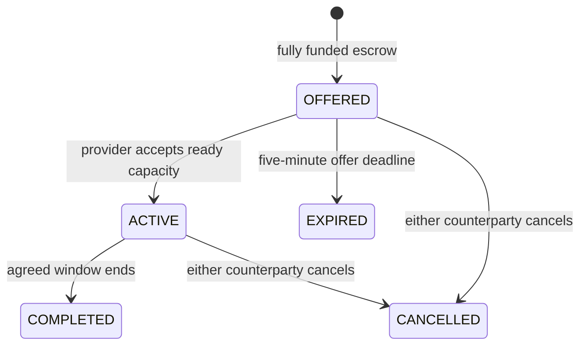

# Funded availability and temporary usage limits

This private implementation makes accepted readiness payable even when no inference request arrives. It transfers existing `LAB_TU` under a bounded agreement. It does not activate the candidate cooperative issuer, protected treasury, cash market or an approved economic tariff.

## Contract lifecycle

1. An authenticated sponsor selects a qualified node, 30–3,600 seconds and an integer rate in microTU per second. A maximum of four open contracts per sponsor bounds private exposure.
2. The service moves `duration × rate` from the sponsor's available account into a dedicated escrow. Funding and creation share one serializable PostgreSQL transaction. Insufficient funds leave no contract or partial reservation.
3. Only the node's provider can accept the offer. Offers expire after five minutes. Acceptance requires a recently ready node and the original qualified model. Only one accepted readiness contract can exist per declared physical domain.
4. The coordinator periodically observes readiness and pays eligible intervals from escrow into the provider's available balance. Payments are possible while the model is idle.
5. Expiry, completion or cancellation returns every unpaid microTU to the original sponsor. Either counterparty may cancel; an administrator can close a contract operationally.



The API freezes counterparties, resource domain, model hash, rate, duration, budget and idempotency identity. Runtime database permissions prohibit updating those terms. Journals and availability events cannot be rewritten by the runtime role. The database owner remains trusted.

## What a payable interval means here

The private coordinator samples about every two seconds. A payable interval needs ready observations at both ends, the same node boot epoch, a heartbeat no older than five seconds, a still-qualified original model, the declared backend model loaded, an enabled provider and no pause/revocation. Intervals exceeding six seconds are not extrapolated. Credited milliseconds are accumulated before integer division, preserving fractional progress between samples:

```text
total_payable_microTU = floor(total_credited_ms × rate_microTU_per_second / 1000)
new_payment = total_payable_microTU - already_paid_microTU
```

Payment cannot exceed the pre-funded budget. A crash followed by reconciliation does not pay the unobserved outage. A backwards wall-clock adjustment does not rewind an already observed checkpoint. Cancellation and reconciliation serialize on the contract, so they cannot both refund the same remaining balance.

These observations are **private control evidence**, not independent proof of useful hardware or correct computation. An unobserved period can underpay a provider who remained available while the coordinator failed. Physical-domain labels cannot defeat an adversary that falsely registers one GPU as several domains. Independent verification, outage compensation, complete distributed routes and fleet-wide funding policy remain required before an open cooperative launch.

Normal inference currently retains its experimental 80/20 provider/working-account allocation. A readiness contract is separately funded; it does not silently draw on that working account. The eventual cooperative tariff must define whether and how useful-work compensation supplements readiness. This private increment does not establish a sustainable market price.

## API and interface

| Method | Route | Purpose |
|---|---|---|
| GET | `/api/v1/availability/leases` | Own sponsored/received contracts; admins can inspect all |
| POST | `/api/v1/availability/leases` | Create a fully funded offer |
| POST | `/api/v1/availability/leases/:id/accept` | Provider accepts |
| POST | `/api/v1/availability/leases/:id/cancel` | Close and refund the unused balance |
| GET | `/api/v1/capacity/:model` | Current temporary admission allowance |

Offer body:

```json
{
  "node_id": "00000000-0000-4000-8000-000000000001",
  "duration_seconds": 60,
  "rate_microtu_per_second": "1000",
  "idempotency_key": "my-first-funded-window"
}
```

The UUID is illustrative; use an existing qualified node. This example reserves 60,000 microTU, or 0.060 LAB_TU. Repeating the same account/key and body returns the original offer. Reusing the identity with changed terms returns a conflict.

In the PT-BR interface, open **Meus nós → Contratos de disponibilidade**. Enter the node ID, duration and rate, then select **Financiar oferta**. The provider selects **Aceitar**. **Encerrar** closes the agreement and returns unused funds. Incoming offers and observed payments refresh periodically. One LAB_TU equals one million microcredits.

## Elastic admission: 1, 2 or 4

The current policy is `private-elastic-v1`:

| Condition for the requested model | Maximum active requests for the account/model |
|---|---:|
| Other accounts have eligible queued requests, or no ready domain exists | 1 |
| No competing queue, but ready domain slots are occupied | 2 |
| Declared ready capacity has spare slots and no competing queue | 4 |

The existing hard limit of four active requests across the account still applies. These are request/queue allowances, not a guarantee of simultaneous GPU execution. Physical-domain admission continues enforcing actual configured slots. Existing accepted sessions retain their reservations when a limit falls. The next new request is checked against current conditions; idempotent retries are resolved first.

An idle network therefore offers more temporary admission headroom without issuing permanent credits, altering a model's price or expanding its context. This simple private rule does not implement all candidate v6 control windows, economic recovery predicates or a fresh accepted market study.

## Validation

The real PostgreSQL suite covers funding, insufficient balances, repeated identities, provider authorization, fixed terms, concurrent acceptance on one domain, observed payment, outages, epoch fencing, exact refunds, expired offers and immutable events. Another case verifies quota contraction/expansion and preservation of accepted work. The browser campaign exercises funding, acceptance, observed payment and closure at desktop and mobile widths.

Those checks establish executable private contracts. They do not replace measured operator costs, independent verification, mature-phase circulation or the failed F0 economic study.
