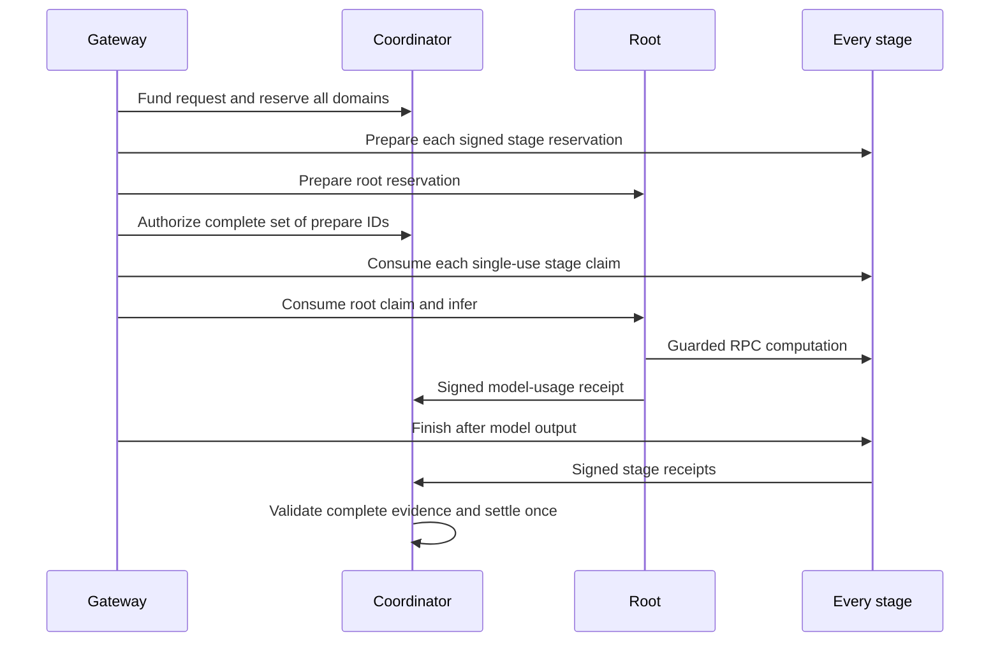

# Complete routes and participant settlement

Version 0.4 adds an executable route containing one root agent and one or more stage agents. A real Qwen3-32B Q4_K_M model was run through two CPU workers with separately signed stage identities. All agents and workers were on **one physical computer, under one operator account**. This closes a local protocol and accounting gap; it does not qualify independent providers, WAN transport, or a public marketplace.

## What a route represents

A route is a complete offer for one immutable model profile. The root runs the model server's inference interface. Each stage guards a configured local llama.cpp RPC worker. Registering a stage alone does not offer an executable model. The scheduler only admits a route when its root, every stage, every provider and the exact model are eligible.

The current adapter supports the documented two-worker CPU split. The control contract allows 2–16 members, but that schema limit does not establish a working 16-member adapter. Placement remains an operator configuration; no automatic partitioner or hardware optimizer is claimed.

| Identity | Responsibility | Earns on a successful request |
|---|---|---|
| Root | Holds the model session, generates output and reports engine token usage | Its accepted share of the provider pool |
| Stage | Claims its reservation, gates RPC computation and reports completed commands | Its accepted share of the same pool |
| Physical domain | Represents shared CPU/RAM or GPU capacity | No independent balance or extra payout |

The managed profile puts all three identities in one domain with one slot. Creating three agents therefore does not triple this computer's capacity. A route spanning distinct domains reserves every domain atomically. Ordinary model nodes using a reserved domain must also wait.

## Proposal, consent and qualification

In **Meus nós** (My nodes), open **Rotas de computação** (Compute routes). The workflow is:

1. Create invitations with `node_kind: ROUTE_ROOT` or `RPC_STAGE`. Ordinary invitations default to `INFERENCE`.
2. The root's owner proposes an ordered member list. The root is first. Each node must serve the same model profile. Node identities are distinct; shares are positive integers totaling 10,000 basis points.
3. Each provider reviews the participant list and accepts the exact SHA-256 of the immutable terms. An account owning several stages accepts on behalf of all its listed nodes.
4. An administrator records qualification evidence before enabling private use. Readiness is still required afterward; qualification cannot turn offline workers into available capacity.
5. A provider may withdraw from future admissions. Already accepted sessions retain their frozen terms. Joining again requires a new proposal and fresh consent. End the previous qualified route before qualifying a replacement for the same root.

The route identifier, model manifest hash, ordered members, domain assignments, recipient accounts, shares and provider-pool policy enter the signed terms. A new proposal gets a new identifier/hash even when its allocation percentages repeat. Node owner, model, endpoint, domain and role cannot be reassigned through the runtime database role.

## Request lifecycle



The coordinator refuses a root claim until every stage has claimed. Each attempt freezes node epochs, participants, domains and shares. A restarted/revoked stage, invalid evidence, cancellation or expired attempt prevents successful settlement. A late root receipt cannot bypass the deadline while waiting for the periodic reaper.

The gateway prepares all stages, then the root, and starts stage claims before invoking inference. On failures it releases unclaimed preparations and requests cancellation. Routed streams wait for stage finishing before their final `[DONE]`. A durable but not yet accepted receipt is reported as pending; the original session's `billing_state` remains authoritative. There is no automatic inference retry or reconstruction of an interrupted answer.

## How the credits are divided

Text token usage and stage computation observations are different measurements. Input/output tokens come from the configured model engine. Stages count completed RPC graph commands, not text tokens. Increasing the number of stage identities does not multiply the consumer's bill.

The current experimental rule is:

```text
charge = price_for_engine_input_and_output_tokens
network_fee = floor(charge × 2,000 / 10,000)
provider_pool = charge − network_fee
participant_payment = deterministic_share_of(provider_pool)
```

Prefix rounding assigns every integer micro-unit exactly once. Each participant receives the difference between two rounded cumulative allocations; the sum always equals the pool, including tiny amounts. Shares are percentages **of the provider pool**, not of the whole bill. The terms cannot change while a session runs.

In the measured request, 18 input tokens and 6 output tokens cost 36,000 micro-LAB_TU (0.036 LAB_TU). The network received 7,200; the root received 2,880; each CPU stage received 12,960. The route used an explicitly selected 10%/45%/45% split of the provider pool. Those percentages are a laboratory configuration, **not a finding that these prices cover electricity, hardware depreciation, connectivity or commercial overhead**. All three recipients belonged to one account in this campaign.

No request is charged until a valid completed root receipt and all valid completed stage receipts exist. Each stage must report nonzero completed commands and observed traffic. Duplicate receipts do not pay again; conflicting receipts are rejected. Missing/failed evidence refunds the hold. This proves conservation and specified private settlement behavior, not that an untrusted operator actually performed correct inference.

## RPC guard and initialization

The guard targets the pinned llama.cpp `b10964` protocol and keeps both listeners and upstream workers on loopback. It parses bounded frames and disables transport upgrades in both directions so an RDMA negotiation cannot bypass observation. Graph-compute commands have no direct response; an ordered device-memory request supplies a completion barrier. The receipt hashes the observed compute request and barrier bytes without retaining their payload in public evidence.

Initialization required one computation per worker in this binary even with `--no-warmup`. The initial campaign correctly rejected that unreserved computation before any consumer session. The adapter now supports an **explicit, nonbillable startup allowance**. Its default is zero. The managed profile permits at most four commands, 256 MiB of associated requests and ten minutes from agent startup, and permanently closes this allowance when the backend first becomes ready. Observed startup work never enters a session receipt or creates credits. Normal session work requires a signed, claimed, unexpired route capability.

The RPC server is upstream prototype code and is not safe for exposure to untrusted clients. These guards do not sandbox its tensor parser, prevent a local administrator bypassing loopback ports, or establish cryptographic correctness. The private QUIC bridge carries eligible node-control requests; it does **not** make raw RPC a qualified WAN protocol. [Pinned upstream protocol](https://github.com/ggml-org/llama.cpp/blob/b29c606e2/ggml/src/ggml-rpc/ggml-rpc.cpp), [upstream RPC warning](https://github.com/ggml-org/llama.cpp/blob/b29c606e2/tools/rpc/README.md).

## Install the measured profile

First follow [artifact acquisition](MODEL_ARTIFACTS.md) to obtain and verify the documented official weights and Windows CPU engine. This managed installer checks the measured artifact revision and engine SHA-256; another OS or binary requires a separately measured profile. Finish active sessions before changing the managed CPU group. With the private core services running:

```powershell
pnpm lab:install-cpu-route --engine-dir .runtime/engines/llama-b10964-cpu/bin --model-dir .runtime/models/qwen3-32b --manifest adapters/manifests/qwen3-32b-q4-k-m.json
```

The installer verifies existing weights, backs up the private database, reuses the previously assigned CPU domain when present, creates limited node profiles, starts the two guarded stages and root, records consent/qualification, and saves the managed configuration. It retains the old CPU profile while selecting the new group for subsequent `lab:start` calls. It does not load both 32B copies. The installed catalog identifier is `qwen3-32b-route-private`.

Preflight rejection leaves the running CPU group untouched. A failure after switching groups stops the incomplete replacement, revokes its new offers and retains private files for diagnosis. Installation is not a general automatic repair tool; inspect a partial installation before reusing its operator directory. The existing model/artifact and previous CPU configuration are retained.

`pnpm lab:stop` stops the project's tracked group and retains its identities, pending receipts and database. `pnpm lab:start --no-build` restarts it. Startup can take minutes because weights are verified and loaded again. `--skip-cpu` starts only core services; it does not stop a CPU group that is already running. Other Docker projects and independently managed engines are unaffected.

To reproduce the temporary campaign, first stop the managed CPU group and start core services with `--skip-cpu`, then run:

```powershell
pnpm test:route --engine-dir .runtime/engines/llama-b10964-cpu/bin --model-dir .runtime/models/qwen3-32b --manifest adapters/manifests/qwen3-32b-q4-k-m.json --fault
```

This command performs actual model inference, checks serialization and settlement, and deliberately terminates its own second stage while leaving the consumer stream connected. It revokes temporary offers and keys and stops its owned children afterward. Logs, identities and full reports remain private under `.runtime`. Restart the installed CPU group with `pnpm lab:start --no-build` when finished.

## Recorded result and remaining boundary

The September 14 campaign completed three short requests. End-to-end durations were 4,000 ms, 2,620 ms and 5,501 ms; the latter two were submitted together, and their execution intervals did not overlap. Each worker observed six graph commands per completed request. Cached graph reuse reduced subsequent request bytes; those bytes are not total model transfer volume or a bandwidth benchmark. Both workers needed one nonbillable initialization command. Killing stage 2 during a separate generation produced `FAILED / REFUNDED` with zero charge and no injected client cancellation. [Machine-readable report](evidence/qwen3-32b-complete-route.json).

These are short, same-host acceptance checks. They do not establish sustained throughput, long-context quality, heterogeneous GPU placement, cross-provider privacy, independent receipt verification, power cost or economic viability. The remaining [launch gates](../execution/GATES.md) are unchanged by a local success.
