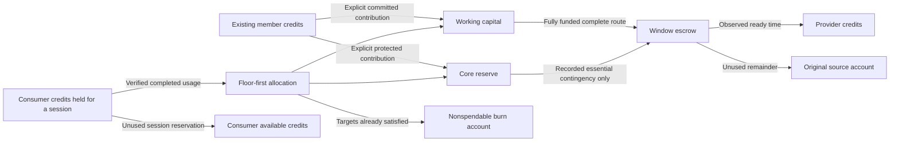

# Cooperative funds: capacity, consumption and renewal

Version 0.6 private preview · Dev-Encrypted · CC BY 4.0

The fund rules and original v0.6 campaign below remain valid. Version 0.7 adds optional [bounded automatic renewal](BOUNDED_RENEWALS.md) with separate manager and provider permissions; existing manual windows retain their original consent flow.

NETWORK AI can now connect three real operations: people contribute existing laboratory credits, a fund contracts a complete model route, and opted-in consumption replenishes that fund. Providers explicitly accept payment for observed readiness. They do not receive an additional inference split for sessions charged to that fund.

This is an executable private accounting mechanism. It does not establish public decentralization, sustainable prices, independent earnings or approval of the proposed token issuer. The first live campaign used one existing 32B model, three signed agents, one physical computer and one operator account. The preserved [economic study](../execution/ECONOMY_V1_RESULTS.md) remains rejected; its historical inputs and holdout results have not been modified.

## Follow the credits



There is no reward merely for registering a node. There is no new grant during recycling. An idle route earns only when a sponsor or fund has already committed its entire bounded window and its components are observed ready. Without contributions or consumption, funds eventually run out and no further promises can be made.

`1 LAB_TU = 1,000,000 microcredits`. All API amounts are integer decimal strings. A text token is a unit reported by the inference engine; its price comes from the selected immutable model manifest. One model token is not automatically one credit across every model and precision.

## What a plan contains

A signed-in account can create a plan with one to four essential service groups. Each group names a qualified model route, a rate for the **whole route** and a 30–3,600-second window. The API also supports up to eight alternative routes for the same model in a group. The interface starts with one route per group and can add more groups.

One group has one budget regardless of the number of alternative routes or agent identities. Only one open window is permitted per group. Alternatives are selected from complete, available routes without conflicting readiness claims; the least recently awarded route is tried first. This is a private selection rule, not Sybil-resistant economic fairness. Ownership and physical domains are still administrator-qualified declarations.

Groups that require simultaneous service cannot overlap physical domains, including their alternative routes. This conservative restriction avoids counting the same GPU/RAM domain as several independent essential services. It does not certify a collection of unrelated devices. The [model scaling guide](../MODEL_SCALING.md) explains why models above 27B generally need more memory and contributed capacity, while parameter count alone cannot determine a number of people.

Plan identity, groups, model identities, exact route hashes, prices and policy are immutable. A new financial plan requires a new identifier and explicit funding. Runtime database permissions and append guards prevent editing or extending a committed plan. Operational support can be paused, resumed or reaffirmed separately; these changes are recorded and do not rewrite accepted window terms.

Contributions require the exact policy hash and the literal consent `COMMITTED_LAB_CREDITS_NO_REDEMPTION`. They transfer the contributor's existing available credits. Contributions are committed to the plan; there is no personal withdrawal, promised return or cash redemption. Pausing preserves its funds for later supported operation. Choose bounded amounts when experimenting.

## Working capital and protected reserve

For approved essential rates totaling `r` microcredits per second, this private policy uses:

| Quantity | Calculation | Purpose |
|---|---|---|
| Working floor `F` | `max(0, r × 21,600 − held)` | Six hours of essential commitments not already funded |
| Working target `W*` | `max(0, r × 86,400 − held)` | One day of essential commitments not already funded |
| Reserve target `R*` | `r × 259,200` | Three additional days of essential contingency capacity |
| `held` | Unpaid escrow of open, unexpired windows in this plan | Already funded obligations; unavailable for another purchase |

All windows are at most one hour and the fixed execution limit is at most three minutes, so the minimum six-hour horizon dominates this private profile. A different maximum contract or settlement policy must revisit that assumption. The reserve target is additional contingency; its held contracts are already excluded from the free reserve balance.

These horizons are policy targets, not claims that the computer will remain online for six or 72 hours. Operational support is a separate, explicitly declared time window of at most 30 days. A newly accepted lease must fit both its original frozen support deadline and the current support declaration. A plan cannot borrow against future requests or expected buyers.

Normal windows use working capital. A protected-reserve window is allowed only when working capital cannot fund that essential group's complete next window and reserve funds can. The operation creates one immutable incident with the exact route, group, policy, budget, deadline, reason and observed working shortfall. Incident creation, the hold and the window are one transaction. Retrying creates no second incident or hold. Reserve-funded windows are excluded from the normal-cost recurrence denominator.

The account cannot combine two insufficient compartments into an unfunded promise. Ordinary funding never debits the burn account. There is no expansion, promotional grant or cash payout from protected reserves.

## Accepted operator terms

The fund reuses the [complete-route readiness contract](ROUTE_AVAILABILITY.md), with explicit additional terms:

```json
{
  "compensation": "READINESS_ONLY",
  "cooperative": {
    "pool_id": "the immutable pool UUID",
    "group_key": "essential-32b",
    "policy_sha256": "the exact pool policy SHA-256",
    "funding_source": "WORKING",
    "support_until": "the original operational deadline"
  }
}
```

Every distinct provider accepts the full window hash. One account controlling three agents accepts for that account once; it does not become three independent providers. Component maximums, actual observed readiness, restart fencing, physical-domain exclusion and protection of other providers' accepted obligations remain as in version 0.5.

For **opted-in pool sessions**, providers receive the readiness payment and no additional 80/20 inference payment. Ordinary sessions and previously accepted standalone/additional-readiness contracts retain their existing terms. The interface displays the difference before acceptance. An unused window remainder returns to the frozen working or reserve source, never to the manager's personal wallet.

Pause stops new promises. Accepted windows still settle against their original funded obligations; providers can relinquish their own future readiness earnings, and other components retain their accepted deadlines. A failure cannot retroactively confiscate earned credits.

## Consumer selection and admission

In the PT-BR private interface, open **Cooperação** to inspect funds. In **Conversar**, select the model and choose its fund under **Destino do consumo**. The ordinary 80/20 option remains the default. The quote freezes the pool and policy hash; the consumer cannot switch that context after reserving a session.

API clients first send `POST /api/v1/quotes` with `cooperative_pool_id`, then pass the returned ID in `X-Quote-Id` to the normal chat endpoint. There is no extra nonstandard field in the chat body:

```json
{
  "model": "qwen3-32b-route-private",
  "max_output_tokens": 16,
  "cooperative_pool_id": "replace with the pool UUID"
}
```

A cooperative session can be admitted only on a matching ready route with an active, fully accepted window and more than ten seconds remaining. Withdrawn components, a paused fund or expired support prevent new admission. The capability contains the window ID and terms hash; execution is bounded by the earlier of the normal execution deadline and the accepted window's end. The private coordinator remains the trusted enforcement point; this does not establish independent work verification.

The eligible-account scheduler applies the coverage condition before choosing the next account. An uncovered cooperative request cannot block an ordinary request that has usable capacity. Cooperative mode grants no additional queue priority or physical slot. A request may wait for coverage within the normal 120-second queue deadline; failure to obtain it refunds its held consumer credits. A quote does not reserve a route or guarantee completion inside a short window.

## Exact recycling

Let `q` be finalized consumption, `W` and `R` the current **free** working/reserve balances, and `F`, `W*`, `R*` the targets above. In order:

```text
a = min(q,                 max(0, F  − W))
p = min(q − a,             max(0, R* − R))
w = min(q − a − p,         max(0, W* − W − a))
b = q − a − p − w

working receives a + w
reserve receives p
burn account receives b
q = a + p + w + b
```

Example in microcredits: consumption `100`, empty balances, floor `30`, working target `50` and reserve target `40` yields `30` to the floor, `40` to reserve, `20` more to working and `10` burned. There is no newly issued credit in these transfers.

All component receipts must satisfy the existing settlement contract first. The consumer hold, actual charge, unused return, frozen allocation record and balanced journal commit atomically. Pool-level locking and serializable retries prevent concurrent sessions from replenishing the same deficit twice. A repeated receipt cannot duplicate the charge. Ordinary inference still uses its prior 80/20 split.

The burn account is a nonspendable sink for ordinary operations. It is excluded from spendable circulating credit balances; it does not change the historical record of gross laboratory grants. A full approved refund may reverse the exact prior burn, as described next.

## Refunds and accounting recovery

Failed/unadmitted sessions return unused consumer holds as before. A completed cooperative charge has a separate administrator-only full-refund operation with a required reason. It debits exactly the original working, reserve and burn destinations and credits the original consumer once. It does not reclaim provider readiness earnings or spend someone else's escrow.

If recycled working or reserve credits have already been committed elsewhere, the refund transaction is rejected until the original compartments are replenished. No replacement credits are minted. Approval and posting are atomic in this preview, so there is no outstanding future reversal commitment `J`; a broader asynchronous approval process would need its own reserved reversal exposure. Partial refunds and a public dispute procedure are not implemented here.

Restoration checks the same exported PostgreSQL snapshot used by the dump, including cooperative plans, funding, windows, incidents, settlements, refunds and events. It verifies zero global ledger sum, journal-to-balance projections, settlement context and protected permissions. Existing database-owner trust remains; this is not consensus across independent operators.

## Operational states

| State | Executable private condition |
|---|---|
| `HIBERNATING` | Paused/expired support, or no ready complete group with an existing funded window or enough free funds in an allowed source |
| `DEFENSE` | Some required groups are unavailable or working cannot fund the currently unfunded minimum essential windows |
| `RECOVERY` | Minimum service is fundable, but a full healthy observation period has not completed |
| `NORMAL` | All groups ready, floor and reserve targets met, support active, and 24 hours of continuous healthy coordinator observations |

The coordinator samples every two seconds. A gap over six seconds resets continuous recovery qualification. An isolated database-clock test exercises the 24-hour transition; the real 32B campaign did **not** run for 24 hours and stayed in `RECOVERY` with small test funding.

These states govern this bounded private essential plan. Demand-backed expansion, tariff notice periods, contributor issuance, public quorum, diversity/rotation policy and independent access cohorts remain unqualified. The original v0.6 windows are explicitly proposed and accepted. The optional [v0.7 renewal mechanism](BOUNDED_RENEWALS.md) requires additional finite authority; creating a fund alone never authorizes unattended spending.

## Endpoints and bounded use

| Method | Path under `/api/v1` | Effect |
|---|---|---|
| GET / POST | `/cooperative/pools` | Authenticated transparent pool summaries / create immutable essential plan |
| POST | `/cooperative/pools/:id/fund` | Existing-credit contribution, exact policy consent and UUID idempotency |
| POST | `/cooperative/pools/:id/windows` | Manager/admin proposes one funded whole-route window |
| POST | `/cooperative/pools/:id/manage` | Manager/admin pauses, resumes or updates declared operational support |
| POST | `/cooperative/refunds/:session_id` | Admin approves one fully backed complete consumption refund |

Financial creation/funding/window commands bind idempotency to their complete payload. The interface preserves a retry key when a response is lost. Pool summaries are visible to authenticated members for internal fund transparency; they include recent settlement identifiers and amounts, but no prompts, responses, keys or contributor credentials. Existing session detail authorization remains owner-scoped. Limits include four active plans per creator, four open contracts per sponsor across readiness APIs, and one open window per group. Lists currently return at most 100 pools and 20 recent settlements per pool; public-scale pagination and governance are future work.

## Real 32B result

The [allowlisted campaign](evidence/qwen3-32b-cooperative-cycle.json) ran on September 14, 2026 local time (September 15 UTC):

1. An existing **3,000 microcredit** contribution funded a 30-second window at 100 microcredits/second, leaving working capital at zero.
2. Actual 32B inference used 18 input and eight output tokens, completed in 4,289 ms and settled **42,000 microcredits** into working capital. Participant inference payouts were zero; their readiness payments were separate.
3. The first window paid all 3,000 microcredits: 300 to the root, 1,350 to each stage. All components were observed ready for 30 seconds.
4. Recycled consumption funded a second 3,000-microcredit window without another contribution or grant. It also paid its full budget and released the physical-domain claim.
5. Working capital ended at 39,000 microcredits; protected reserve and burn remained zero. Both windows had no remaining escrow. The ledger balanced and projections matched. The campaign then paused new promises.

The observed ratio `42,000 / 6,000 = 7` describes two tiny windows and one request by the same account. It is **not** a profitability estimate or mature economic pass rate. Prices are laboratory agreements, not measured electricity costs. The same account supplied initial and consumer credits and received the component payments. Real demand, independent operators, consumer affordability, funding diversity, adversarial behavior and a fresh mature economic study still need evidence.

Run `pnpm test:cooperative` only with the already-installed managed CPU route and available existing credits. It performs two real 30-second windows, creates one bounded plan, and pauses that plan afterward. Private reports stay under `.runtime/private-lab/cooperative-campaigns/`. [Validation summary](validation-v0.6.json) records the separate database, browser and live evidence.
