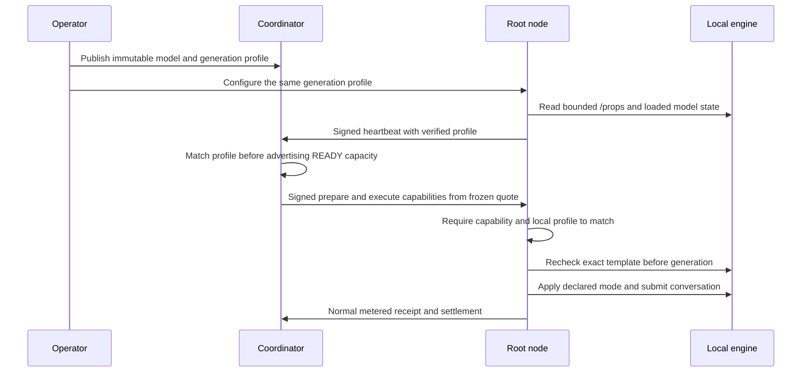

# Explicit generation policies

The same model weights can behave differently when an inference engine formats a conversation differently. A token allowance intended for a short answer may be consumed by a reasoning preamble. A user selecting an offer needs to know which behavior that offer actually runs.

Version 0.14 adds an optional, immutable `generation_profile` to a model offer. It binds one supported adapter, the SHA-256 of the exact chat template, and a declared thinking mode. The coordinator, signed execution authorization and root node all check the same terms. The model catalog displays the mode when it is specified.

This is an adapter contract for the private application. It does not implement arbitrary model architectures, hidden reasoning verification, public provider attestation or a guarantee that answers will be correct. Broader adapter support remains part of the [implementation plan](STATUS.md).

## Why the template is part of the offer

A chat template converts role/content messages into the token sequence a model consumes. Model weights, template, engine and runtime settings therefore describe different parts of a reproducible offer. The existing `artifact_sha256` identifies the weights. The optional `execution_profile` describes engine and placement terms. The new `generation_profile` describes the reviewed conversation formatting policy.

On the installed Qwen3-32B GGUF, a read-only formatting experiment found that the default template and `enable_thinking=true` produced identical prompt bytes. Explicit `enable_thinking=false` added the template's closed thinking prefill. It added four prompt tokens in each of three inspected cases. Formatting calls did not generate answers, so that observation alone could not establish whether accuracy improved.

The engine launcher already uses a reasoning budget of zero. A budget and a template switch are distinct controls in the [pinned llama.cpp b10964 server manual](https://github.com/ggml-org/llama.cpp/blob/b10964/tools/server/README.md). This adapter explicitly sends the reviewed template option when the offer requests it. It does not infer a mode from the model's name or parameter count.

## Manifest fields

An offer may include this object:

```json
{
  "generation_profile": {
    "schema_version": 1,
    "adapter": "llama_cpp_b10964_jinja",
    "chat_template_sha256": "57f1fd00f0013a2be96aa79b857391f27e23df5b5f847072b524c897e24d0361",
    "thinking": "disabled"
  }
}
```

| Field                  | Meaning and validation                                                                                                                                                                |
| ---------------------- | ------------------------------------------------------------------------------------------------------------------------------------------------------------------------------------- |
| `schema_version`       | Exactly `1`; other versions are rejected.                                                                                                                                             |
| `adapter`              | Exactly `llama_cpp_b10964_jinja` for this implementation. The operator must use the reviewed engine and Jinja template path.                                                          |
| `chat_template_sha256` | SHA-256 over the exact UTF-8 `chat_template` string returned by the backend's `/props` endpoint; 64 lowercase hexadecimal characters. Whitespace is significant.                      |
| `thinking`             | `disabled` sends `chat_template_kwargs: {"enable_thinking": false}`. `template_default` sends no template override; it retains the separately configured engine defaults and budgets. |

Unknown fields and unsupported modes are rejected. Arbitrary backend options, tools, grammar overrides and client-supplied template parameters are not accepted through this object. An inference request cannot override the purchased offer's policy.

The fingerprint shown above belongs to the installed official Qwen3-32B Q4_K_M template at artifact revision `938a7432affaec9157f883a87164e2646ae17555`. The [profile file](../../adapters/generation-profiles/qwen3-32b-b10964-direct.json) contains the same object without its outer manifest key. Do not reuse its fingerprint for another model or modified template. Model and third-party engine licenses continue to apply independently of NETWORK AI's original code license.

## From publication to execution



1. Publishing a model includes the generation profile in the canonical manifest hash. Existing model definitions remain immutable; changing the mode or fingerprint requires a new model identity and its own route bindings.
2. The root node checks `/props` during readiness. The response is limited to one MiB and a four-second request timeout. A missing, changed or unreadable template prevents the node from advertising usable capacity. The `disabled` mode additionally requires the reviewed template to expose `enable_thinking`; this is a basic compatibility check, not a Jinja interpreter or a semantic proof.
3. A signed heartbeat carries the configured profile only after the local readiness check. The coordinator compares it with the published profile for root and standalone inference nodes. Missing or mismatched terms keep the node in `VALIDATING`. RPC stages process model tensors, so their heartbeat does not need a chat-template declaration.
4. A quote freezes the model manifest. Root prepare and execute capabilities contain the profile from that quote. The node requires exact equality with its private configuration. Stage capabilities retain the full manifest hash and their existing stage scopes; they do not gain template controls.
5. Immediately before a backend generation request, the root checks the template again. If that check fails, it does not send the conversation to the generation endpoint. Execution follows the existing failure receipt and refund rules. A process changing immediately after the check is still outside cryptographic attestation; these are trusted local operator endpoints.

Template changes are one reason for a request to fail. A model that returns a wrong but well-formed answer still follows the existing execution and accounting rules. Automatic semantic judging and compensation are not implemented by this profile. [Functional qualification](MODEL_QUALIFICATION.md) records answer quality separately.

## Install and operate

For a new [device route](HETEROGENEOUS_CONTRIBUTORS.md), place the object inside `recipe.model.generation_profile`. Choose new model/recipe identities, preserve the actual physical resource domains and point the recipe at a verified node binary containing this implementation. The installer copies the exact profile into the root's private configuration. It retains the existing artifact, engine, binary and memory-budget checks. No extra GPU, admission slot or provider payout is created by selecting another generation mode.

For an invited standalone root using the local compatible backend, the profile can be supplied explicitly:

```powershell
pnpm lab:node-config --invite-file YOUR_PRIVATE_INVITATION.json --backend-kind openai --backend-url http://127.0.0.1:43264 --backend-model network-ai-qualified-model --backend-key-file YOUR_PRIVATE_ENGINE_KEY.txt --port 43164 --generation-profile-file adapters/generation-profiles/qwen3-32b-b10964-direct.json
```

These are example ports and paths, not a command to overwrite an existing installation. The invitation must belong to the intended immutable offer. The key and generated configuration remain private. This command writes a new operator profile and refuses to overwrite an existing one. Start that profile with the updated node binary after checking that the backend, template and published offer agree.

The mode is fixed for the lifetime of this node configuration. Restart a node when loading a different reviewed configuration; do not change a live offer in place. Omitting `generation_profile` preserves legacy behavior: the existing LM Studio path requests thinking disabled, while the generic OpenAI-compatible path sends no template override. Legacy offers and binaries are not silently upgraded. A new profile-bound offer requires an updated root and coordinator.

## Cost, resource use and evidence

Template tokens count as actual prompt tokens when reported by the engine. A mode change can therefore alter both prompt and completion usage. Settlement uses the frozen input/output rates and measured usage; it does not assume that the same user text has the same cost under every template. Provider shares remain the accepted route terms and do not change with this setting.

A generation mode does not make a large model fit a smaller GPU. Models above 27B still require enough combined memory for weights, context, buffers and runtime overhead. The number of contributors depends on each device's usable capacity and the execution method. Adding names for the same physical CPU or GPU creates no additional admission capacity.

Software tests exercise profile validation, real PostgreSQL readiness/admission, signed root capability mismatch and a local HTTP backend that changes its template after readiness. Synthetic backend responses are explicitly software fixtures. The separate real-model comparison uses unchanged corpus questions, expected answers and token allowances. Earlier failed campaigns remain preserved; a new result cannot retroactively qualify them.

The `/props` endpoint and root receipts are statements made by the local runtime. Their signatures authenticate identity and binding, not honest computation by an unknown provider. Independent hosts, other GPU vendors, full-context quality, WAN behavior, hostile nodes and sustainable prices remain separate launch requirements.

## Measured 32B comparison

Two new immutable CPU routes ran the same eight-case corpus, first with `template_default` and then with `disabled`. Both used the same official weights, pinned b10964 engine, node binary, two CPU stages, 1:1 layer weights, 2,048-token context, 128-token batch and original per-case output allowances. Each CPU stage offered a 12 GiB observed-buffer budget with an 8 GiB shared physical reserve. Both stages reused the existing single CPU admission domain. The original CPU route was temporarily stopped to free memory; the original mixed route and LM Studio were preserved.

| Original case                        | Template default                 | Thinking disabled                                                   |
| ------------------------------------ | -------------------------------- | ------------------------------------------------------------------- |
| Integer arithmetic, integer only     | Fail: incorrect result, `313`    | Fail: correct numeric conclusion, but extra text (`323 - 23 = 300`) |
| Structured extraction, raw JSON      | Pass                             | Fail: correct object wrapped in Markdown                            |
| Conversation correction              | Fail: output allowance exhausted | Pass: `Manaus` within the same allowance                            |
| Portuguese classification            | Pass                             | Pass                                                                |
| Array with all 32 integers, raw JSON | Fail: prohibited Markdown fences | Pass                                                                |
| Retrieval near the beginning         | Pass                             | Pass                                                                |
| Retrieval near the middle            | Pass                             | Pass                                                                |
| Retrieval near the end               | Pass                             | Pass                                                                |
| **Accepted samples**                 | **5/8**                          | **6/8**                                                             |
| **Total charge, micro-LAB_TU**       | **2,371,000**                    | **2,412,000**                                                       |

Both campaigns fail their requirement that every case pass. The explicit switch corrected two cases and regressed one; it did not establish a universally better or cheaper mode. Arithmetic in the direct mode reached the right number, but the original instruction required only that integer. Stripping explanations or Markdown after the run would change the acceptance rules, so those responses remain failed samples.

All 16 requests completed and settled with a root receipt and two stage receipts. Both temporary keys were revoked; the reviews found zero remaining domain claims, new grants or ledger projection mismatches. The template's additional four input tokens did not predict total cost: output wording and spacing also changed. The longest observed request was 55,068 ms, and maxima were 530 prompt tokens and 120 output tokens. These are observations on a shared host, not full-context certification or a latency guarantee.

The [selected evidence](evidence/generation-policy-32b-v0.14.json) retains all 16 cases, manifest and plan hashes, exact usage, charges, failure explanations and restoration checks. The [versioned validation](validation-v0.14.json) separates the software tests from the real-model observations. The earlier 10/16 campaign remains an unchanged historical result. Both new comparison launches are stopped and disabled after measurement so they do not compete with the restored original installation for memory.
