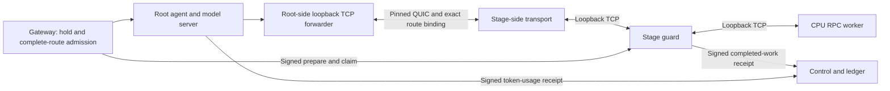

# Guarded model-stage traffic over authenticated QUIC

Version 0.9 connects the actual bytes exchanged by a model server and its CPU stages through pinned Iroh/QUIC peers. Earlier private links carried HTTP node operations, including admission and receipts. This separate transport carries the RPC stream used to load tensors and execute the split model. It is integrated into the installed Qwen3-32B route.

The qualified configuration is still **one Windows computer, one operator account, one CPU/RAM resource domain and one admitted execution slot**. Two workers and four transport processes do not create independent providers or additional physical capacity. The model artifact is the same verified Q4_K_M file used in previous releases; enabling transport does not download a second copy.

## Why this matters for models above 27B

A complete model can require more memory than an individual participant can contribute. A route can divide compatible work among stages, but those stages must also communicate. Having enough aggregate VRAM is insufficient if the runtime, tensor placement, context memory or links cannot support the complete execution.

This increment supplies an authenticated byte path for the existing split-model adapter. It does not choose a partition for arbitrary GPUs, determine trustworthy prices, or certify every model architecture. The recommended focus remains models above 27 billion parameters. Larger profiles generally need more contributed resources; the number of users depends on usable memory, quantization, context, runtime overhead, architecture, spare capacity and measured links. Creating more identities on one device contributes no additional memory.

The installed profile explicitly uses two CPU workers with layer splitting, equal tensor proportions, one context slot and a 2,048-token context ceiling. It does not use this computer's separately occupied GPU. These settings are a reproducible reference configuration, not a universal configuration for large models. [Artifact and engine record](MODEL_ARTIFACTS.md), [hardware planning](../planning/15_HETEROGENEOUS_HARDWARE_AND_CATALOG.md).

## Data path and responsibilities



Each stage has its own pair of transport identities. The root-side process accepts local TCP connections from the model server. The stage-side process accepts the configured QUIC peer, validates the route binding, and only then opens its configured **local guard** port. The guard continues to parse the pinned RPC protocol, enforce claimed capabilities, bound compute commands, fence expired work and produce durable receipts.

There are three separate identities to understand:

| Identity | Purpose | Does not establish |
|---|---|---|
| Transport Ed25519 key | Authenticate the paired QUIC endpoint | Correct computation or independent ownership |
| Registered node signing key and epoch | Authenticate node operations, attempts and receipts | Physical device count or confidential computation |
| Accepted route and model manifest hashes | Bind the declared membership, shares and exact model terms | Automatic installation or numerical verification |

The transport uses the existing exact Iroh 1.2.0 dependency. Relay service and external discovery are disabled. Endpoints use explicitly configured IP/UDP addresses. QUIC encrypts and authenticates the connection; the paired operator still receives the stage's plaintext data and controls its host.

## Protocol and resource limits

The dedicated ALPN is `network-ai/guarded-rpc/1`. It is different from the HTTP bridge's `network-ai/private-link/1`, so an HTTP peer cannot select a model-stage stream by reusing that protocol.

After QUIC authentication, the root sends a four-byte unsigned big-endian length followed by JSON:

```json
{
  "version": 1,
  "binding": {
    "stage_node_id": "11111111-1111-4111-8111-111111111111",
    "route_id": "22222222-2222-4222-8222-222222222222",
    "route_sha256": "aaaaaaaaaaaaaaaaaaaaaaaaaaaaaaaaaaaaaaaaaaaaaaaaaaaaaaaaaaaaaaaa",
    "manifest_sha256": "bbbbbbbbbbbbbbbbbbbbbbbbbbbbbbbbbbbbbbbbbbbbbbbbbbbbbbbbbbbbbbbb"
  }
}
```

These are example identifiers, not an installed route. Use the immutable route response and exact model manifest hash from your own private installation. Do not substitute the GGUF artifact hash for `manifest_sha256`: they identify different objects.

The receiving stage checks the pinned public key, protocol version and every binding field. Unknown JSON fields, empty/oversized headers and mismatches are rejected. It connects to the guard only after those checks and echoes the same version/binding as its acknowledgment. The root verifies the acknowledgment before sending RPC bytes. Neither side accepts a requested target URL, port or arbitrary forwarding path from the peer.

| Resource or event | Bound and behavior |
|---|---|
| Binding header | 1,024 bytes; length checked before allocation |
| QUIC connection setup | Five seconds |
| Stream/header/guard connection setup | Five seconds combined after the connection exists |
| Stage connection handlers | At most four, including any active tunnel |
| Active tunnel | One per root forwarder and one per stage, across all peer connections |
| QUIC streams | One incoming bidirectional stream at a stage; no incoming unidirectional streams; root advertises no incoming streams |
| Application copy buffers | 64 KiB per direction, with awaited writes and backpressure |
| QUIC flow-control windows | 4 MiB stream receive, connection receive and send windows; separate from OS/TLS bookkeeping |
| Link failure detection | Fifteen-second negotiated idle ceiling; keepalive every three seconds preserves a healthy idle loaded connection |
| TCP or stream EOF/error | End both directions and close the connection; no automatic inference replay |
| Model lifetime | No arbitrary total-byte or wall-clock cap on a healthy persistent tunnel |

The lifetime policy matters: a loaded model can stay idle while healthy. Its memory should not be discarded simply because no customer generated a token recently. Bounded session capabilities and the existing guard govern billable work. The guard still enforces its 1 GiB frame ceiling, 8 GiB per-session compute-request allowance, command budget and deadline. Its nonbillable startup allowance remains four commands, 256 MiB and at most ten minutes in the managed profile, permanently closed once loaded. Those guard limits are distinct from transferring the model's weights.

The guard also checks each signed capability against its configured node, route ID, route hash and manifest hash. A valid signature for another route or model cannot reuse this bound stage. Ordered worker completion barriers and all-participant settlement continue to apply. [Complete-route accounting and failure behavior](COMPLETE_ROUTES.md).

## Enable the installed private route

First install and qualify the [measured 32B CPU route](COMPLETE_ROUTES.md#install-the-measured-profile). Finish active sessions and accepted readiness windows before changing its transport. From the repository root, with core services running:

```powershell
cargo build --locked -p network-ai-link --bin network-ai-rpc-link
pnpm lab:route-rpc enable
pnpm lab:status
```

The command verifies the installed route, preserves its node identities and physical domain, generates private transport identities, and binds both pairs to the current immutable terms. It stops only the owned CPU route group, records the selected transport, starts its guards and links, and reloads the verified model. Model loading can take minutes. The gateway, web interface, database and independently managed inference engines stay running.

Once enabled, ordinary `pnpm lab:start --no-build` and `pnpm lab:stop` manage the added processes. A failure does not silently revert to unencrypted transport. The selected private profile and logs remain available for diagnosis. To explicitly return the installed route to its earlier guarded loopback path, outside accepted work:

```powershell
pnpm lab:route-rpc disable
```

Transport identity/configuration files are retained. Re-enabling reuses identical profiles and refuses to overwrite changed peer identities, bindings or targets. A different route revision or planned key rotation requires a separately reviewed private configuration; do not edit historical route terms to fit an old link.

| Managed role | Local address |
|---|---|
| Model inference interface | TCP `127.0.0.1:43224` |
| Root TCP forwarders | TCP `127.0.0.1:43844`, `:43845` |
| Root QUIC endpoints | UDP `127.0.0.1:43932`, `:43933` |
| Stage QUIC endpoints | UDP `127.0.0.1:43930`, `:43931` |
| Stage guard targets | TCP `127.0.0.1:43842`, `:43843` |
| Actual CPU workers | TCP `127.0.0.1:43840`, `:43841` |
| Stage control interfaces | HTTP `127.0.0.1:43125`, `:43126` |

All addresses in this managed campaign are loopback. Startup checks fresh process-bound status files instead of probing the raw RPC listener, because a health probe must not consume the stage's model connection slot.

## Configure an individual private pair

The lower-level tool is useful for controlled transport integration. Each operator generates its own identity; only `identity.json` and the public binding are exchanged. Never copy `identity.private.json`, `rpc.json`, node invites or coordinator secrets to another participant.

```powershell
pnpm lab:rpc-config identity --directory .runtime/example-root
pnpm lab:rpc-config identity --directory .runtime/example-stage
```

Place the actual agreed binding in `.runtime/binding.json`. Configure each side with the other side's **public** identity file:

```powershell
pnpm lab:rpc-config configure --directory .runtime/example-root --role root --binding-file .runtime/binding.json --peer-file .runtime/example-stage/identity.json --peer-address 127.0.0.1:45001 --bind 127.0.0.1:45002 --local-port 45003
pnpm lab:rpc-config configure --directory .runtime/example-stage --role stage --binding-file .runtime/binding.json --peer-file .runtime/example-root/identity.json --peer-address 127.0.0.1:45002 --bind 127.0.0.1:45001 --local-port 45004
```

Run each process in its own terminal:

```powershell
.\target\debug\network-ai-rpc-link.exe --config .runtime/example-stage/rpc.json
.\target\debug\network-ai-rpc-link.exe --config .runtime/example-root/rpc.json
```

On Linux the binary path is `./target/debug/network-ai-rpc-link`. In this example, the model server connects to TCP 45003, and an already configured stage guard must listen on TCP 45004. The guard must use the identical `--route-binding` file. A transport process alone does not create a guard, worker, registered node or executable route.

The transport can be configured with explicit peer IPs, but the managed CPU installer remains a one-host profile. A cross-host route also needs worker-local supervision, a suitable model-readiness source, authenticated control channels, measured GPU/runtime placement and independent failure testing. Merely changing these example IPs is not evidence that those components have been integrated or qualified.

## Status, interruption and recovery

Each process writes `rpc-status.json` next to its private config. The record contains its PID, boot ID, timestamp, public route binding, active/accepted/closed/rejected tunnel counters and application byte counts in each direction. It contains no key, prompt, tensor contents or model response. The containing directory remains private.

Counters count completed forwarding writes, not encrypted wire bytes, cryptographic computation proofs, text tokens or money. Cumulative startup bytes include weight transfers and device discovery; several short discovery connections can precede the one persistent loaded connection. An active tunnel alone is not model readiness. Use fresh signed node readiness, the available complete route and successful settled inference together. Concurrent-call byte deltas may include other admitted work in the measurement interval and must not be billed as per-request usage.

For a reproducible live acceptance campaign:

```powershell
pnpm test:rpc-route --fault
```

This uses the installed route and existing credits. It checks real output, all three receipts, conserved experimental payouts, non-overlapping execution on the shared domain and increasing counters on both QUIC pairs. With `--fault`, it deliberately terminates only the tracked second-stage transport while the client stays connected. It checks a terminal zero-charge result and released physical claims, then restarts the owned route group, reloads the same model and verifies another real response. It revokes its temporary API key and retains private evidence. There is no second model download, synthetic grant or fabricated heartbeat.

An interrupted answer is not resumed at the lost token. Failed RPC state requires a fresh engine connection and, for this adapter, a complete group reload. Existing session identities, node epochs, receipt handling and refunds prevent treating the old attempt as a new successful inference. Accepted readiness contracts retain their original accounting rules; they are not cancelled by this transport module.

## Evidence and remaining trust boundary

The [v0.9 validation record](validation-v0.9.json) and [32B QUIC campaign](evidence/qwen3-32b-rpc-quic.json) distinguish actual inference from protocol fixtures. Five additional Rust cases cover a 16 MiB binary transfer, backpressure, a healthy idle connection beyond fifteen seconds, both concurrency limits, unauthorized keys, wrong ALPN/bindings/versions, oversized and stalled headers, disconnect and peer restart. Two additional Node cases cover persistent private configuration and signed capability rejection through the real stage HTTP handler.

Upstream describes this RPC backend as a prototype unsuitable for open or sensitive networks. Keep the engine isolated and its raw listener local. Pairwise encryption restricts who can reach the configured guard; it does not sandbox a malicious authorized peer's tensor commands or verify the numerical result. [Pinned upstream RPC guidance](https://github.com/ggml-org/llama.cpp/blob/b29c606e2/tools/rpc/README.md), [upstream security guidance](https://github.com/ggml-org/llama.cpp/blob/master/SECURITY.md).

This release does not establish public operator admission, independent work verification, confidentiality from the paired provider, WAN/NAT/relay performance, heterogeneous GPU readiness, distributed consensus or economic viability. It supplies a tested private model-data transport path on the way to those separately tracked [launch gates](../execution/GATES.md).
