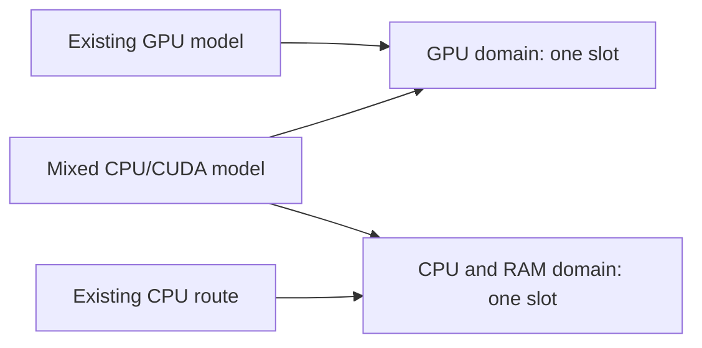

# Different devices, explicit memory budgets, and unequal model placement

NETWORK AI can configure a private route whose contributors offer different amounts of CPU RAM or NVIDIA GPU memory. The root assigns model layers using explicit weights. Each contributor checks its own device, restricts observed RPC buffer allocations, and retains the existing signed readiness, execution claims, receipts, and Windows process containment.

This implementation supports the pinned **Windows x64 llama.cpp b10964 CPU and CUDA 12.4 packages**. It is an adapter for a reviewed, complete GGUF text model. A compatible artifact still needs an actual loading and inference test. Other operating systems, AMD/Intel accelerators, multiple GPU architectures, arbitrary runtimes, and independent machines have not acquired qualification merely because the configuration accepts a model proposal. Current hardware experiments use one computer.

## What a contribution means

A GPU's total VRAM is not its available contribution. Other applications, display rendering, driver state, and the inference engine already occupy memory. A contributor chooses two amounts:

| Setting | Meaning |
|---|---|
| `buffer_budget_mib` | Maximum sum of backend buffers observed through this contributor's guarded RPC connection |
| `reserve_mib` | Free memory that a new observed allocation must leave for the operator |

Both values are integers in **MiB**, with a minimum of 256. A GiB contains 1,024 MiB. At startup, measured free memory must cover the offered buffer budget plus the reserve. A managed recipe also checks the combined budgets of its stages that share one device, using their largest reserve once.

This is **not an operating-system memory quota**. CUDA context state, kernel scratch allocations, driver allocations, the root's mapped file, and other processes are not all represented by RPC buffers. Another application can allocate memory after a check. An engine can round an allocation upward before the guard sees the actual result. Budget checks therefore reduce accidental overcommit and reject incompatible work; they cannot promise that physical usage never exceeds a byte limit. Leave additional operating headroom and measure the actual workload.

## Select the physical device

From an extracted contributor package:

```powershell
node bin/worker.mjs devices
```

In a source checkout, use `packages/contributor/bin/worker.mjs`. The command only observes devices. It does not download or load a model, claim a resource, or create credits. Its output contains the local physical GPU UUID; keep this machine inventory private if you do not want to disclose hardware identifiers.

For a new device profile, set `mode` to `private_contributor_device` and add one of these objects:

```json
{
  "kind": "CPU",
  "buffer_budget_mib": 20480,
  "reserve_mib": 8192
}
```

```json
{
  "kind": "CUDA",
  "uuid": "GPU-REPLACE-WITH-THE-EXACT-UUID-FROM-INVENTORY",
  "buffer_budget_mib": 3072,
  "reserve_mib": 1024
}
```

The second object is a template; its placeholder is deliberately invalid. The CPU profile requires engine ID `llama-b10964-win-x64-cpu`. CUDA requires `llama-b10964-win-x64-cuda12`. An incompatible engine/device pair is rejected before native startup. CUDA selection binds the explicit physical UUID through `CUDA_VISIBLE_DEVICES`; the child then exposes that selected device as `CUDA0`. An inherited CUDA device selection is discarded. A missing device does not fall back to CPU or another GPU.

Legacy `private_contributor_cpu` profiles retain their original explicit CPU behavior and have no buffer budget. They cannot silently become GPU profiles. Use a new profile for changed device terms and preserve existing identities, pending receipts, accepted work, and historical evidence.

## Verify the engine packages

Both engines use upstream commit `b29c606e28a01b1bc8c1351026a0fa6e616bf6c4`. The complete CPU file set is recorded in [engine-pin.json](../../packages/contributor/src/engine-pin.json). The CUDA engine and its runtime dependency file set are recorded in [engine-pin.cuda12.json](../../packages/contributor/src/engine-pin.cuda12.json).

Obtain the files from the [pinned upstream release](https://github.com/ggml-org/llama.cpp/releases/tag/b10964). For CUDA, merge the contents of the following two archives into a new, dedicated engine directory after checking their hashes:

| Archive | Bytes | SHA-256 |
|---|---:|---|
| `llama-b10964-bin-win-cuda-12.4-x64.zip` | 254,067,651 | `264f20d7ee3860aecca9ec12418357a9f3e80349a2b186f66c63859ded1a9593` |
| `cudart-llama-bin-win-cuda-12.4-x64.zip` | 391,443,627 | `8c79a9b226de4b3cacfd1f83d24f962d0773be79f1e7b75c6af4ded7e32ae1d6` |

The merged CUDA directory has 55 pinned files. `check` and `start` reject missing, modified, or extra files. Do not overlay these files on a previously qualified CPU installation. The source contributor package distributes metadata and source; it does not bundle the upstream executables, CUDA runtime, a GPU driver, or model weights. Third-party license terms remain applicable.

The process environment retains `ProgramFiles` and `ProgramW6432` because NVML requires a Windows installation directory to locate its driver library on the measured host. Database passwords, coordinator keys, proxy variables, `NODE_OPTIONS`, and an inherited `CUDA_VISIBLE_DEVICES` remain excluded. Device probing invokes the system `nvidia-smi.exe` by its absolute Windows system path, with a three-second timeout and bounded output.

## How the allocation guard works

The upstream [RPC allocator implementation](https://github.com/ggml-org/llama.cpp/blob/b29c606e28a01b1bc8c1351026a0fa6e616bf6c4/ggml/src/ggml-rpc/ggml-rpc.cpp) has no process memory-limit command-line option. NETWORK AI observes its allocation protocol separately from paid graph execution:

1. Expose one selected device; reject another device index or unexpected device count.
2. Cap reported free/total memory and maximum buffer size to the offer's remaining budget.
3. Before forwarding an allocation, check remaining offered bytes, query the worker's current memory, and independently probe system RAM or the NVIDIA driver.
4. Use the **smaller** free-memory observation and require the operator reserve to remain.
5. Track the actual returned buffer size, including alignment. Reject an invalid pointer, duplicate allocation, inconsistent response, or growth outside the budget.
6. After a free, send an ordered memory query to confirm the worker has processed it before returning those bytes to the offer.

On the measured WDDM host, a CUDA runtime query reported substantially more free memory than `nvidia-smi` while another model remained loaded. Using the conservative independent reading prevents that optimistic value from becoming a contribution offer. An unavailable driver probe fails closed; it does not substitute a cached total.

Allocation-time observations include a timestamp. They are not a continuous memory monitor, and the heartbeat does not label them as current free memory. Private health/status exposes allocated bytes, peak observed bytes, live buffer count, rejections, the budget, and the observation's scope. It does not expose raw buffer pointers.

The existing execution capability is still required for paid compute commands. Memory loading is not a billable text request. Authentication and allocation checks do not sandbox an authorized malicious compute peer; retain the [private RPC trust boundary](GUARDED_RPC_TRANSPORT.md).

## Plan unequal parts without confusing them with payment

The root accepts one positive integer tensor weight per worker, a context size, and a batch size:

```powershell
pnpm model:cluster --engine-dir C:/NetworkAI/llama-b10964-cpu/bin --model-dir C:/NetworkAI/models/qwen3-32b --manifest adapters/manifests/qwen3-32b-q4-k-m.json --directory C:/NetworkAI/root-engine --workers 2 --worker-supervision external --port 43234 --rpc-port 43850 --rpc-forward-port 43854 --rpc-transport iroh-direct-quic-guarded-rpc --context 2048 --batch 128 --tensor-split 1,9
```

This command requires separately configured and started contributor/control/RPC peers. The managed installer below assembles them locally.

`1,9` requests approximately one tenth and nine tenths of the layer placement weight. It does **not** promise exact byte percentages, tenfold relative speed, or those payment percentages. Layer boundaries, embeddings/output tensors, KV state, and compute buffers change the actual allocation. The pinned engine's log may call all RPC offloads “GPU” even when a destination is the CPU engine; inspect the contributor's selected backend and its measured allocations.

The root launcher accepts zero local RPC workers or 1–15 explicit workers. The route protocol allows a root plus up to 15 stages. These are software bounds, not evidence that 15 stages, every model size, or Internet-scale performance have been qualified. Context is bounded to 512–131,072 tokens, and batch size to 1–2,048. Large accepted configuration values still require measured capacity.

Payment uses the separately accepted `share_bps` terms, which total 10,000 within the provider pool. The example's 10/45/45 split demonstrates separate accounting contracts; it is not a claim that two very different devices incur equal costs or deserve equal market compensation. A public pricing system still needs measured cost, useful delivered capacity, reliability, demand, and accepted provider offers. Increasing node count or an advertised buffer budget creates no credits.

## Install a managed one-host recipe

Start with [device-route.windows.json](../../examples/device-route.windows.json). Replace every placeholder with reviewed local values. It contains a complete model manifest, exact artifact location, native binary hashes, existing resource-domain IDs, explicit ports, device offers, layer weights, and provider shares.

The `execution_profile` in the model manifest must exactly match the recipe's devices, context, batch, weights, budgets, reserves, and worker threads. That profile becomes part of the canonical manifest hash used by quotes, route consent, readiness, and execution bindings. [Migration 010](../../infra/migrations/010_immutable_model_profiles.sql) permits qualification changes while preventing definition/hash edits or model deletion. Publish a new model ID and obtain fresh consent for a different definition.

```powershell
node scripts/device-route.mjs install --recipe C:/NetworkAI/private/mixed-route.json
node scripts/device-route.mjs list
node scripts/device-route.mjs stop --id qwen32-mixed
node scripts/device-route.mjs start --id qwen32-mixed
```

In an existing checkout, finish active sessions and accepted readiness windows, take a backup, stop the private application, then run `pnpm install --frozen-lockfile`, `pnpm lab:init` and `pnpm lab:start` to apply migration 010 and build the current contracts. Initialization preserves the existing database and does not repeat its initial grant. Never edit the bytes of an applied migration.

Finish active sessions and accepted readiness windows before installing a device recipe. This installer operates through the local authenticated administrator API and uses **existing one-slot domains owned by that operator**. It does not create domains, users, financial grants, or public offers. Assign a CUDA stage to the domain already used by that physical GPU; CPU stages share the root's existing CPU domain. A request for a mixed route claims both resources, so it competes with an existing GPU model and an existing CPU route instead of pretending to provide two new independent resources. These assignments are trusted declarations, not cryptographic proof of physical uniqueness.

Installation verifies the reviewed model and native file sets, checks budgets and ports, records resumable invitations and immutable settings, creates and accepts a distinct route, and starts the contributor guardians, links, model root, and signed node. It enables ordinary `lab:start` management only after readiness succeeds. `lab:stop` stops tracked managed device routes, including partially installed groups, before the application; `lab:start --no-build --skip-devices` intentionally leaves them stopped. A local start does not automatically validate model output or qualify public service.

A failed installation stops its tracked components and pauses its new nodes. It retains private state under `.runtime/private-lab/device-routes/<id>`; retry `install` with the exact original recipe after resolving the cause. It refuses a changed recipe and detects a previously created invitation whose private checkpoint is missing instead of silently creating another node. Keep an existing successful route's files and identity intact; use a new recipe ID for different terms.

The shared admission rule can be pictured as follows. The mixed request must acquire both domains together; a second process name supplies no extra slot.



## What this does and does not establish

The software can represent unequal devices and enforce observed allocation budgets. TCP allocator fixtures exercise budget exhaustion, returned capacity, independent headroom, malformed device/free requests, and unexpected allocation growth. PostgreSQL tests exercise immutable execution definitions and consent hashes. Neither fixture category is GPU inference evidence.

A real qualification must additionally identify the model file, engines, hardware, driver, placement, actual buffer peaks, physical headroom, context, completed requests, receipts, conservation, admission conflicts, and recovery after a device failure. One computer can prove a local mixed-device execution; it cannot prove independent providers, WAN viability, general GPU compatibility, or sustainable market prices.

Models **above 27B parameters** remain the project's main focus. More parameters usually require more total memory at the same precision. More contributors are needed when that requirement exceeds the useful capacity of the available devices, but parameter count alone cannot determine the number of people, throughput, or a fair price. See [model scaling](../MODEL_SCALING.md) and the [remaining implementation gates](STATUS.md).
