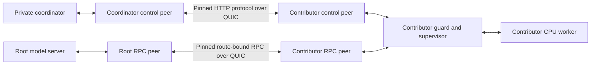

# Portable contributor workers

**Current version: v0.11.** The [process containment guide](CONTRIBUTOR_PROCESS_CONTAINMENT.md) explains the required Windows guardian, forced-crash cleanup and upgrade path. The [v0.10.1 status recovery guide](CONTRIBUTOR_STATUS_RECOVERY.md) describes the earlier Windows file-sharing correction. The v0.10 feature campaign below remains preserved as historical evidence.

Version 0.10 separates a contributor's CPU worker, protocol guard and two authenticated transports from the root's model server. The root no longer has to start the contributor's worker process or give the contributor its model API credential. The standalone package accepts the participant's own keys, a private invitation and explicit public route/peer settings.

This implements a private contributor operating path. The recorded installation still uses **one Windows computer, one operator account, one physical CPU/RAM domain and one slot**. It uses the already installed official Qwen3-32B Q4_K_M, with no second model download or GPU takeover. Configurations and process trees are separated; the OS account and hardware are shared. Independent-host, heterogeneous-GPU, adversarial-engine, economic and public-admission qualification remain open.

## Why this change matters

Previously, the private root-side cluster launched both CPU workers, and each stage polled the root backend's `/v1/models` endpoint with the backend API key. That arrangement demonstrated real complete-route execution, but was unsuitable as a contributor package: a separately operated stage should not require the root's private model credential or a coordinator checkout.

The new contributor owns these components:

| Component | Purpose | Local exposure |
|---|---|---|
| CPU RPC worker | Store assigned tensors and execute the pinned engine protocol | Loopback TCP only |
| Stage guard, in the Node supervisor | Check execution capabilities, claim work, observe ordered compute, retain receipts | Loopback HTTP and TCP only |
| Node control link | Exchange allowed node messages with one pinned coordinator identity | Loopback HTTP forwarder and authenticated QUIC |
| Stage RPC link | Carry the paired root's route-bound model traffic to the guard | Authenticated QUIC to the loopback guard |



Repeat the contributor side for each stage in a complete route. The registry's node URL points at the coordinator-side control forwarder. The contributor's local guard port may differ. The two QUIC protocols retain different application identifiers and keys; a control connection cannot act as a model-data connection.

## Becoming ready without the model API key

1. The participant registers or resumes its node with its own Ed25519 signing identity and invitation. A new boot fences previous epochs.
2. Its worker and guard complete the pinned engine's RPC handshake. The guard creates a fresh UUID for that connection. Plain connection establishment alone does not prove the model is loaded.
3. The stage signs a request to `POST /api/v1/nodes/:id/stage-readiness`, with its epoch, route ID, exact route/model hashes, RPC generation and fresh 32-byte random challenge.
4. The coordinator reads the current model, root and complete route membership. It checks exact bindings, model/route qualification, root identity/boot/epoch, loaded backend model, ready/desired states, provider ownership, domains, accepted current terms, withdrawals and disabled accounts. Other stages may still be `VALIDATING`, so startup has no circular dependency.
5. If eligible, the coordinator returns an Ed25519 declaration under the distinct `NAI-READY` header and `network-ai-rpc-stage-readiness` audience. It includes the request's bindings and the observed root boot/epoch/time. Otherwise it returns `ready: false` without a declaration.
6. The stage verifies signature, audience, header, all bindings, current generation and challenge. Its new-admission gate also checks wall-clock and monotonic expiry. A fresh ordinary node heartbeat reports the resulting state back to the coordinator.

The maximum declaration lifetime is **four seconds**. Its expiry cannot exceed **six seconds after the root observation**, allowing normal two-second heartbeat scheduling while bounding stale readiness. The coordinator refuses observations from the future and declarations with less than 250 ms remaining. The stage permits up to 250 ms forward timestamp tolerance but never extends the signed expiry. Operators need synchronized clocks; large skew makes the stage unavailable.

A renewal in flight does not erase an unexpired declaration. A false, invalid or failed response clears it. Expiry itself closes new admission even if the pending request has not returned. RPC disconnect clears prepared work and readiness; a new connection cannot reuse the old generation's declaration. A declaration is not independently verifiable proof of model correctness: it combines a trusted coordinator's root observation with the guard's local connection observation.

## Execution and economics

Readiness does not authorize compute, reserve physical capacity, issue credits or change any payout. The existing signed prepare/execute capabilities, route binding, stage claim, whole-route admission, physical-domain exclusion and receipt-dependent settlement remain in force. Already admitted execution has its own bounded capability deadline; a readiness renewal is not a new execution authorization.

The contributor permits an explicit initial engine allowance of at most four compute commands and 256 MiB for ten minutes. It closes that allowance on the first loaded/ready observation. Initialization is operator-funded and unbillable. It cannot become an unlimited idle earning mechanism. A restart after a broken model connection requires coordinated model reload; there is no inference replay or automatic creation of new sessions.

The private `LAB_TU` ledger, existing-credit funding and cooperative rules are unchanged. These tests do not establish public issuance, profitable exchange, lower API prices, independent ownership or sustainable economics. The unsuccessful F0 economic studies retain their original results.

## Standalone participant setup

The [package README](../../packages/contributor/README.md) gives the complete operator workflow and an [editable Windows settings example](../../packages/contributor/examples/settings.windows.json). Its commands are `identity`, `configure`, `check`, `start`, `status`, `stop` and `upgrade`.

The package has one declared bundled JavaScript dependency, Zod. Packing uses an isolated staging directory with the installed exact dependency, without changing the workspace's pnpm linker. The pack script extracts the resulting artifact and launches its CLI and identity command from the extracted package. This proves the package can resolve its own source/dependency without importing the coordinator's source tree; it does not prove physical-host or OS security isolation.

```powershell
pnpm contributor:pack
```

The command prints the archive path, version, SHA-256, byte size and extraction result. Generated artifacts stay below `.runtime/`. The archive includes source, examples and applicable licenses. It excludes the model, upstream engine, Node runtime, compiled transport binaries and private profiles. Review and obtain those prerequisites as described in the package guide.

The worker profile has a strict schema and no extension field for arbitrary engine arguments or environment variables. Generated children receive only a short OS environment allowlist, plus their own control-link configuration and disabled RDMA upgrades. Every file of the tested Windows CPU engine, including DLLs, is pinned; link binaries use the operator's explicit SHA-256. Existing identities and different profile contents are never silently overwritten.

## Upgrade the existing managed demonstration

First build the transport binaries and control application, with accepted sessions/windows completed. On Windows, stop owned route processes before rebuilding an executable they may be using. Preserve the private database, applied migrations and signing state. The general `lab:start`/`lab:stop` workflow remains available.

```powershell
pnpm --filter @network-ai/control-api build
cargo +1.93.1 build --locked -p network-ai-link
cargo +1.93.1 build --locked -p network-ai-contributor-guardian
pnpm lab:route-contributors enable
pnpm test:contributors
```

The installer checks that the original route is qualified and has no pending session or accepted readiness window. It creates separate contributor profiles and transport identities, snapshots the built links, preserves the original stage signing identities, and refuses pending old receipts. It keeps the same root, stages, provider account, resource domain, model artifact and route hash. It then selects external worker supervision for the root model server and starts the full group. Restart the coordinator after deploying the new control code; it must serve the signed readiness endpoint before contributors can become ready.

The managed same-host ports are deliberately explicit:

| Path | Stage 1 | Stage 2 |
|---|---:|---:|
| Coordinator HTTP forwarder / registered node URL | 43125 | 43126 |
| Contributor guard HTTP | 43225 | 43226 |
| Contributor HTTP forwarder to coordinator | 43141 | 43142 |
| Raw worker RPC | 43840 | 43841 |
| Guard RPC | 43842 | 43843 |
| Root local RPC forwarder | 43844 | 43845 |
| Stage RPC QUIC UDP | 43930 | 43931 |
| Root RPC QUIC UDP | 43932 | 43933 |
| Coordinator control QUIC UDP | 43951 | 43953 |
| Contributor control QUIC UDP | 43952 | 43954 |

The installed root backend remains on 43224 and the root node on 43124. None of these process counts changes the physical-domain slot count. To return to the previous private supervision, run `pnpm lab:route-contributors disable` after work has drained. Disable portable contributors before disabling their required QUIC transport. A failed startup retains the selected profile for diagnosis; it does not silently restore root credentials.

## Failure, recovery and evidence

The supervisor reports `STARTING`, `WAITING_ROOT`, `READY`, `STOPPING`, `STOPPED` or `FAILED` with its PID, boot ID and current timestamp. A tracked child failure closes the guard and drains the contributor's other children. The graceful stop command is bound to the live boot. The root owns only its model process when contributors supervise the workers. Group recovery reuses the original node signing identities and reloads model tensors.

Version 0.11 adds a required [Windows job guardian](CONTRIBUTOR_PROCESS_CONTAINMENT.md) for normal contributor descendants. It addresses supervisor/guardian termination without depending on JavaScript cleanup. Root-model service supervision, hostile-peer resource limits and OS-user isolation remain separate work. The next startup still refuses occupied ports. Inspect recorded ownership before recovery. The [upstream prototype RPC warning](https://github.com/ggml-org/llama.cpp/blob/b29c606e2/tools/rpc/README.md) still applies.

The preserved [v0.10 contributor campaign](evidence/qwen3-32b-portable-contributors.json) completed five real 32B requests, concurrent consumers sharing one slot, loss of an owned control-link child during execution, loss of an owned CPU worker, zero-charge failure handling and full-group recovery. It checked actual QUIC byte counters, the root receipt, both observed stage receipts, payouts and ledger projections. Control-link failure took 17,482 ms to reach the recorded terminal/refunded observation; worker failure took 1,655 ms. These are measured acceptance outcomes, not a public failure-detection SLO. No additional grant or clock/ownership fabrication was introduced. Signature/expiry/profile tests use explicit fabricated fixtures and are reported separately from actual model execution. The [v0.10 validation](validation-v0.10.json) and [original package record](evidence/contributor-package.json) remain unchanged. The [v0.11 containment campaign](CONTRIBUTOR_PROCESS_CONTAINMENT.md#september-15-2026-measurements) adds actual supervisor/guardian termination, complete affected-process cleanup and another real status-lock regression.

Remaining work includes independent Windows/Linux/GPU operator profiles, hardware and cost qualification, private/WAN transport tests, NAT/relay operation, OS resource limits and isolation, public admission, independent work verification, distributed continuity, issuance and payment settlement. The project continues to prioritize models above 27B; larger model support still depends on a qualified complete route, not a sum of advertised VRAM or additional node names.
