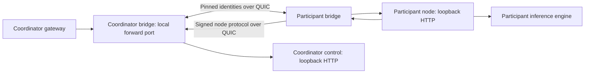

# Authenticated private node links

The `network-ai-link` daemon connects an invited node to its coordinator through direct QUIC. The application continues using loopback HTTP on each machine; a pair of bridges carries only the assigned node protocol between them. This extends the private profile without exposing PostgreSQL, browser login, account administration, or arbitrary proxy destinations.

The implementation uses [Iroh 1.2.0](https://docs.rs/iroh/1.2.0/iroh/struct.EndpointAddr.html). Each participant creates a separate persistent Ed25519 transport identity. Both configurations pin the other participant's public identity. Node message signatures, one-use invitations, session capabilities, epoch fencing and ledger idempotency remain in force inside the connection. Transport authentication does not verify the model's computation.

## Topology



One pair currently represents one invited node. Additional nodes use separate profiles and unused ports. Multiple peers do not automatically partition a model. A shared physical GPU must still have one correctly assigned resource domain.

## Prepare each machine

Build with `cargo build --locked -p network-ai-link -p network-ai-node`. The coordinator also runs the normal gateway and control service. Use a working private installation and a compatible local inference engine on the participant.

On **each** machine, create a private identity directory:

```bash
node scripts/link-config.mjs identity --directory .runtime/my-link
```

Exchange only `identity.json`. Check its public identity through an already trusted channel. Keep `identity.private.json` on the machine that generated it. The generator restricts the directory to the current account and refuses to overwrite existing identity files.

The administrator creates an ordinary node invitation. Its `base_url` is the coordinator bridge's **local forward endpoint**, for example `http://127.0.0.1:43112`. The invitation now includes a portable `operator` section with public configuration; it contains no database credentials or coordinator signing key.

Configure the coordinator bridge:

```bash
node scripts/link-config.mjs configure --directory .runtime/my-link --role control --node-id NODE_UUID --peer-file participant-identity.json --peer-address PARTICIPANT_IP:43813 --bind COORDINATOR_IP:43812 --forward-port 43112 --target-port 43101
```

Configure the participant bridge:

```bash
node scripts/link-config.mjs configure --directory .runtime/my-link --role node --node-id NODE_UUID --peer-file coordinator-identity.json --peer-address COORDINATOR_IP:43812 --bind PARTICIPANT_IP:43813 --forward-port 43114 --target-port 43113
```

Replace the uppercase placeholders with the invitation UUID and explicit reachable IP addresses. These examples use control port 43101, node port 43113 and different local bridge ports. Both machines need reachable UDP at their configured bind address; `0.0.0.0` is a bind address, never a peer destination. Keep the forward listener on loopback, as enforced by the daemon.

On each host, set `NETWORK_AI_LINK_CONFIG` to its private `link.json`, then run `network-ai-link`. On Windows, the executable is `target/debug/network-ai-link.exe`; PowerShell sets an environment variable with `$env:NETWORK_AI_LINK_CONFIG = 'absolute path'`.

On the participant, create its independent node profile:

```bash
node scripts/node-config.mjs --invite-file invitation.json --backend-model EXACT_BACKEND_ID --backend-url http://127.0.0.1:1235 --backend-kind lmstudio --port 43113 --control-port 43114 --directory .runtime/operator
```

Use `openai` for a compatible non-LM-Studio text server. Set `NETWORK_AI_CONFIG` to the generated operator `config.json` and run `network-ai-node`. Its registration, heartbeat, claim and receipt travel through the participant bridge. The gateway reaches preparation and execution through its coordinator bridge. A legacy invitation without the portable section still requires the coordinator's local configuration during profile generation.

## Enforced boundaries

The node-facing side permits `GET /health`, `POST /prepare` and `POST /execute`. The control-facing side permits registration and only the assigned node's resume, heartbeat, claim and receipt paths. Queries, other node IDs, admin routes and alternative methods are rejected. Only authorization and the three node-signature headers cross the bridge. Cookies and the gateway secret are dropped.

The protocol has an 8 KiB header, 128 KiB request body, 64 KiB response frame, 8 MiB total response and 195-second overall deadline. Connection establishment has a shorter deadline. Each side bounds concurrent connections and requests; streamed responses use a four-frame channel for backpressure. A mandatory terminator distinguishes complete responses from transport truncation. Neither side automatically retries execution. Existing application identities govern safe retries and refunds.

Stopping a bridge interrupts affected transport. The node and coordinator then apply their normal heartbeat, deadline, refund and outbox rules. Transport keys are separate from node signing keys. Replace a transport key by stopping the pair, generating a new local identity in another private directory, updating the peer's pinned identity, and restarting. Revoking the node still blocks signed control operations even if a transport connection remains reachable.

## Evidence and remaining qualification

`cargo test --locked -p network-ai-link` covers real authenticated QUIC, both forwarding directions, binary/UTF-8 bodies, forbidden routes, header filtering, oversized bodies, an unauthorized peer, repeated completed requests and peer disappearance. Its HTTP fixture is a protocol test, not inference evidence.

`pnpm test:link` runs a separate real-model campaign through the application, temporarily enrolls a node, checks settlement and funded readiness, and retires its temporary model/node afterward. The September 14 campaign completed all those steps on one physical computer. Private details remain under `.runtime/private-lab/link-campaigns/`.

**Relay service, CGNAT traversal, WAN performance, independent hosts and public admission are not qualified.** Relays are disabled in this version. This HTTP link does not carry model-stage tensors. The separate [v0.9 guarded RPC transport](GUARDED_RPC_TRANSPORT.md) now carries those bytes for the installed private 32B route. Neither transport provides Byzantine consensus, conceals data from the paired compute operator, or establishes independent-host qualification.
