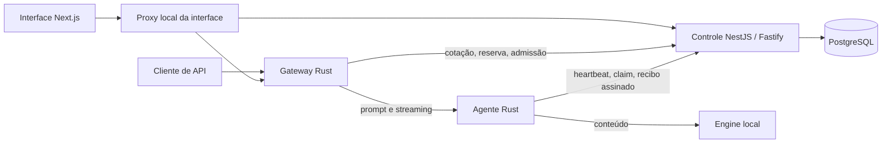

# Produto privado v0.2

**Autoria e direção: Dev-Encrypted.** Esta versão integra interface, controle, PostgreSQL, gateway e agente de nó com uma engine local real. É um ambiente privado executável. A rede pública e a economia cooperativa de destino continuam em validação.

- [Instalação e operação](OPERATIONS.md)
- [Contratos da API e protocolo](API.md)
- [Contabilidade e limites de confiança](ACCOUNTING.md)
- [Cobertura e critérios pendentes](STATUS.md)
- [Decisões de implementação](PRIVATE_PREVIEW.md)
- [Direção e revisão visual](DESIGN.md)

## Componentes



O conteúdo da conversa passa pelo proxy da interface, gateway, agente e engine. O controle e o banco recebem metadados, hashes, uso e valores. O navegador mantém a conversa em memória somente enquanto a aba permanece aberta. A política de logs e retenção da engine é responsabilidade do operador; este projeto não a modifica.

O controle é um coordenador único neste perfil. Registrar vários agentes no mesmo computador não transforma o laboratório em uma rede de operadores independentes. Os experimentos QUIC e Petals permanecem no [corte F0](../execution/README.md).

## Uso local

Requisitos: Node.js 24, pnpm 10.33.0, Rust 1.93.1, Docker com Compose e uma engine local. No Windows, use PowerShell. A engine já existente não é instalada, substituída nem descarregada pelo inicializador.

```powershell
pnpm install --frozen-lockfile
pnpm lab:init
pnpm lab:start
```

A interface abre em `http://127.0.0.1:43100`. O inicializador informa o caminho do arquivo privado de credenciais. O perfil incluído identifica o modelo LM Studio observado na bancada; outro ambiente deve configurar seu próprio manifesto e agente conforme o [guia operacional](OPERATIONS.md).

Código original: [Apache 2.0](../../LICENSE). Documentação original: [CC BY 4.0](../../LICENSES/CC-BY-4.0.txt). Dependências e modelos mantêm suas licenças.
