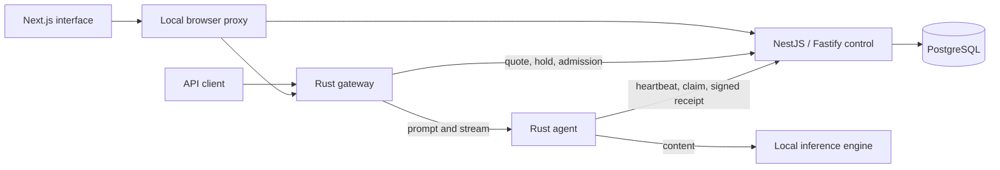

# Private application v0.2

**Created and directed by Dev-Encrypted.** This release connects the interface, control service, PostgreSQL, Rust gateway, and Rust node to a real local inference engine. It is an executable private environment. Public decentralized operation and the proposed cooperative economy still require qualification.

## Read the manual

- [Installation, model registration, operation and recovery](OPERATIONS.md)
- [API and node protocol](API.md)
- [Laboratory accounting and trust boundaries](ACCOUNTING.md)
- [Implemented coverage and actual validation](STATUS.md)
- [Implementation decisions](PRIVATE_PREVIEW.md)
- [Interface design](DESIGN.md)

## Components and data flow



Conversation content passes through the browser proxy, gateway, node and engine. The control service and database receive metadata, digests, usage and amounts. The browser keeps the conversation in tab memory. The operator controls the engine's logging and retention policy.

There is one coordinator in this profile. Multiple agents on one host do not establish independent operators or split a model automatically. QUIC and Petals experiments remain separate [F0 research](../execution/README.md).

## Start locally

Prepare Node.js 24.13.0, pnpm 10.33.0, Rust 1.93.1 and Docker with Compose. A compatible local inference backend is required for real responses.

```bash
pnpm install --frozen-lockfile
pnpm lab:init
pnpm lab:start
```

Open `http://127.0.0.1:43100`. The initializer prints where to find private credentials. The supplied profile identifies the original LM Studio artifact; another installation must register its own exact manifest and node using the [operator guide](OPERATIONS.md).

The current UI is Brazilian Portuguese. The [beginner guide](../GETTING_STARTED.md) translates navigation labels. The repository's maintained public documentation is English.

## Large-model scope

NETWORK AI prioritizes models above 27B, but this release's measured model is the original community 27B/Q4 local profile. Distributed execution of larger models is a [roadmap requirement](../planning/12_ROADMAP_AND_BACKLOG.md), not a delivered feature. Read [model scaling](../MODEL_SCALING.md) before estimating contributors or devices.

Original code: [Apache 2.0](../../LICENSE). Original documentation: [CC BY 4.0](../../LICENSES/CC-BY-4.0.txt). Dependencies and model artifacts retain their own terms.
