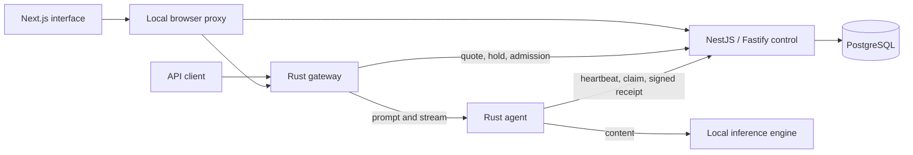

# Private contributor preview v0.10

**Created and directed by Dev-Encrypted.** This release connects the interface, control service, PostgreSQL, Rust gateway, and Rust node to a real local inference engine. It is an executable private environment. Public decentralized operation and the proposed cooperative economy still require qualification.

## Read the manual

- [Installation, model registration, operation and recovery](OPERATIONS.md)
- [API and node protocol](API.md)
- [Laboratory accounting and trust boundaries](ACCOUNTING.md)
- [Implemented coverage and actual validation](STATUS.md)
- [Implementation decisions](PRIVATE_PREVIEW.md)
- [Interface design](DESIGN.md)
- [Authenticated private node links](PRIVATE_LINK.md)
- [Guarded model-stage RPC transport, installation and recovery](GUARDED_RPC_TRANSPORT.md)
- [Portable contributor workers, signed readiness and standalone packaging](PORTABLE_CONTRIBUTORS.md)
- [Funded availability and temporary quotas](AVAILABILITY.md)
- [Verified model artifacts and the trusted CPU cluster adapter](MODEL_ARTIFACTS.md)
- [Complete routes, stage agents, consent and participant settlement](COMPLETE_ROUTES.md)
- [Complete-route readiness budgets, component obligations and refunds](ROUTE_AVAILABILITY.md)
- [Cooperative funding, readiness-only terms, recycling and exact refunds](COOPERATIVE_FUNDS.md)
- [Bounded automatic renewal, spending authority and provider mandates](BOUNDED_RENEWALS.md)
- [Demand-backed expansion, essential protection and private economic evidence](DEMAND_BACKED_EXPANSION.md)

## Components and data flow



Conversation content passes through the browser proxy, gateway, node and engine. The control service and database receive metadata, digests, usage and amounts. The browser keeps the conversation in tab memory. The operator controls the engine's logging and retention policy.

There is one coordinator in this profile. The private QUIC bridge now carries the actual node protocol, while the original transport and Petals benchmarks remain preserved as [F0 research](../execution/README.md). Multiple agents on one host do not establish independent operators or split a model automatically.

## Start locally

Prepare Node.js 24.13.0, pnpm 10.33.0, Rust 1.93.1 and Docker with Compose. A compatible local inference backend is required for real responses.

```bash
pnpm install --frozen-lockfile
pnpm lab:init
pnpm lab:start
```

Open `http://127.0.0.1:43100`. The initializer prints where to find private credentials. The supplied profile identifies the original LM Studio artifact; another installation must register its own exact manifest and node using the [operator guide](OPERATIONS.md).

The current UI is Brazilian Portuguese. The [beginner guide](../GETTING_STARTED.md) translates navigation labels. The repository's maintained public documentation is English.

## Large-model scope

NETWORK AI prioritizes models above 27B. The original integrated profile is a community 27B/Q4 model; version 0.3 adds a pinned official Qwen3-32B GGUF manifest, verified acquisition and a trusted CPU cluster experiment. Consult the [current evidence](STATUS.md) for measured outcomes. Independent multi-participant execution remains a [roadmap requirement](../planning/12_ROADMAP_AND_BACKLOG.md). Read [model scaling](../MODEL_SCALING.md) before estimating contributors or devices.

Version 0.4 adds a complete signed-agent route around two real CPU workers, including all-stage preparation and claims, atomic shared-domain admission, participant consent and receipt-dependent payouts. Its managed installer keeps one model copy active. The real campaign covers completed requests, concurrent admission and stage loss on the same computer; it does not close the independent-participant requirement.

Version 0.5 adds a fully funded readiness window for the complete route. Its providers accept one set of terms; each component earns its agreed maximum in proportion to observed ready time. A stage failure does not retroactively remove healthy providers' accepted commitments. The common physical-domain registry prevents overlapping readiness payments across route and standalone contracts. The [guide](ROUTE_AVAILABILITY.md) explains the additional compensation, fixed deadlines, private trust boundary and measured campaign.

Original code: [Apache 2.0](../../LICENSE). Original documentation: [CC BY 4.0](../../LICENSES/CC-BY-4.0.txt). Dependencies and model artifacts retain their own terms.


Version 0.6 adds opt-in cooperative funds. Existing credits finance accepted whole-route windows; verified consumption replenishes the fund using a deterministic floor-first allocation. The real installed 32B route funded its next window from recycled consumption without another contribution. The interface includes plans, transparent compartments, provider consent and the chat's explicit consumption destination. [Full guide and limitations](COOPERATIVE_FUNDS.md), [versioned validation](validation-v0.6.json).

Version 0.7 adds automatic continuation within explicit limits. A fund manager authorizes finite gross working/reserve commitments and window counts; each provider separately authorizes its exact route participation. The coordinator funds and accepts a complete window atomically when all permissions, deadlines, capacity and funds permit. The actual one-host 32B campaign renewed a second window from consumed credits and blocked a third after provider revocation. [Contracts, API and recovery](BOUNDED_RENEWALS.md), [versioned validation](validation-v0.7.json).
