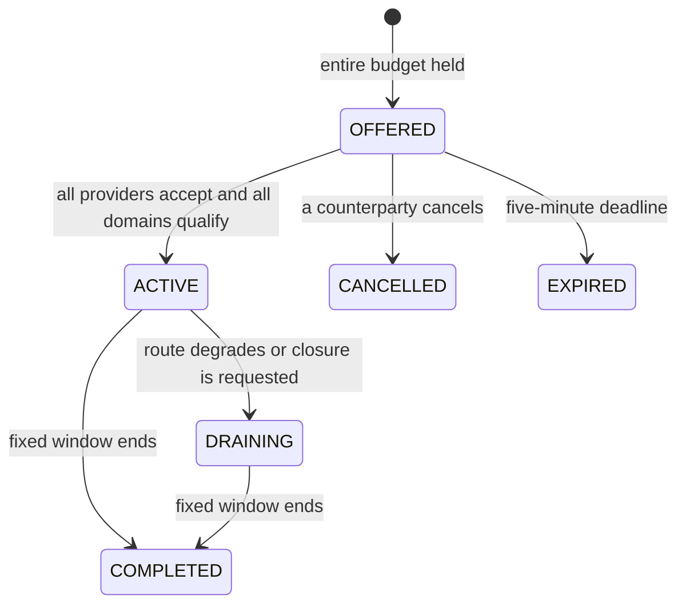

# Funded readiness for a complete route

Version 0.5 lets a sponsor fund **one bounded readiness window for an entire qualified route**. All providers review and accept the same terms. Each component then earns its agreed part of the budget for observed ready time. A root and its workers cannot obtain separate overlapping readiness contracts for the same declared physical capacity.

This is executable private software using existing `LAB_TU`. It does not issue cooperative TU, operate a common treasury, collect money or prove that recurring demand can fund the network. The [failed economic study](../execution/ECONOMY_V1_RESULTS.md) remains unchanged. The network's intended focus above 27B makes complete-route obligations especially relevant, but parameter count does not determine a fair price or a fixed number of contributors.

## A concrete example

A sponsor requests 30 seconds at 1,000 microcredits per second for a root and two workers. The **whole** budget is 30,000 microcredits, or 0.030 LAB_TU. It is moved from the sponsor's available balance into escrow when the offer is created.

The route's previously accepted 10% / 45% / 45% allocation produces these maximum payments:

| Component | Maximum for the window | If observed ready for all 30 seconds |
|---|---:|---:|
| Root | 3,000 microcredits | 3,000 microcredits |
| Worker 1 | 13,500 microcredits | 13,500 microcredits |
| Worker 2 | 13,500 microcredits | 13,500 microcredits |
| Total | **30,000 microcredits** | **30,000 microcredits** |

The rate is for the entire route, not for each registered identity. The shares are agreed laboratory terms, not measured hardware costs. Providers may refuse an offer. Readiness compensation is **additional to the existing per-inference payment**, and both the API terms and interface disclose this before acceptance. Normal token settlement still allocates its experimental 80/20 provider/working-account split; this version does not silently divert it into readiness funding.

## Proposal, acceptance and activation

The sponsor selects an existing, qualified, completely ready route and records a purpose: requested use, a scheduled window or a bounded experiment. The reason is an operator statement, not proof of independent demand. There is no automatic fleet purchase or renewal policy.

Funding and creation use one serializable PostgreSQL transaction. Insufficient funds roll back the entire offer. A sponsor can have at most four open readiness contracts **across both standalone-node and complete-route APIs**. Offers expire after five minutes. Supported durations are 30–3,600 seconds.

The server freezes the route and model hashes, sponsor, members, physical domains, roles, shares, individual maximums, duration, total rate, purpose, reason and compensation/cancellation policy. A SHA-256 digest identifies these terms. Each distinct provider authenticates and accepts that exact digest. One account operating several members accepts for all of its members once; that is not evidence of independent operators.

The last acceptance activates the window only if:

1. Every provider accepted the same terms and the offer has not expired.
2. The original route and model remain qualified and every route participant still consents.
3. Every component is ready, unpaused, enabled, reports the configured backend model and has a heartbeat no older than five seconds.
4. None of the distinct physical domains has another accepted readiness contract.

All domains are checked and claimed atomically in a stable order. The common claim registry includes older standalone contracts. Shared domains appear once even when several stages use the same machine. If activation fails, the last acceptance and all its claims roll back; earlier acceptances remain available for a retry before expiry. The fixed duration starts only on successful activation.

These readiness claims prevent duplicate readiness compensation. They do **not** reserve an exclusive inference slot or give the sponsor queue priority. Inference admission independently reserves physical execution capacity for actual sessions.

## Measuring payment without inventing missing time

The coordinator samples about every two seconds. Each payable component interval needs ready observations at both ends, a matching boot epoch, and no more than six seconds between observations. A long coordinator outage, missing heartbeat, pause, withdrawal, disabled provider, unqualified model or changed epoch does not earn an estimated payment. A new boot can begin another eligible interval after fresh observations; the transition interval is not credited.

First, prefix rounding divides the fixed window budget exactly:

```text
budget = duration_seconds × route_rate_microcredits_per_second
component_maximum[i] = floor(budget × cumulative_share[i] / 10000)
                     - floor(budget × cumulative_share[i-1] / 10000)
```

Every component must receive a positive maximum. The individual maxima sum to the one funded budget. Payment uses accumulated milliseconds:

```text
component_total_due = floor(component_maximum × credited_ms / window_ms)
new_component_payment = component_total_due - already_paid
```

Accumulation carries fractional progress between samples. If every component is observed for the full window, the entire budget is payable without a rounding leak. With incomplete observations, every unpaid microcredit returns to the sponsor at closure. Several nodes owned by one account are combined into balanced journal lines without multiplying the budget.

The system also records **joint ready time**: intervals during which the entire original route satisfies its conditions. This is different from adding component seconds. A route may have a smaller joint-ready duration while still owing its healthy components for accepted obligations.

These are observations from authenticated agents and a trusted private coordinator. They do not independently prove hardware identity, correct work or honesty. A provider who remained available during an unobserved coordinator outage can be underpaid under this rule; automatic outage compensation has not been implemented.

## Failure, withdrawal and protected obligations



Before activation, a counterparty or administrator can cancel and recover the whole unused budget. After activation, the sponsor cannot retroactively cancel other providers' funded obligations. A closure request puts the window into `DRAINING`; the remaining escrow and domain claims stay until its original end.

A provider withdrawing from the window relinquishes **only its own future earnings**. Its other already-paid intervals remain final. Other components continue earning while individually eligible. If the sponsor also operates components, its cancellation relinquishes those components' future earnings as well. The interface makes this distinction with separate action labels.

A missing component makes the route drain and stops that component's payment. A model revocation makes affected components ineligible. Withdrawing a route participant makes that participant ineligible. Revoking the complete route prevents joint-ready credit while preserving still-eligible individual commitments for the remainder of the window. Restoring readiness can make later intervals payable, but it does not extend the deadline or silently renew the agreement. An incomplete route cannot obtain a new funded window.

At the fixed end, reconciliation finalizes eligible observed time, refunds the exact remainder to the original sponsor and releases every readiness claim. Cancellation, reconciliation and repeated requests serialize on the contract. A backward wall-clock adjustment cannot rewind the recorded checkpoint and replay an interval.

## API and interface

All paths below are relative to `/api/v1` and require authentication. Amounts are decimal strings in micro-LAB_TU.

| Method | Endpoint | Purpose |
|---|---|---|
| GET | `/availability/routes` | Sponsor/provider contracts; administrators can inspect all; includes members, acceptances and the latest 20 events |
| POST | `/availability/routes` | Reserve the entire window budget and propose immutable terms |
| POST | `/availability/routes/:id/accept` | A listed provider accepts `{ "terms_sha256": "<returned digest>" }` |
| POST | `/availability/routes/:id/cancel` | Cancel an offered window, or drain an active window while preserving other obligations |

Example offer; replace the illustrative UUID with an actual ready route:

```json
{
  "route_id": "00000000-0000-4000-8000-000000000001",
  "duration_seconds": 30,
  "rate_microtu_per_second": "1000",
  "purpose": "REQUESTED",
  "reason": "Keep this qualified route ready for a short scheduled group session.",
  "idempotency_key": "00000000-0000-4000-8000-000000000002"
}
```

Reuse the same account/key and body after a lost response. Identical retries return the original offer; changed terms return a conflict. The browser preserves this identity across a failed response while the offer's inputs remain unchanged. A successful new submission is a new offer.

In the PT-BR interface, open **Meus nós → Disponibilidade da rota completa**. Select the route, duration, total rate, purpose and reason. Review the one total budget before selecting **Financiar janela da rota**. Providers inspect the maximums and terms, then select **Aceitar janela**. The card displays individual payments, observed time, total spending, joint-ready time and the fixed end. Active participant withdrawal is labeled **Encerrar minha contribuição**; a sponsor without a contribution sees **Encerrar após os compromissos**.

## Validation and reproduction

The new real-PostgreSQL cases cover funding rollback, idempotency, access control, term immutability, every-provider consent, activation rollback, shared-domain exclusion in both APIs, concurrent activation, shared sponsor limits, component failure, withdrawal, outages, epochs, clock reversal, expiry, integer rounding, refunds and projections. They use explicit fabricated observations in isolated databases; they are not hardware evidence.

The [real installed-route campaign](evidence/qwen3-32b-route-availability.json) used this computer's actual signed agents and already-loaded 32B model. In its 30-second window:

- Initial idle observations paid every component without any inference request.
- An API pause stopped one stage's future readiness earnings while the other components continued earning; no worker process was killed in this campaign.
- The original route was resumed. A real request completed with 18 input and seven output tokens in 4,183 ms and separately settled 39,000 microcredits.
- Readiness paid 25,483 of its 30,000 reserved microcredits and refunded 4,517. All domain claims were released and accounting projections matched.

These payments use **one account on one physical host**, so they do not demonstrate income earned from independent buyers or sustainable circulation between people. The measured run performed no grants or cash transfers. Time is recorded in UTC in the raw report; the local campaign date was September 14, 2026 in São Paulo.

After explicitly installing the managed route, run:

```bash
pnpm test:integration
pnpm exec playwright test --grep 'complete route readiness'
pnpm test:route-availability --fault
pnpm test:backup
```

The live command funds one 0.030 LAB_TU window from the existing administrator balance, optionally pauses one managed stage, restores it, executes one real request and records an allowlisted report under `.runtime/private-lab/route-availability-campaigns/`. It creates no extra model copy. Run it without another readiness window on that domain. Normal per-request token charges remain additional. The browser campaign requires the installed route; GPU-less CI does not fabricate its readiness.

Migration 006 adds the contract, member, acceptance, event and shared-claim tables. Committed membership cannot be extended; runtime permissions prohibit editing accepted terms, consents or domain claims directly. Claim triggers synchronize accepted standalone and route windows. Backup verification uses an exported PostgreSQL snapshot for both the dump and source comparison, so ongoing payments cannot invalidate the comparison. The local campaign restored an active funded window and its domain claim, checked every member/escrow projection and preserved runtime restrictions. [Restore evidence](evidence/route-readiness-backup-restore.json). The database owner remains trusted.

Common-fund financing, consumption recycling, protected reserves, useful-route selection across demand cohorts, independently measured costs, mature-period economic acceptance and public decentralized trust are still separate requirements. This implementation supplies complete funded obligations on which that work can build; it does not close [FC01–FC06](../execution/GATES.md).
