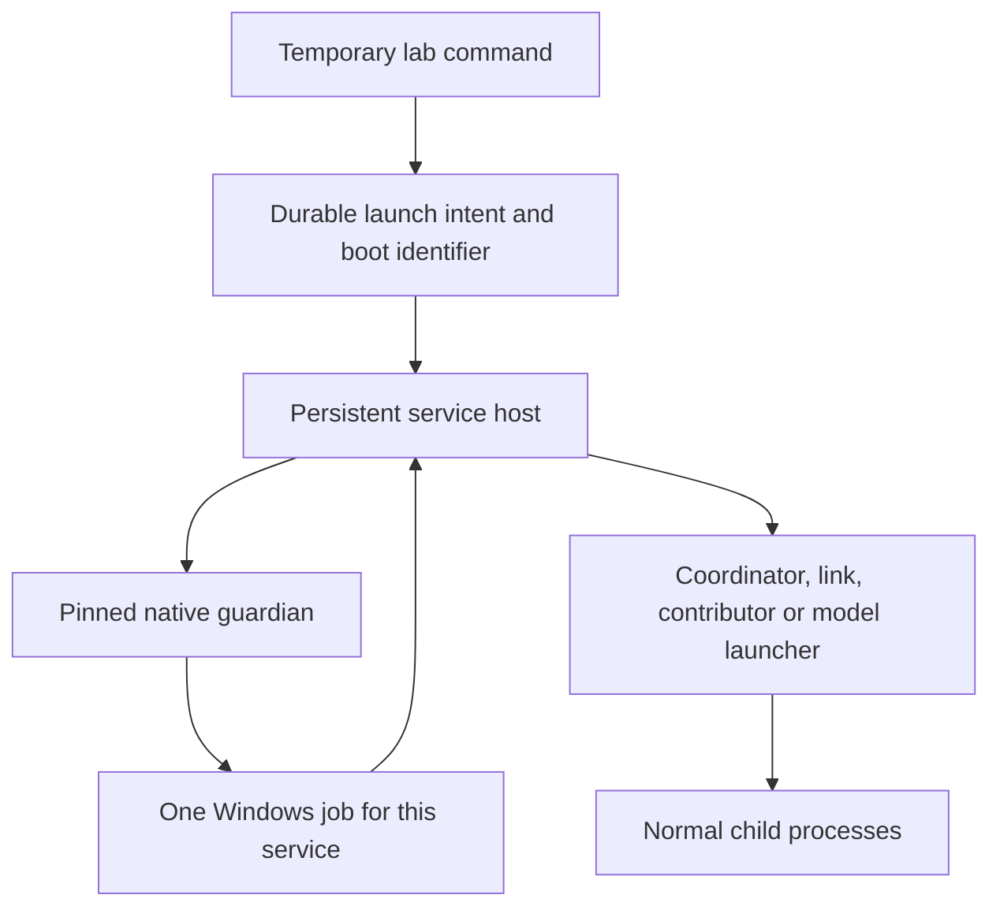

# Managed Windows services and crash recovery

Version 0.13 extends process ownership from individual contributors to the services launched by the private laboratory manager. The coordinator, gateway, web application, node agents, private links and root-model launcher each run under a separate persistent supervisor. If that supervisor disappears, its normal process tree must disappear with it. This prevents a failed model launcher from leaving an untracked model server using memory or accepting work.

This is a private Windows lifecycle mechanism. It does not install a Windows service, start the network after a reboot, isolate operating-system users or provide public high availability. The [versioned validation](validation-v0.13.json) distinguishes disposable process tests from actual 32B inference. The existing contributor source package remains version 0.12.0; the new service manager is part of the repository checkout.

## The processes involved



The command that starts the laboratory can exit while the managed services continue. It is never assigned to the service's job. Each service host first verifies the SHA-256 of its guardian and obtains a parent/boot-bound acknowledgement. Only then can it start the requested program. The guardian holds the sole non-inheritable handle to an anonymous job with kill-on-close enabled and breakaway disabled. Losing the host or guardian ends the associated process tree.

Contributors retain their existing inner guardian. Their outer service job owns the contributor supervisor and its normal descendants, while the contributor's job continues to own its worker and transports. The measured Windows configuration supports these nested jobs. Programs created through an outside broker or another operating-system service are outside this mechanism. Microsoft documents both normal child inheritance and the exceptions. [Windows job objects](https://learn.microsoft.com/en-us/windows/win32/procthread/job-objects).

LM Studio is an external inference service. NETWORK AI does not adopt or terminate its process tree. Stopping the managed application retains PostgreSQL and its volume. None of these ownership rules grants the right to stop another program merely because it listens on an expected port.

## Durable ownership and concurrent commands

Every launch has a random boot identifier and a private directory under `.runtime/private-lab/managed-services/<name>/<boot>/`. Its immutable profile selects the program, arguments, working directory, pinned guardian, allowed environment and optional graceful-shutdown mechanism. The registry records this launch intent before the service host is spawned. The host exclusively creates its identity record, preventing a second process from executing the same intent.

An identity includes process creation time as well as PID. A reused PID is insufficient proof of ownership. The current executable, exact private profile path and boot identifier must also agree. The profile's SHA-256 is recorded with the identity; an unexpected profile edit refuses further ownership-dependent operations. A diagnostic status file is not an authority to terminate or reuse a process. Windows can briefly retain a dying process row with cleared command/path fields; observation retries are bounded, and an unreadable live process retains its registry entry for inspection.

Process queries use the operating system's Windows PowerShell executable with an empty module search path and explicit imports from its system module directory. The query closes standard input, emits UTF-8 and retains its five-second limit. It receives a filtered OS environment and only the required process-query fields. This avoids a module-discovery startup stall measured on hosted Windows without inheriting user module paths or coordinator credentials. The fixtures also use accented and non-Latin private directory names to check actual command-line ownership. PowerShell constructs and searches module paths at startup; the measured regression and diagnostic cases are preserved in the [initial observations](evidence/service-initial-observations-v0.13.json). [Microsoft's module-path rules](https://learn.microsoft.com/en-us/powershell/module/microsoft.powershell.core/about/about_psmodulepath?view=powershell-7.5).

Registry mutations reread the latest registry under one path-bound kernel mutex, then publish the result atomically. The native mutex helper checks its actual parent and acknowledges the current launch/key. It releases the mutex when the command releases its pipe or exits. Losing that helper while a command owns the lock terminates that disposable command. If a previous lock owner exits, the next command still reads and validates the registry; it does not assume partially written state is valid. Windows explicitly distinguishes abandoned mutex acquisition from an ordinary successful wait. [Mutex wait results](https://learn.microsoft.com/en-us/windows/win32/api/synchapi/nf-synchapi-waitforsingleobject).

The mutex uses the Windows `Global` namespace so separate logon sessions address the same path-bound lock. A session-local namespace would give each Windows session a different lock for the same registry. This namespace selection follows the operating-system contract; actual multi-session acceptance is still separate from the single-session fixtures recorded here. [Kernel object namespaces](https://learn.microsoft.com/en-us/windows/win32/termserv/kernel-object-namespaces).

If the starting command disappears between process creation and registry PID publication, a later start reconciles the saved intent with the current process identity. It adopts the same live boot instead of launching a duplicate. Ambiguous matches fail for inspection. Registry deletion compares the previous boot and PID, so an older stop command cannot erase a newer launch record.

On Linux the registry uses `flock`; the Windows service-host mechanism is not enabled there. That fallback does not establish equivalent Linux crash containment. These locks coordinate project commands in the tested local environment. They are not a consensus protocol, a defense against a hostile process with the same OS identity, or a replacement for database transactions.

## Environment and status

Children receive the existing restricted OS environment plus the explicit values needed by their role. The coordinator, node and gateway receive their private configuration path. The web process receives only its local control/gateway addresses and telemetry setting. Control links receive their own link configuration. Contributors retain their participant-only profile and filtered environment; installing outer supervision does not add coordinator credentials to them.

`pnpm lab:status` reports service ownership, the actual child process, diagnostic freshness and containment separately from the application health check. A running wrapper cannot certify a loaded model, accepted readiness contract or available physical slot. The model/node endpoints and current contributor protocol still determine readiness.

A viewer holding `status.json` open without delete sharing can temporarily prevent atomic replacement on Windows. The service preserves healthy work and reports unavailable/stale diagnostics; it resumes publishing after the viewer releases the file. Failures writing identity, launch or receipt state are different from a replace-only diagnostic sharing conflict. Raw status includes local paths, process identities and configuration references. Keep it private; publish selected evidence only.

## Install or upgrade an existing private checkout

Finish or drain accepted requests and readiness windows, take a backup and stop the managed application before changing binaries. Preserve all private identity/configuration files and the exact bytes of applied migrations.

```powershell
pnpm lab:backup
pnpm lab:stop
pnpm install --frozen-lockfile
cargo build --locked -p network-ai-contributor-guardian
pnpm build
pnpm lab:start --no-build
pnpm lab:status
```

The first managed Windows launch snapshots the built guardian into the private `service-supervision` directory, verifies the copied bytes and records its hash atomically. Existing service pins are retained on later starts. A rebuilt `target/debug` executable does not silently replace the installed guardian. A missing or changed installed binary fails closed. The original contributor guardian and transport pins remain independent and unchanged.

Version 0.13 adds no database migration, grant, model download, route identity or provider account. Installing it does not create more physical capacity. The source checkout, Node 24, locked dependencies, Rust toolchain and the already qualified inference engines remain prerequisites. Existing setup instructions still apply for a new laboratory. [Operations](OPERATIONS.md).

## Stop and recover

`pnpm lab:stop` addresses only tracked owned services. Its stop request names the current boot. Contributors receive their existing boot-bound graceful-stop request; model launchers receive their private shutdown file. The host waits up to ten seconds for a configured graceful stop, then terminates the child and exits. Closing the job also cleans up remaining normal descendants. Other service types terminate their owned child directly. This is bounded cleanup, not a promise that every engine flushes state successfully.

There is no automatic process respawn. Inspect the affected session, billing state, receipts and resource claims before an explicit restart. Existing coordinator epochs, receipt reconciliation and contract rules remain responsible for accounting; the operating-system job does not settle credit balances.

The source RPC transport also improves graceful shutdown inside one process. `RpcLink.close()` waits for owned listener tasks, drops its endpoint reference and checks that its UDP address can be bound again. The address check is bounded to three seconds and returns an error if the address remains occupied; the complete graceful shutdown can take longer. It does not terminate another owner or silently retry a model request. Tests require immediate port reuse after successful close and an explicit failure when an exported endpoint clone retains the socket. This is separate from Windows job termination. The real 32B campaign retained its original pinned transport executables, so it does not qualify a rebuilt transport binary; this source change is covered by the Rust suite. Installed pins are never replaced automatically.

After a model-stage or root-model failure, reload the complete route because its connections and session epochs may no longer be usable. For the installed mixed demonstration:

```powershell
pnpm lab:device-route stop --id qwen32-mixed
pnpm lab:device-route start --id qwen32-mixed
```

Other installations must use their own installed recipe ID. A cold 32B load can take several minutes on the measured computer. A diagnostic observation timeout alone is not evidence that startup failed: retain the active launch and inspect the actual owned process and model health before retrying.

## Reproduce the checks

Build the guardian, then run `pnpm test:guardian` on Windows. The disposable fixtures cover host, guardian and child loss; preservation of an unrelated sibling; stale stop requests; concurrent registration; interrupted launch reconciliation; abandoned registry ownership; invalid guardian pins; and a read-only status viewer. They create private temporary directories and do not load a model. The original contributor fixtures remain in the same suite.

With the measured device recipe running and no unrelated sessions or windows, run:

```powershell
pnpm test:devices --id qwen32-mixed --root-host-fault
pnpm test:faults
pnpm test:outbox
pnpm test:backup
```

The first command makes real mixed-device requests, observes the owned model server, interrupts the root service host during a stream, checks zero-charge terminal accounting and released physical claims, verifies process-tree cleanup and unchanged sibling identities, then reloads the route and generates another answer. The node and outbox campaigns separately check epoch fencing and receipt settlement across coordinator loss. Private reports remain under `.runtime/`.

Read [the selected real-model evidence](evidence/qwen3-32b-service-supervision-v0.13.json) for observed results and durations. Terminal/refund/cleanup observation time includes protocol and polling delays; it is neither raw OS termination latency nor a recovery SLA. All model evidence still comes from one computer and one operator. Installed-service recovery, reboot tests, broader OS/GPU coverage, independent machines, public verification, measured exchange prices, issuance and cash settlement remain unfinished.

Copyright 2026 Dev-Encrypted. Original documentation: CC BY 4.0. Referenced third-party documentation retains its own terms.
