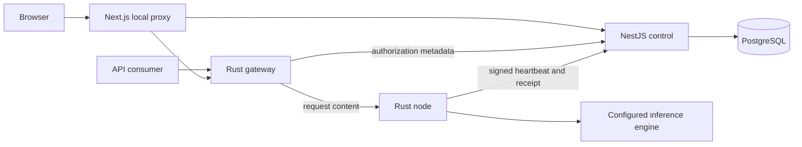

# 03. Architecture and failure boundaries

## Four planes

| Plane | Owns | Must not be confused with |
|---|---|---|
| Control | Identity, catalog, admission, assignments, policy and discovery | Numerical model execution |
| Inference | Prompts, tensors where applicable, session state, streaming and cancellation | Catalog registration or file distribution |
| Artifacts | Pinned manifests, integrity, downloads, caching and distribution | Proof that the downloaded model has executed |
| Accounting and audit | Quotes, holds, obligations, receipts, settlement and reversals | Verification of a malicious operator's computation |

The intended architecture supports complete-model nodes, nearby GPU clusters, and model stages across participants. Models above 27B are a primary motivation for the latter two paths. The [scaling guide](../MODEL_SCALING.md) explains the physical constraints.

## Current deployment

The private profile uses loopback HTTP with authenticated application messages. Its control service and database receive metadata, hashes, usage, and amounts, rather than prompt and answer bodies. The proxy, gateway, node, and engine handle content. The engine operator retains control over its own logs.

This deployment is one coordinator and one trust domain. The independent QUIC and Petals benches do not become an integrated decentralized runtime through this diagram.

## Admission before execution

A session begins with an immutable model profile and an expiring quote. Its maximum charge is reserved transactionally. The scheduler selects a fresh qualified node with a free physical-domain slot. Prepare reserves the node's local slot; a single-use claim authorizes the attempt before the engine is called.

The attempt binds the session, node identity, epoch, request digest, model manifest, limits, and deadline. Receipt processing settles the original attempt idempotently. Old epochs and conflicting receipts cannot be accepted as a new successful execution.

## Extending to a complete distributed route

A future route coordinator must reserve all required stages consistently. Partial placement cannot be advertised as a complete service. The plan must specify activation interfaces, stage versions, state ownership, timeouts, cancellation propagation, and funded component contracts.

One participant leaving may make a route unusable even while most of its weights remain online. Recovery needs an eligible replacement and a tested state-transfer or recomputation strategy. A promise to continue at the exact interrupted token must be backed by that mechanism. The current product instead terminates an interrupted attempt and refunds under its private policy.

## Persistent versus temporary state

PostgreSQL owns balances, holds, session identities, model manifests, node generations, and durable audit metadata in the private implementation. Heartbeat freshness and local process state are temporary eligibility signals. Losing a temporary signal must not erase a financial obligation.

Artifact caches can be rebuilt from trusted sources, but identity keys and accepted receipts need protected recovery. A database dump without node and authority keys is not a complete deployment backup.

## Evolution

Keep profile and protocol identifiers versioned. Introduce cross-host transport and independent gateways only after tests preserve admission and accounting contracts across partitions and restart. Federation must identify who confirms the ledger and how authority changes. [Protocol](06_NODE_PROTOCOL_AND_SCHEDULER.md), [data contracts](09_DATA_MODEL_AND_APIS.md), [continuity](22_POLICY_CLOSURE_AND_CONTINUITY.md).

