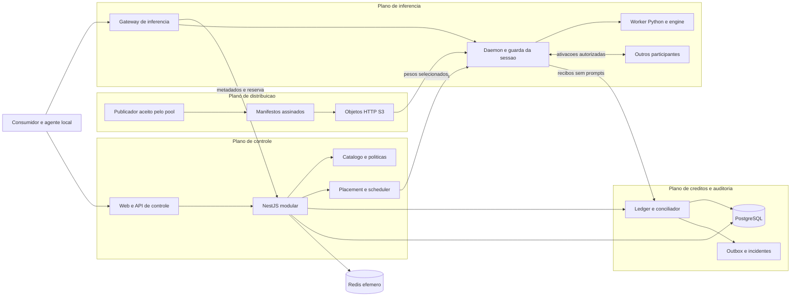
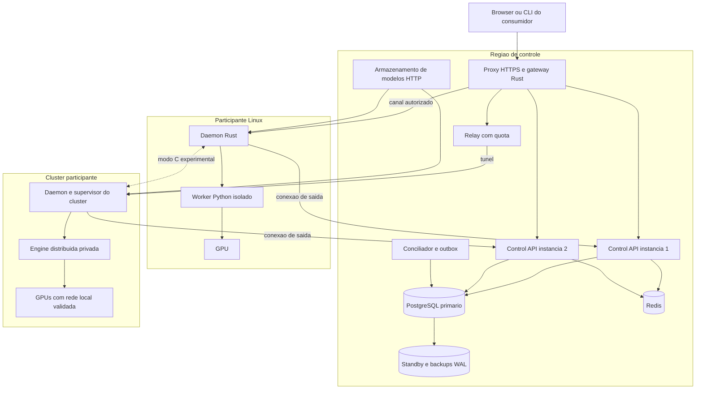
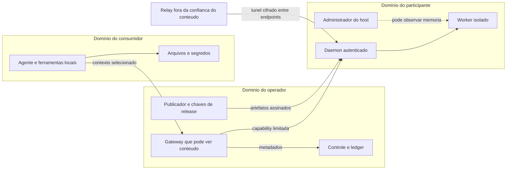
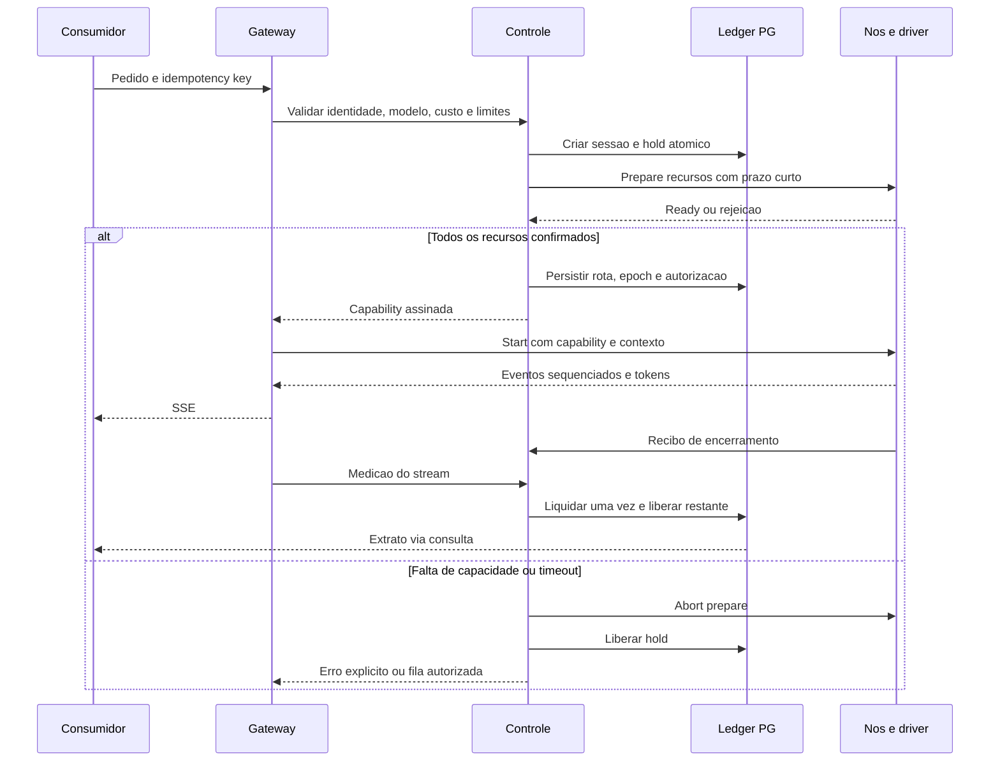

# Arquitetura da plataforma

## Decisão central

Uma rede aberta de nós, publicadores, pools e gateways independentes, com descoberta P2P e liquidação verificável. O [18](18_OPEN_NETWORK_AND_COMPUTE_MARKET.md) define entrada e ofertas abertas; o [20](20_COOPERATIVE_ECONOMY_AND_ELASTIC_LIMITS.md) define cooperação sem compradores, registro de TU e pagamentos separados. A aplicação NestJS/PostgreSQL abaixo é a implementação de referência **de um pool/gateway**, útil no laboratório e replicável por outros operadores; não é autoridade global de identidade, catálogo ou saldo.

Componentes existentes tornam o serving completo viável como integração. O modo C exige validar o particionamento de cada arquitetura, seus estados e sua comunicação. Petals comprova o conceito em modelos determinados, enquanto as receitas K3 atuais descrevem clusters com aceleradores e interconexões específicos. [Petals](https://arxiv.org/html/2312.08361v1), [receita K3](https://recipes.vllm.ai/moonshotai/Kimi-K3).

## Quatro planos dentro de um operador

| Plano | Responsabilidades | Autoridade/estado | Fronteira de falha |
|---|---|---|---|
| Controle | Conta, identidade, catálogo, admissão, políticas, placement, scheduling, autorização | PostgreSQL; chaves de assinatura com funções separadas | Falha impede novas autorizações; presença Redis não autoriza sozinha |
| Inferência | Prefill, decode, estados, tensores, streaming, medição e cancelamento | Estado da engine, sequência da sessão, autorização assinada e spool de recibos | Falha de worker pode perder KV/SSM; nunca implica estorno contábil “por memória” |
| Distribuição | Manifestos, pesos, blocos, revisões, downloads/cache | Objetos por conteúdo e manifesto assinado | Indisponibilidade impede novos loads; atribuições já carregadas podem continuar |
| Créditos/auditoria | Emissão/holds/consumo TU, pagamentos separados, limites e incidentes | Journal local conciliado com registro de serviço e liquidação financeira | Sem confirmação da autoridade correspondente, não criar saldo/gasto; recibos pendentes |

As autoridades PostgreSQL da tabela se restringem ao estado daquele operador. TU entre operadores depende de emissão/holds autorizados no registro cooperativo do 20; dinheiro depende de depósitos/contratos de liquidação. Recibo local ou linha de banco não cria saldo global. TU não exige receita financeira; os modos não fazem fallback entre si. Controle solicita operações contábeis por interface e nunca edita saldo diretamente. Workers, relays, páginas web e scheduler não têm credenciais de escrita no banco. O diagrama representa este componente local da rede aberta.

## Identidade da configuração e do grupo

`configuration_id = manifest_id`, digest do payload canônico com separação de domínio definida no documento 05. IDs derivados e assinaturas ficam fora desse payload, evitando autorreferência. Inclui modelo upstream, revisão completa, grafo/arquitetura, formato/precisão dos pesos, precisão de cálculo/cache, tokenizer, chat template, código aprovado, engine/build, ABI de estados e transporte de tensores. Alterar qualquer item que modifique números, interpretação dos tokens ou cache cria nova configuração.

Para C heterogêneo, o manifesto pode fixar um conjunto de builds por componente/papel e perfil de hardware, qualificados conjuntamente. O conjunto inteiro participa do digest; não autoriza mistura livre de backends. Ver a [matriz de GPUs, modelos e cenários](15_HETEROGENEOUS_HARDWARE_AND_CATALOG.md).

`serving_group_id` referencia essa configuração, política de confiança versionada, modalidade/funcionalidades habilitadas, limites operacionais e topologias/regiões admitidas. Duas regiões podem atender a mesma configuração; permissões e cobertura continuam distintas. Não unir parts de revisões diferentes. “Kimi” sozinho não é identificador executável.

Oferta pode ser publicada por qualquer participante com identidade/manifesto válidos. Para o selo qualificado de um pool, capacidade exige rota completa, orçamento e contingência definidos. Registro aberto separa anúncio, evidência independente e qualificação local; um pool não altera o catálogo de toda a rede. Estados `candidate`, `qualifying`, `available`, `degraded`, `unavailable`, `quarantined` e `retired` identificam emissor e escopo. Snapshot de artefatos não prova disponibilidade.

## Implantação inicial de um pool/gateway

Começar com Compose em ambiente privado. Duas instâncias de API e recuperação do banco são o primeiro desenho de disponibilidade; não implicam duas autoridades simultâneas de escrita. A composição exata pode começar em uma máquina de laboratório, mas isso não atende ao gate de continuidade do serviço público.

O gateway público de inferência é um processo Rust separado, reutilizando bibliotecas de autenticação/transporte do daemon. Ele recebe HTTP/SSE, valida limites, tokeniza ou encaminha a tokenização aprovada e obtém autorização do controle. Faz streaming com buffers limitados. O backend NestJS recebe metadados, não os tensores nem o conteúdo integral como caminho obrigatório.

Browser e clientes compatíveis usam HTTPS/SSE. Eles não abrem diretamente uma conexão libp2p QUIC nativa. Cliente nativo poderá usar ingresso direto autorizado quando disponível. Em ambos os casos é necessário identificar quem vê o prompt: gateway que termina TLS, driver da sessão e participantes que processam seus dados. TLS não elimina essa fronteira.

## Modos de execução com uma interface externa

| Modo | Unidade agendada | Implementação inicial | Estado e recuperação |
|---|---|---|---|
| A — modelo completo em um nó | Uma instância carregada | vLLM supervisionado, uma GPU no primeiro perfil | KV e fila locais; falha exige reexecução ou interrupção explícita |
| B — modelo completo em cluster participante | Um endpoint com capacidade agregada qualificada | vLLM TP/PP/EP dentro de rede privada | O cluster administra ranks; perda de rank pode reiniciar a instância inteira |
| C — modelo entre participantes | Rota completa de componentes e seus recursos | Petals para referência; integração Kimi experimental | Estados por estágio; recuperação por replay e/ou checkpoint compatível |

No modo B, GPUs não recebem leases globais independentes incompatíveis com o lease do cluster. O operador anuncia subrecursos apenas se consegue particioná-los e provar seus limites. Sair de um cluster e cadastrar as mesmas placas como nós não permite emissão duplicada legítima.

No modo C, um **driver de sessão** controla ordem de tokens, amostragem, posição, fronteiras e recuperação. Ele roda no plano de inferência, não no scheduler de negócio. Embeddings, visão, normalização final e cabeça de saída também precisam de placement; “dividir as camadas” não cobre automaticamente o modelo inteiro.

## Estratégias de particionamento

| Estratégia | Benefício | Custo/risco | Decisão |
|---|---|---|---|
| Blocos/camadas contíguos | Poucas fronteiras WAN em comparação com TP/EP por camada | Decode sequencial, menor nó limitado pelo bloco, caches por estágio | Primeira hipótese do modo C |
| Experts remotos | Distribui grande parcela dos pesos MoE | Dispatch/combine frequentes, fan-out, stragglers, alta variância e dependência do router numérico | Não escolhida como padrão WAN; pesquisa controlada |
| Híbrida | TP/EP dentro de uma ilha rápida e PP entre ilhas | Placement e estados mais complexos | Melhor hipótese de longo prazo para K3 |
| Réplica completa de rota | Falha e admissão mais simples; dobra cobertura independente | Duplica pesos; réplica sem estado não continua geração instantaneamente | Primeira redundância operacional |
| Réplicas seletivas | Mais memória nos gargalos e componentes frágeis | Estado/KV precisa ser refeito ou replicado; cobertura não garante throughput | Após medir falhas e gargalos |

Cada engine deve declarar a menor unidade exportável e o formato de suas entradas/saídas. `forward` de um bloco convencional é diferente de um estágio K3 que carrega KDA, convoluções, MLA e AttnRes. Se a menor unidade não couber no orçamento, o scheduler rejeita o placement. Alternativas são cluster B, agrupamento local de GPUs, outra quantização aprovada ou pesquisa de particionamento adicional. Não criar um bloco fictício apenas dividindo o arquivo em bytes.

Decodificação especulativa fica para depois da referência correta: exige memória para draft/verificação, tolerância numérica e estados especulativos reversíveis. Seu ganho precisa ser medido separadamente de throughput em lote. Não sustenta a viabilidade básica do produto.

## Fronteiras de segurança

Assinaturas identificam origem e integridade. Um operador malicioso continua podendo devolver cálculo errado com assinatura válida. A policy comunitária aceita essa exposição e a mitiga por verificação probabilística, reputação e limites; não anuncia confidencialidade ou prova criptográfica universal de inferência.

## Sessão e transações entre planos

Isso é uma saga com leases e ações compensatórias, não uma transação distribuída entre GPUs e banco. `Prepare` expira; um `Start` só é aceito após persistência e assinatura. O sistema pode executar um cálculo duas vezes após falha de confirmação. Cobrança e emissão usam chaves únicas e reconciliação para produzir um único efeito contábil válido.

## Continuidade de um operador e da rede aberta

| Função | Dentro de um pool/gateway | Em falha daquele operador/região |
|---|---|---|
| Computação | Participantes e clusters distribuídos | Sessões já iniciadas podem terminar dentro do envelope assinado se o caminho de dados sobreviver |
| Pesos | HTTP/S3 central com caches locais | Modelos carregados continuam; novos downloads dependem de origem/espelho disponível |
| Descoberta | Diretório autoritativo no controle; DHT somente em experimentos | Usar rota já autorizada, sem escolher novos peers arbitrariamente |
| Autenticação | Autoridade central, certificados/tokens limitados | Chaves de verificação em cache; sem emissão de nova sessão |
| Agendamento | Central com owner e fencing por grupo | Sem novos placements/sessões; operações já autorizadas respeitam prazo |
| Contabilização | Journal PostgreSQL local; registros globais separados de TU e dinheiro | Spool de recibos limitado; outro operador usa registros saudáveis; sem criar saldo offline |

Se apenas a API cair, o streaming pode sobreviver porque está fora dela. Se o gateway/driver da região cair, o caminho de dados também pode parar. Não garantir continuidade universal. Recuperar em outra região exige autoridade de escrita restaurada, recursos equivalentes e confiança/região permitidas. Novas sessões falham fechadas quando o estado de saldo é incerto.

Essas falhas são locais. Na rede aberta do 18, outros gateways, indexadores, carteiras e contratos continuam independentes; o cliente deve poder iniciar nova sessão por outra oferta e verificar/retirar valores finalizados sem o servidor original. Não garantir preservação automática de streaming ou disponibilidade irrestrita dos registros. Se apenas a integração financeira falha, o serviço cooperativo pode continuar com registro de TU saudável. Se falta quorum cooperativo, suspender novas confirmações e honrar apenas autorizações vigentes. Saldo não confere acesso compulsório à GPU de terceiros.

Interoperabilidade entre operadores é requisito da abertura: identidade por chave, anúncios assinados, unidade de liquidação explícita, depósitos, limites, disputa e caminho independente de saída. Não unir bancos locais nem adotar DHT como consistência financeira. Bancada privada não encerra a prova de descentralização; os gates dos EP10/EP11 são obrigatórios. O consenso de serviço ainda exige seleção; o laboratório federado de quatro validadores/quorum três é hipótese explícita, não comprovação de validação permissionless.

## Registro e continuidade selecionados na revisão 4

O [22](22_POLICY_CLOSURE_AND_CONTINUITY.md) seleciona CometBFT v0.38.26 como referência de integração com aplicação ABCI determinística. Quatro organizações validadoras com peso igual e três confirmações; inferência/ofertas abertas, consenso federado com admissão pública regrada. Projeções PostgreSQL e indexadores são reconstruíveis; não são autoridades alternativas de saldo.

O registro mantém contas de continuidade, seus holds, emissão complementar e destinação do consumo. O scheduler contrata rotas completas com fundos existentes antes de emitir; falta de um modelo não interrompe outro viável. Pausa de quorum não permite gasto offline irrestrito. A seleção não executou consenso ou aprovou a build para produção.

## Orçamento operacional consolidado na revisão 6

O [24](24_CLOSURE_PROGRAM_AND_LAUNCH_GATES.md) é a política econômica vigente. O scheduler escolhe capacidade necessária e registra seu financiamento; o registro confirma fontes, versões e holds. WORKING possui piso de renovação essencial e alvo normal; CORE_RESERVE financia somente contingência qualificada. O consumo finalizado recompõe primeiro o piso operacional. Alvos não somam obrigações já retidas novamente nem criam capacidade física.

O núcleo cooperativo é independente de liquidação financeira. Um adaptador comercial identifica o vendedor responsável pela rota e seus contratos com componentes, sem promessa de divisão atômica entre redes. A primeira bancada privada de inferência não exige pagamentos ou quatro operadores de registro; a prova pública de independência exige os critérios FC05/FC06.

