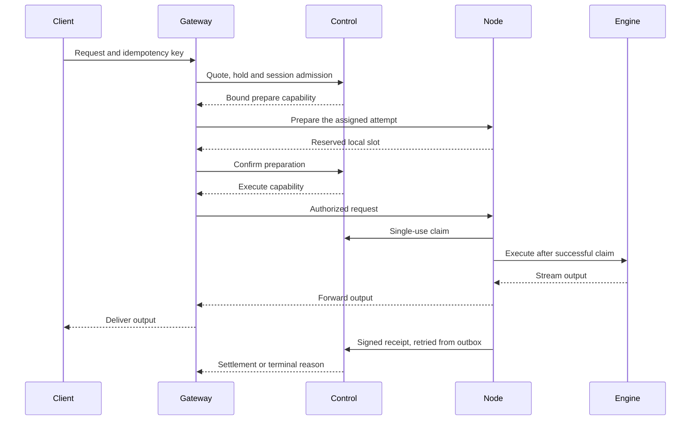

# 06. Node protocol and scheduling

## What admission must protect

Admission commits both capacity and a maximum accounting exposure. It must prevent two sessions from spending the same balance, two agents from claiming the same physical slot, and a restarted node from completing an obsolete attempt.

The scheduler considers a qualified model, fresh node presence, available domain capacity, request limits, account balance, and queue order. A model's parameter count is a sizing input, not an admission shortcut. For future distributed models above 27B, every required stage must be reserved as part of one complete route.

## Private node identity

A node has a persistent Ed25519 key and a boot identity. A single-use 24-hour invitation binds its owner, model, physical domain, and endpoint. The registering agent proves control of the key; it cannot choose a different owner or model through the registration body.

Subsequent messages sign a canonical request containing method, path, timestamp, nonce, and body hash. The private window is 30 seconds, and nonces are persisted for five minutes. Heartbeats are sent every two seconds; after 15 seconds without presence, a node loses eligibility. A new boot advances its epoch and fences older attempts.

## Request lifecycle

Capabilities bind network, audience, node, epoch, session, attempt, manifest, request hash, limits, deadline, and prepare ID. The local node semaphore and database domain lock address different layers of oversubscription.

## Queue behavior

The private profile allows at most four active sessions per account, a 120-second queue window, and a 180-second execution window. Among executable accounts, the least recently served has priority; requests within an account retain FIFO order. This is account-level scheduling, not proof of fairness between humans using multiple accounts.

Reject or expire work with an explicit reason. Do not remove compatible capacity rejections from service metrics merely because the scheduler declined them. Retry budgets and backpressure must prevent an outage from multiplying load.

## Cancellation, failure, and recovery

Pause prevents new admissions while accepted work may finish. Revocation prevents re-enrollment under the revoked identity. An interrupted epoch cannot submit a receipt that silently resumes an old attempt.

The node writes receipts durably before retrying control delivery. An outbox write failure prevents new admissions until correction and restart. The current product does not reconstruct generation at the exact interrupted token; it ends and refunds according to its private policy.

Cross-participant pipelines require an additional stage-state, replacement, and cancellation protocol. Model file replication does not implement those behaviors. Detailed private wire fields and state transitions are in the [API contract](../implementation/API.md); public trust and quorum requirements remain in [continuity](22_POLICY_CLOSURE_AND_CONTINUITY.md).

