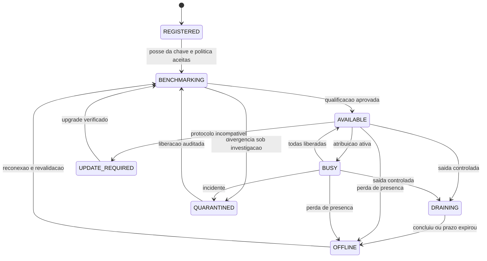
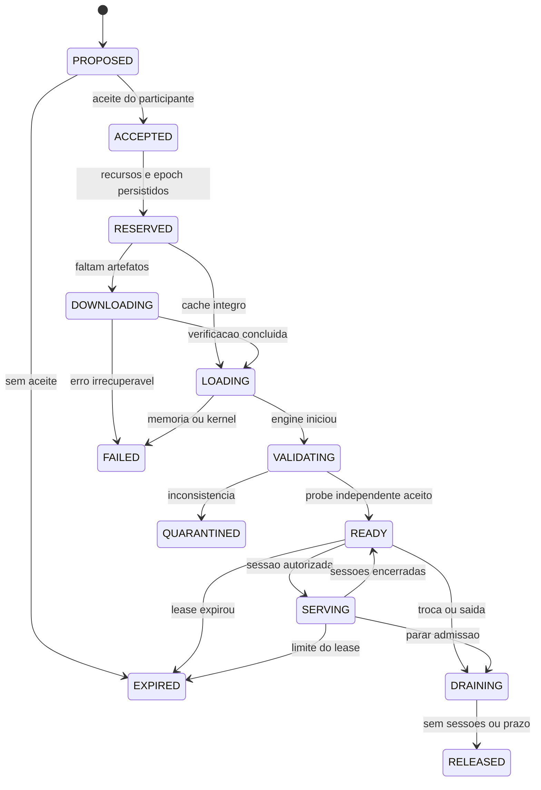
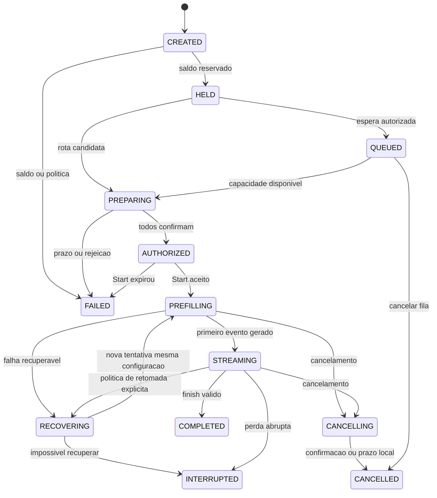

# Protocolo dos nós e agendamento

Na rede aberta do [18](18_OPEN_NETWORK_AND_COMPUTE_MARKET.md), este protocolo opera entre participantes e coordenador/pool escolhido. Cadastro no banco e admissão em um pool não são autorização global para criar um nó. Identidades por chave, anúncios assinados, ofertas diretas e recursos financeiros segregados permitem outros operadores. Uma sessão tem coordenador e rota definidos; não há scheduler central obrigatório para todas as sessões.

## Separar placement de scheduling

**Placement** decide o que ficará pronto em cada nó: componentes, memória, slots, prazo, política de confiança e tarifa da reserva. É controlado pela demanda prevista, cobertura, redundância, custo de transferência e disponibilidade contratada. **Scheduling** escolhe recursos já aptos para uma sessão específica, com budget de memória, prazo e afinidade. O router de experts executado dentro do modelo é uma terceira função, numérica, que nenhum desses schedulers substitui.

```text
Placement: demanda e cobertura -> proposta -> download/load -> validação -> capacidade pronta
Scheduling: pedido e hold -> escolher rota pronta -> reservar slots -> autorizar -> executar
```

Petals é referência de blocos, rotas e recuperação; a camada NETWORK AI acrescenta admissões, autorizações e contabilidade próprias. A implementação de referência não deve receber confiança de produção apenas por ser distribuída. [Petals](https://github.com/bigscience-workshop/petals).

## Parâmetros iniciais do protocolo

Valores abaixo são defaults de engenharia para o piloto, não SLOs medidos. Cada lease/session incorpora a versão da política; mudanças não reescrevem acordos em andamento.

| Parâmetro | Default | Motivo/efeito |
|---|---:|---|
| Heartbeat | 15 s, com jitter de ±20% | Presença e capacidade sem sincronizar todos os nós |
| Presença suspeita | 45 s sem heartbeat aceito | Retirar de novas admissões; não confundir com prova de fraude |
| Lease de atribuição | 15 min, renovar a cada 60 s | Limita autoridade offline e mantém previsibilidade do contribuidor |
| Prepare de sessão | 15 s, máximo 30 s por rota | Evita slots presos por coordenador que falhou |
| Prazo para usar Start | 30 s após autorização | Reduz replay e reserva improdutiva |
| Prazo de sessão | Até 10 min no perfil inicial | Limite financeiro e de estados; contextos/agents maiores exigem perfil explícito |
| Drenagem solicitada | Até 60 s, configurável para menos | Após prazo, interromper e reportar resultado parcial |
| Reexecução automática | Até 1, antes do primeiro token | Modelo/precisão/confiança iguais e contingência aprovada |
| Flush de medição | 5 s ou 64 tokens, o que ocorrer primeiro | Limita perda de evidência; valores são cumulativos |
| Prazo de conciliação normal | deadline da sessão + 120 s | Liberar saldo após expirar autoridade e processar recibos conhecidos |
| Retenção de deduplicação | ≥30 dias no piloto | Maior que todos os prazos de entrega/reenvio; financeiro preservado permanentemente |

O deadline autorizado nunca ultrapassa o lease que o sustenta. Renovar atribuição antes de admitir uma sessão que excederia sua validade. Relógio do host não define remuneração: usar horário do verificador/DB e intervalos assinados; duração local monotônica é evidência auxiliar. Desvio excessivo de relógio bloqueia novas autorizações até correção.

## Identidade e admissão

Nó cria sua chave localmente e pode anunciar oferta sem autorização da empresa. Para ingressar em um pool escolhido, vincula sua chave à conta/pagamento por desafio assinado com nonce, domínio e prazo; isso não prova GPU física única. O pool pode exigir inventário, benchmark, conectividade e evidências para suas ofertas qualificadas. O daemon pode recusar atribuições que violem preferências locais; publicação de modelo não obriga outro nó a instalar seu runtime.

Uma identidade nova começa com teto baixo de reservas e crédito pendente de verificação. Benchmark e testes de memória incluem variação de formas/carga para reduzir simulação de GPU. Usar observações ao longo do tempo e testes simultâneos de reservas suspeitas; não concluir unicidade física de serial, UUID, IP, TPM ou benchmark isolado.

## Máquinas de estado

Estado do nó descreve admissão/saúde, enquanto cada atribuição possui seu próprio ciclo. Uma GPU com mais de um suborçamento não deve ter uma única flag `ready` que oculte quais componentes realmente estão prontos.





Download/load/validação não recebem tarifa de capacidade pronta no MVP. READY e SERVING podem gerar recibo de disponibilidade se houver reserva válida, prova e nenhum conflito de recursos. DRAINING não aceita novas sessões; remuneração continua apenas pelo tempo de recursos ainda necessários a sessões válidas, limitado ao prazo contratado. Falha/quarentena param novas emissões para a janela suspeita e iniciam investigação.



`execution_state` terminal fica preservado. `billing_state` independente percorre `HELD → RECONCILING → SETTLED`, ou `DISPUTED → SETTLED`, com ajustes posteriores por lançamentos compensatórios. Não sobrescrever o motivo da falha para mostrar apenas “liquidado”. Transições não desenhadas de interrupção global são: revogação/incidente leva atribuição a QUARANTINED e sessão a INTERRUPTED; expiração em fila libera hold; nenhuma transição terminal retorna a execução ativa sem novo `attempt_id`.

Revogação/incidente tem escopo do contrato/pool, não autoridade sobre todos os peers. O estado financeiro só é final depois da finalidade e janela de disputa da liquidação escolhida; fim do cálculo ou COMMIT local não antecipa essa finalização. As regras de estorno nas tabelas abaixo descrevem a oferta qualificada do pool de referência; ofertas independentes publicam suas garantias antes do aceite.

## Placement

Manter por grupo cobertura por componente, prefill/decode medidos, slots e domínios de falha. No piloto A, alvo de duas instâncias em hosts distintos. No C público, mínimo inicial: cada componente obrigatório disponível em dois domínios de falha distintos; uma rota completa com slots e uma alternativa montável com links, memória e procedimento de recuperação qualificados. Dois processos no mesmo host não satisfazem o mínimo. Essa cobertura não garante por si um SLO e não significa duas GPUs no total. Sem contingência, retirar novas admissões públicas C; sessões existentes seguem a política de falha e o catálogo sinaliza degradação. Laboratório privado pode operar uma rota única explicitamente experimental.

Algoritmo inicial: filtrar confiança/hardware, estimar custo de acomodação usando perfis medidos, selecionar atribuições que fechem rotas/capacidade necessárias e distribuir reserva ociosa útil segundo orçamento. Uma heurística greedy com revisão periódica é suficiente inicialmente; registrar razão e pontuação para comparação futura com bin packing/otimização inteira.

Inventário por dispositivo e domínio de memória, cruzado com hardware/SO/engine/modelo/precisão/função/contexto. GPUs desiguais podem receber quantidades diferentes de blocos; não balancear apenas camadas. Em C minimizar custo por etapa e caminho crítico usando links observados. Elegibilidades para vários modelos não multiplicam capacidade física. Inicialmente, uma atribuição de engine por GPU; coexistência no mesmo dispositivo exige perfil conjunto posterior. Ver [15](15_HETEROGENEOUS_HARDWARE_AND_CATALOG.md).

Não pagar um componente solto apenas porque é popular, nem deixar de pagar uma camada rara indispensável à cobertura aprovada. Demandas de redundância e contingência também são demanda útil, com orçamento e prazo. Files em cache reduzem custo de mudança, mas não equivalem a uma atribuição pronta.

Rebalancear no máximo 10% da capacidade de um grupo por rodada inicial de 5 min, desde que cobertura não caia abaixo do mínimo. Valores ajustáveis após benchmark. Esperar demanda persistente por três janelas, salvo falha/risco crítico. Estimar download pela menor banda entre origem, relay e nó, somando load e validação. Trocar pesos não deve ser a reação normal a cada pedido.

## Scheduling

1. Filtrar por configuração exata, grupo de confiança, região, capacidades funcionais, validade de lease e versão de protocolo.
2. Preferir sessão/instância com cache compatível **do mesmo escopo de usuário/tenant**. Cache de outro tenant não é uma otimização admissível no piloto.
3. Prever memória de contexto+saída, KV/SSM, prefill e concorrência; reservar slots de todos os estágios da rota.
4. Estimar tempo até primeiro token e conclusão por filas, compute observado, tamanho do prompt, fronteiras e banda. Ping sozinho não basta.
5. Considerar percentis de latência, tendência de throttling, histórico de falha e custo de recuperação; escolher rota que satisfaça deadline e teto.
6. Executar Prepare/Commit com versão de recurso e fencing; na rejeição, liberar demais prepares e tentar outra rota dentro do prazo.

Para C, verificar todos os componentes e links do caminho crítico. Não basta soma de VRAM ou cada nó estar “online”. Um link ruim pode limitar a sessão inteira. EP/TP interno ao cluster B não é rescheduled pela rede global a cada token.

Admissão usa limites de concorrência por conta, chave de API, grupo, gateway, nó e rota. Fila tem tamanho/TTL finitos, custo estimado e cancelamento. A política do [16](16_TOKEN_ECONOMY_AND_FAIR_DISTRIBUTION.md) agrega chaves e subcontas conhecidas por tenant, experimenta round-robin com déficit por custo de recursos e não usa saldo de TU como peso de prioridade. O [20](20_COOPERATIVE_ECONOMY_AND_ELASTIC_LIMITS.md) define teto regular 1 e extras até 2/4 por conta/grupo, subindo um nível a cada 5 minutos de folga comprovada. Não inferir folga pela ausência de compradores: contar demanda cooperativa. Nova fila concorrente interrompe novos extras imediatamente, preservando sessões já aceitas. Extras têm prazo máximo inicial de 60 segundos, sem aumento automático de contexto; recursos reais e saldo sempre limitam admissão. Limite agregado da conta também cobre múltiplos grupos, conforme capacidade publicada. Impedir que milhares de requisições pequenas contornem o limite; pedidos maiores acumulam elegibilidade dentro do teto e deadline. Não executar novo prefill se faltam slots para completar o decode reservado.

No pico, cada pool limita novas reservas, aumenta fila ou apresenta indisponibilidade. Preço segue a oferta aceita e a política prospectiva daquele operador; não mexer em holds e leases aceitos. Contingência atende recuperação antes de tráfego extra. Não substituir modelo ou confiança/região sem escolha explícita. Placement reserva teto de emissão cooperativa contra capacidade/estoque ou pagamento comercial contra fundos, conforme reward_mode, época e grupo. Emissão cooperativa não exige vendas; exige reserva útil. Cadastro não gera orçamento. A mesma alocação/intervalo não recebe emissão cooperativa integral e pagamento comercial integral.

A cada 30 segundos, avaliar pressão regular, fila, validade da telemetria e memória/rede. Regras exatas e histerese estão no 20; contadores de extras não se tornam saldo. Não tomar recurso de contrato aceito para satisfazer um limite anunciado. Ofertas financeiras não podem esgotar a parcela cooperativa contratada do pool.

## Autorização verificável no nó

Capability assinada inclui: emissor/key ID, sujeito, session/attempt ID, hash da requisição canônica com chave apropriada, configuração, trust-policy version, route ID/epoch, peers permitidos e seus papéis, assignment IDs/epochs, operação, start-before, deadline, limites de input/output/total tokens, batch, concorrência, memória, bytes de transporte e teto de custo reservado.

Guarda local verifica assinatura, chave/revogação, destinatário, posse da chave do peer no canal, role, epoch, validade e limites **antes** de chamar o worker. A autorização é vinculada à rota: copiar um token para outra GPU ou ingressar em outro peer não autoriza execução. O nó conserva deduplicação de Start por `(session, attempt, epoch)`; reinício invalida sessões locais que não puder comprovar como ativas.

Tokens não carregam saldo disponível completo nem autorizam gasto ilimitado. Novo attempt/rota exige controle e hold/contingência, com fencing da tentativa anterior. A API não deve autorizar simultaneamente duas rotas completas usando o mesmo budget máximo se elas puderem produzir efeitos independentes.

## Fluxo e alternativas

| Evento | Execução | Reserva e cobrança |
|---|---|---|
| Falta de saldo | Rejeitar antes de Prepare | Nenhuma reserva/execução |
| Falta de capacidade | Fila somente se aceita, com prazo; senão 503 | Hold liberado ao desistir/expirar; fila não cobra |
| Nó rejeita Prepare | Abort nos demais; tentar outra rota | Nenhum consumo até Start e trabalho confirmado |
| Nó cai antes de primeiro token | Uma reexecução permitida se houver contingência, mesmo modelo/trust | Custos extras da falha são da plataforma |
| Nó cai após resultado parcial | Emitir interrupção, preservar prefixo no consumidor; não repetir ferramentas | Política de falha de infraestrutura estorna a tentativa afetada |
| Cancelamento em fila | Remover interesse | Liberar hold integral |
| Cancelamento durante execução | Propagar flag/stream control; interromper engine; liberar cache | Cobrar somente prefill concluído e saída comprovada até o cutoff, dentro do teto |
| Timeout por falha de infraestrutura | Finalizar com erro, não “sucesso vazio” | Estornar tentativa afetada |
| Deadline de orçamento solicitado pelo consumidor | Encerrar por limite conhecido | Cobrança da execução comprovada, sem extensão automática |
| Medição divergente | Marcar incidente e liquidar parcela incontroversa | Nunca cobrar acima do autorizado; ajuste via journal |
| Coordenador cai | Sessão já iniciada pode seguir só no envelope assinado | Nenhum novo hold, lease ou crédito offline; spool bounded |
| Banco cai na liquidação | Reenviar evento com a mesma idempotency key | Transação recuperada/deduplicada; saldo não nasce no cache |
| Cancelamento e finish concorrem | CAS define terminal; registrar ambos com sequência | Aplicar regra pelo cutoff e evidência, uma liquidação |

Uma desconexão do cliente pede cancelamento após grace inicial de 5 s. API nativa pode explicitamente manter uma sessão detached se o perfil permitir; não presumir isso para Chat Completions. O gateway limita buffers e interrompe clientes lentos antes de causar exaustão.

## Recuperação dos estados

Fase inicial: replay do contexto autorizado e dos tokens já aceitos em nova instância compatível. Repetir prefill não repete execução de tools: resultados de ferramentas já realizadas entram como dados e só o consumidor decide nova ação. Depois de streaming parcial, retomada automática fica desabilitada até provar prefixo/ordem e API de resume.

KV/SSM não migram só porque há um worker reserva. Checkpoint futuro terá engine ABI, dtype, digest da configuração, posição, RNG, KDA/convoluções, MLA e AttnRes conforme arquitetura, além de proteção por tenant. Réplicas seletivas quentes consomem memória e banda; seu benefício precisa superar replay medido.

Workers lentos recebem menos admissões e reclassificação para leases futuros; falha isolada não é fraude. Nó com evidência maliciosa é quarentenado, com motivo, escopo, contestação e revalidação. Retorno após sleep/reboot invalida afirmações antigas de readiness até probe e inventário de memória.

## Limites e fontes de contrato fechados na revisão 4

Aplicar o [22](22_POLICY_CLOSURE_AND_CONTINUITY.md): déficit por custo e pagador conhecido, sem peso por riqueza; máximo de dois pedidos pendentes por configuração/pagador e oito no total. Prazo inicial da fila interativa: 120 segundos, com liberação integral antes do Start. Lotes flexíveis têm contrato próprio. Rejeitar excesso global antes de hold; nenhum pedido impossível bloqueia toda a fila.

Promover limites elásticos por tempo monotônico efetivamente decorrido, não por quantidade de eventos. Intervalo de reatribuição por domínio: 30 minutos, salvo falha. Lease conserva 15 minutos e fonte exclusiva por parcela; somar pagamentos de circulação/emissão não excede o READY contratado. Preservar rotas completas por modelo; fragmentos sem rota não recebem continuidade. Nenhuma dessas regras foi executada em GPU pelo simulador econômico.

## Contratação por necessidade e liquidez — revisão 6

Aplicar o [24](24_CLOSURE_PROGRAM_AND_LAUNCH_GATES.md): calcular rotas/réplicas necessárias por configuração e horário, selecionar ofertas equivalentes por rotação e reservar financiamento. Saldo livre não é demanda. Guardar justificativa e efeito na cobertura. A expansão preserva o piso de WORKING, exige CORE_RESERVE recomposta e custeio suficiente; a rota precisa estar completa. Leases aceitos são honrados até drenagem/prazo.

Planos de financiamento incluem custos futuros ainda não cobertos, atraso de liquidação, alvos e evidência. A referência v6 verifica condições pontuais; o simulador v4 não implementa essa política. Não tratar recibos em revisão ou saldo retido como orçamento para renovar outro lease.

