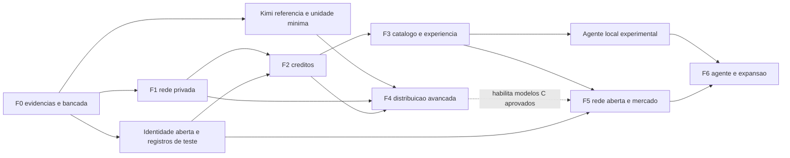

# Roteiro de implementação e backlog

## Como executar este plano

Este pacote encerra a etapa de planejamento; não implementa o produto. A próxima etapa recomendada é a fase 0. Fases são gates de evidência, não datas de lançamento. Não há estimativa de calendário sem equipe, orçamento, acesso a GPUs e resultados dos experimentos.

Direção atual: rede aberta, ofertas comunitárias e venda de inferência conforme o [18](18_OPEN_NETWORK_AND_COMPUTE_MARKET.md). O laboratório central de referência testa um operador; não define a autoridade global. EP10 torna independência do operador requisito da rede aberta e liquidação verificável requisito da modalidade comercial. O [20](20_COOPERATIVE_ECONOMY_AND_ELASTIC_LIMITS.md) preserva contribuição e uso sem compradores, com TU e dinheiro separados. EP11 cobre emissão, limites elásticos e registro cooperativo. Token nativo negociável e consenso próprio não foram presumidos.

Classificações: **E** = engenharia previsível usando componentes; **I** = integração com risco de compatibilidade; **R** = pesquisa cujo resultado pode ser inviabilidade no perfil pretendido. Concluir uma tarefa R pode produzir rejeição fundamentada; isso não equivale a lançar a feature.

## Fases e critérios de avanço

| Fase | Dependências e entregáveis | Gate de aprovação | Fora do escopo / risco / revisão |
|---|---|---|---|
| **0 — Risco técnico** | E00–E07 iniciais; baseline A, Petals privado, referência/load parcial K3, transporte, matriz hardware/modelo; decisões de engine e ABI | Reproduzir modelo de referência distribuído e registrar custo; medir unidade K3 ou comprovar bloqueio; ADRs atualizados com caminho testável | Sem chat comercial/ledger público/desktop. Kernel, memória e WAN podem inviabilizar K3 residencial; testar ilhas e host maior, não adiar risco |
| **1 — Rede privada funcional** | F0 permite engine/configuração concreta; daemon/CLI, controle, catálogo privado, gateway, inferência, logs, pause/cancel | Pelo menos dois hosts controlados; um modelo qualificado, falha/cancel/limites reproduzidos; E01/E05/E09 no escopo | Sem créditos reais da comunidade, múltiplas engines de serviço ou execução arbitrária. Se transporte falha, restringir perfil de rede e reabrir F0 |
| **2 — Cooperação e pagamentos separados de teste** | F1; READY, TU emitidos sob orçamento, hold/consumo, probes, controlador elástico e registro de serviço; bancada financeira separada | E10/E15/E16 no escopo, concorrência/COMMIT/failover e zero divergência; 7 dias sem compradores; EP09/10/11 correspondentes | Créditos de teste; nenhuma receita financeira exigida para cooperar; seleção de registro e confiança explícitas |
| **3 — Ofertas comunitárias e experiência** | F2; dois modelos distintos, manifesto comunitário importado, múltiplos indexadores/gateways, ofertas e API/web/CLI | E08/E11 e EP10; oferta sem aprovação global, modelo exato, preço/unidade/termos visíveis, UI/API reais | Catálogo aberto não promete compatibilidade universal; selo identifica quem qualificou e sob quais condições |
| **4 — C avançado** | Pesquisa Kimi iniciada em F0; rota privada, estado, paridade, hardware e licença aprovados | E03/E04/E07: modelo grande realmente executado; rota com contingência; critérios funcionais/latência/custo publicados | Sem EP WAN automático ou especulação obrigatória. Se falhar, continuar pesquisa/ilhas B e relatar limite; não renomear modelo pequeno como realização do objetivo gigante |
| **5 — Rede aberta e piloto comercial** | F2/F3, EP10/EP11, segurança, custos e suporte; nó/publicação abertos, qualificação e aceitação por contraparte | E12/E15/E16 ≥30 dias no escopo; operadores/gateways alternativos, nova cooperação sem servidor original; retirada comercial e disputas testadas à parte | Comércio limitado a capacidade demonstrada; seleção/governança dos validadores explicitada; C qualificado depende de F4 |
| **6 — Agente e expansão** | API/tools desde F1–F3; agente consolidado, mais modalidades e instrumentos opcionais entre operadores | Permissões/injection/reexecução e qualidade; crédito bilateral só após teste de risco/liquidação próprio | Não adiar independência do operador para esta fase; sem execução arbitrária de tools nos contribuintes |

A abertura A/B da fase 5 pode ocorrer sem declarar K3 C disponível; o roadmap de modelos grandes continua central e visível. Fase 4 não é um pré-requisito artificial para testar todo produto, nem pode desaparecer como pendência indefinida depois da UI. Revisões de fase devem explicitar o que o experimento gigante resolveu e o que falta.

## Dependências principais

## Backlog por épicos

Cada item gera evidência ligada a config/build/run, critérios reproduzíveis e revisão humana. IDs são referências de trabalho, não issues já criadas. P0 precede seu gate de fase, P1 aprimora a fase, P2 é expansão. Não criar dezenas de serviços só porque há épicos distintos.

### EP01 — Evidência, licenças e reprodutibilidade

| Item | Classe/prioridade | Critério de aceite verificável | Dependência |
|---|---|---|---|
| B001 — Resolver revisão e pacote | E/P0/F0 | Pesos/tokenizer/licença por digest; origem e transformação rastreáveis; metadados não marcados como bytes verificados | Snapshots do 05/13 |
| B002 — Imagens e toolchains | I/P0/F0 | Build repetível, commit/driver/kernel registrados; sem `latest`; SBOM/avisos completos | B001 |
| B003 — Harness de benchmark | E/P0/F0 | Mesma carga local/remota, timestamps definidos, erros incluídos, artefatos e seeds reproduzíveis | E00/E01 |

### EP02 — Modelos grandes e execução distribuída

| Item | Classe/prioridade | Critério de aceite verificável | Dependência |
|---|---|---|---|
| B004 — Referência Petals privada | I/P0/F0 | Run reproduzido em modelo suportado, dependências antigas identificadas; falha de nó e paridade examinadas | B002/B003, E02 |
| B005 — Referência completa K3 | I/P0/F0 | Cluster de receita oficial, load/estado/saídas/tools registrados; hardware ausente explicitamente bloqueia paridade | B001/B002, E03 |
| B006 — K3 menor unidade e kernels | R/P0/F0 | KDA/MLA/AttnRes/MoE/head/visão mapeados; picos de memória em 24 GiB e perfil maior; falhas não escondidas | E04; B005 para referência completa |
| B007 — Stage executor e ABI Kimi | R/P0/F4, protótipo F0 | Loader parcial, dependências e estados explícitos; logits e fronteiras dentro do envelope pré-registrado | B005/B006 |
| B008 — Rota WAN/híbrida Kimi | R/P0/F4 | Geração completa, custo/TTFT/TPOT por topologia, contexto/tools e recuperação; aprovar/rejeitar perfil interativo | B007/B011/B028 |
| B009 — Especulação e experts remotos | R/P2/F4+ | Ganho de trabalho útil e paridade versus baseline, custo de verificação/rejeição e rede incluídos | B008 estável; nenhuma dependência do MVP |

### EP03 — Daemon, recursos e transporte

| Item | Classe/prioridade | Critério de aceite verificável | Dependência |
|---|---|---|---|
| B010 — Inventário e qualificação heterogêneos | I/P0/F1; expansão F3 | Perfil por GPU/SO/engine/modelo; RAM unificada sem duplicação, kernel desconhecido recusado; amostra de GPUs distintas | B003, E11 |
| B011 — Transporte autenticado | I/P0/F0–F1 | QUIC/relay com limites, matriz NAT real/emulada, revogação/replay/cancel testados; escolher uma stack | E05 |
| B012 — Lifecycle daemon/CLI | E/P0/F1 | Registro/load/validate/ready/drain/unload; pause local offline; crash, sleep e startup seguros | B002/B010/B011 |
| B013 — Cache e distribuição | E/P0/F1 | Download parcial/retomável por digest, ENOSPC e update concorrente; arquivo em uso nunca removido | B001/B012 |
| B014 — Recursos no mesmo host | I/P1/F3 | Budget por domínio, interferência de jogo/driver e GPU dupla; coexistência só após perfil conjunto | B010/B012, E08/E11 |

### EP04 — Controle, catálogo e scheduler

| Item | Classe/prioridade | Critério de aceite verificável | Dependência |
|---|---|---|---|
| B015 — Identidades/grupos/catálogo | E/P0/F1 | ACL por objeto/tenant; configuração imutável; modelo candidato não anunciado disponível | B001/B002 |
| B016 — Leases e placement | E/P0/F1–F2 | Prazo/epoch, demanda/cobertura, rota completa e orçamento; piso operacional preservado para expansão; sem dupla reserva; drenagem gradual | B010/B012/B015; 24 |
| B017 — Admissão e sessão | I/P0/F1 | Prepare/Commit, deadline e slots, fairness/backpressure; erros do 06 cobertos | B011/B016 |
| B018 — Múltiplos modelos | I/P0/F3 | Dois modelos diferentes ativos, queda/troca num grupo sem confundir outro; preço e contexto corretos | B016/B017/B024, E08 |

### EP05 — Disponibilidade, créditos e auditoria

| Item | Classe/prioridade | Critério de aceite verificável | Dependência |
|---|---|---|---|
| B019 — Journals e saldos tipados | E/P0/F2 | Partidas balanceadas; TU emissão/hold/consumo/estorno separado de depósito/repasse/retirada financeiros; projeções imutáveis e sem conversão implícita | Modelo 09 e 07; B051 |
| B020 — Emissão por READY | I/P0/F2 | Duração verificada × tarifa; resto acumulado e orçamento de emissão antes do lease; funciona sem compradores; probes com custo medido | B016/B019/B052 |
| B021 — Metering e settlement | I/P0/F2 | Cumulativos, idempotência, falha antes/depois de COMMIT, diferença de contadores e recibo tardio; invariantes zero | B017/B019 |
| B022 — Risco econômico | E/P0/F2 | Capacidade/estoque TU e fundos financeiros separados; horários/modelos, energia, compromissos e saída de nós; mesmo intervalo não ganha integralmente nos dois modos | B020/B021/B054, E12 |

### EP06 — Segurança e operação

| Item | Classe/prioridade | Critério de aceite verificável | Dependência |
|---|---|---|---|
| B023 — Atualizações e isolamento | I/P0/F1–F5 | Imagem/manifesto assinados, allowlists, sem pickle/RPC público; sandbox sem segredos; canary/rollback | B002/B011/B012 |
| B024 — APIs/SDK e gateway | I/P0/F1–F3 | Subconjunto 09 com streaming/cancel/retry; clientes fixados, payloads limitados, conteúdo fora do NestJS | B015/B017 |
| B025 — Fraude e validação probabilística | R/P0/F2–F5 | Sybil/conluio/tarefas falsas; custo e falsos positivos publicados; assinatura não aceita como prova de cálculo | B020/B021/B023, E10 |
| B026 — Observabilidade e incidentes | E/P0/F1–F5 | Correlation IDs, p95 e capacidade por grupo; logs sem conteúdo; quarentena por digest e runbooks exercitados | B012/B017 |
| B027 — Backup, HA e restore | I/P0/F2–F5 | Restore isolado, fencing, RPO/RTO medidos, journal/outbox/holds consistentes; nenhum writer duplo | B019/B021, E09/E12 |
| B028 — Recuperação C | R/P0/F4 | Falha de cada stage; replay sem repetir tools; ABI KV/SSM/AttnRes aprovada antes de snapshot/resume | B007/B017/B021 |

### EP07 — Experiência e agente local

| Item | Classe/prioridade | Critério de aceite verificável | Dependência |
|---|---|---|---|
| B029 — Web consumidor/contribuidor | E/P0/F3 | Modelo/trust/fila/contexto/preço e extrato explicáveis; testar jornada completa PT-BR em browser real | B018/B021/B024 |
| B030 — Desktop Tauri | I/P1/F3 | Reusa daemon/CLI; limites reais, pause local, recuperação/upgrade e diagnóstico de GPU; nenhum ledger na UI | B012/B029 |
| B031 — Windows/WSL2 | I/P1/F3+ | Instalação real, jogos, suspend/resume e GPU memory sob pressão; status por combinação | B010/B012/B030 |
| B032 — Tools e agente controlado | I/P0/F6, contratos F1–F3 | Leitura/edição/terminal/testes/destrutivo separados; diretórios permitidos; preview de contexto; injection e replay sem efeitos repetidos | B024/B029/B023 |

### EP08 — Distribuição de artefatos e crédito bilateral futuros

| Item | Classe/prioridade | Critério de aceite verificável | Dependência |
|---|---|---|---|
| B033 — Cache P2P de artefatos | I/P2/F4+ | Chunks/hash íntegros, licença e quota; ganho real de distribuição, sem fonte de código não aprovada | B013/B011 e custo HTTP medido |
| B034 — Crédito bilateral opcional | R/P2/F6 | Instrumento adicional de crédito entre operadores, limites, risco e insolvência especificados; não requisito da liquidação financiada do EP10 | B022/B027 e demanda demonstrada |
| B035 — Protótipo de crédito bilateral | R/P2/F6 | Duas autoridades sem saldo não financiado global implícito; falha/partição e risco da contraparte testados | B034 aprovado |

### EP09 — Economia de tokens e distribuição justa

Revisão de planejamento do [16](16_TOKEN_ECONOMY_AND_FAIR_DISTRIBUTION.md), com cálculos históricos no [17](17_TOKEN_POLICY_SIMULATIONS.md) e política consolidada no [24](24_CLOSURE_PROGRAM_AND_LAUNCH_GATES.md). Os 18 exemplos já executados não encerram estes itens: eles exigem produto, banco, hardware, carga e operação reais conforme seu escopo.

| Item | Classe/prioridade | Critério de aceite verificável | Dependência |
|---|---|---|---|
| B036 — Unidade TU nos contratos cooperativos | E/P0/F2 | MicroTU e coop_network_id explícitos; dinheiro em payment_atomic/payment_unit_id separado; tokens processados distintos; overflow/conflitos recusados | B019/B024/B051, 07/09/16 |
| B037 — Tarifas por contribuição e configuração | I/P0/F2–F3 | Cesta fixada, três execuções por dois operadores independentes; pesos/rota sem fragmentação rentável; horas de READY por chamada de referência publicadas; mudanças prospectivas do 22 | B003/B010/B016/B020, E08/E11; 22/23 |
| B038 — Cotação, teto e experiência de resgate | E/P0/F2–F3 | Quote/hold por configuração e tokenizer; preço fixo aceito, cache confirmado, cancel/estorno e teto de saída; UI explica custo máximo e TU versus tokens processados | B021/B024/B029, contrato 09 |
| B039 — Compromissos de serviço e financeiros | I/P0/F2 | S inclui fundos/holds; L só emissão futura; J só reversão pendente de queimados; recomposição piso/protegido/alvo/queima atômica e versionada; restituição por origem e soma limitada | B016/B019/B020/B022/B052; 07/09/24 |
| B040 — Distribuição de acesso e oportunidade | I/P0/F3 | Mesma classe tem tarifa equivalente; rotação de novas admissões cabe no budget; fila agrega tenant/chaves, não depende do saldo, mede espera por custo/tamanho e não perde pedidos grandes silenciosamente | B017/B029/B037, comparação DRF/DRFH |
| B041 — Incentivos e coortes adversárias | R/P0/F2–F5 | Grants cooperativos ≤2% da emissão total e estoque; grants comerciais financiados; Sybil/autochamadas/dupla reserva/conluio avaliados, com custo e falsos positivos | B025/B039/B040/B058, E10/E12 |
| B042 — Sustentabilidade e continuidade de resgate | I/P0/F2–F5 | Pilotos 7/30 dias, bootstrap rastreável e fase madura sem nova emissão/aporte ou déficit encoberto; acesso e troca por coorte/modelo; custeio 30+7 dias; nenhuma tarifa fictícia publicada | B022/B026/B027/B037/B039; 24/FC02/FC06 |

### EP10 — Rede aberta e mercado de inferência

| Item | Classe/prioridade | Critério de aceite verificável | Dependência |
|---|---|---|---|
| B043 — Identidade e descoberta abertas | I/P0/F0–F1 | Chave local, assinatura com domínio/prazo, anúncios limitados, múltiplos bootstrap/indexadores e oferta direta; criar nó sem backend da empresa | B011/B012; contrato 18 |
| B044 — Modelos publicados pela comunidade | I/P0/F1–F3 | Manifesto fora da lista inicial, runtime escolhido pelo host, schemas/modalidades e licença; registro aberto separado do selo de cada operador | B001/B013/B043 |
| B045 — Contrato e referência do adaptador comercial | R/P0/F0–F2, trilha opcional | Contrato de vendedor/rota, teto, unidade, fundos, medição e disputa; referência x402 batch-settlement/EVM, Base Sepolia/USDC de teste, inventário de releases e critérios de qualificação; integração final será aceita em B050 | ADR-016/017, 24/FC04; antecede B046, sem depender de B048 |
| B046 — Fundos comerciais e liquidação | I/P0/F2 | Adaptador de referência com depósito, holds exclusivos, finalidade, retirada e reconciliação; vendedores/rotas e subcontratos financiados; replay/reinício/reorg; nenhuma divisão atômica entre cadeias prometida | B019/B045; 07/09/24 |
| B047 — Ofertas comerciais e repasses | I/P0/F3 | Um vendedor responde pela rota; preço total, unidade, taxas, medição e termos assinados; subcontratos cobertos; READY/spot sem dupla remuneração; gateways alternativos dentro do mesmo contrato | B024/B036/B044/B046; 24 |
| B048 — Evidência e disputa escolhidas | R/P0/F2–F5 | Provider falso e cliente que recusa recibo; árbitro/verificador declarados, garantia/fundo e perda máxima; retirada e prazo independentes do gateway original | B025/B046/B047 |
| B049 — Provar independência do operador | I/P0/F3–F5 | Três ou mais operadores, dois gateways/indexadores; desligar originais e criar/publicar/contratar; confirmar TU e, à parte, retirar pagamentos; 4 organizações validadoras independentes no perfil federado do 22 | B043–B048/B055; registrar limites de streaming e consenso |
| B050 — Qualificar comércio e piloto comparável | I/P0/F5 | Integração x402 de teste, retirada sem gateway original, streaming, limite, disputa e repasses demonstrados; custos/margem por oferta; gates comuns aprovados antes de valor real; comparação de API equivalente | B037/B042/B045–B049; 24/FC04/FC06 |

### EP11 — Cooperação sem compradores e capacidade elástica

Os [20 casos do 21](21_COOPERATIVE_SIMULATIONS.md) verificam a referência de cálculo/política, não encerram este épico.

| Item | Classe/prioridade | Critério de aceite verificável | Dependência |
|---|---|---|---|
| B051 — Separar serviço e dinheiro | E/P0/F2, contrato F0 | Carteiras/API/journals tipados; TU sem saque; sem soma/conversão/fallback; contribuição inicia sem compra; compatibilidade entre operadores | 07/09/20; desenho antes de B019 |
| B052 — Emissão cooperativa limitada | I/P0/F2 | READY útil cria TU com vendas zero; orçamento reservado, L→S sem duplicação, consumo/estorno corretos; grants e meia-noite dentro dos tetos | B016/B051; desenho e referência antes de B020 |
| B053 — Controlador de limites | I/P0/F2–F3 | 1/2/4 sob demanda e recursos reais; promoção gradual, perda de sinais, fila adversária; extras ≤60 s preservam preço/prazo; contexto não cresce | B017/B024; contrato 20 |
| B054 — Estoque, contratação e liquidez operacional | R/P0/F2–F5 | Seleção por necessidade/rotação, piso WORKING, protegido e alvo normal; comparar v4, decomposições v5 e v6 com prioridade isolada; fase madura, bootstrap, atraso de liquidação e coortes; valores sem dupla contagem | B003/B016/B052; 24/FC02; medições B037 para aprovação |
| B055 — Integrar registro cooperativo selecionado | I/P0/F0–F2 | CometBFT/ABCI v0.38.26 de referência, build/pins/segurança; quatro organizações/peso igual/quorum três; executar governança, replay, rotação, censura e partição; dinheiro desligado não impede TU | ADR-014/015, 22; escolha concluída, integração não executada |
| B056 — Piloto sem compradores | I/P0/F2–F3 | 7 dias de receita monetária zero, classes GPU/modelos distintos, contribuição e uso cruzado; energia, espera, saldo e limites registrados | B019–B021/B037/B052–B055 e configuração qualificada |
| B057 — Partilha voluntária da capacidade | I/P0/F3 | Perfil misto 75/25 sobre C_safe, cooperação até 100% sem comercial; empréstimo termina antes da reserva aceita; sem dupla remuneração | B016/B047/B053; modo comercial ativado separadamente |
| B058 — Estresse e decisão de continuidade | R/P0/F3–F5 | Usar as falhas registradas no 23; medir custos/comportamento, calibrar e validar em sementes distintas; 30 dias reais, fraude sem detecção presumida, reserva esgotada, caixa e retomada; aprovação por piores coortes | B025/B042/B054–B057, E15/E16; 22 |

## Primeiro incremento recomendado

Começar por **B001–B006, B011 e B043**: bancada privada de inferência, identidade, transporte, execução local/remota e unidade distribuída K3. Dois hosts privados bastam para começar a medição; não comprovam rede aberta. Desenhar B019/B051/B055 cedo, mas a instalação financeira e quatro organizações independentes não são dependências da primeira medição de inferência.

B045 inicia a trilha comercial opcional pelo contrato e referência do adaptador. B046 implementa fundos, B047 ofertas e B048 disputa; B050 reúne a qualificação final. B055 e quatro organizações independentes são necessários para a prova pública do registro federado, sem bloquear a bancada privada de risco técnico.

Em paralelo lógico de trabalho da equipe, documentar B010/B019/B023 com os contratos deste pacote; não é instrução para iniciar subagentes ou implementar nesta etapa. Não começar pela landing page ou por uma economia pública sem E03/E04. O primeiro incremento de produto, após F0, é B012/B015/B017/B024 com A privado e uma configuração qualificada.

## Critério de pronto por mudança

Engenharia: contrato/versionamento, testes proporcionais de comportamento e falhas, segurança, telemetria, documentação operacional e rollback aplicáveis. Integração GPU: além disso, hardware real, pico de memória, paridade e workload reproduzível. Pesquisa: hipótese, método, resultado bruto, limitações e decisão aprovar/rejeitar/repetir com novo motivo.

Nenhuma tarefa de UI conclui a prova de infraestrutura. Nenhuma simulação conclui a prova de WAN residencial. Nenhum HTTP 200 conclui a paridade Kimi. Evidências devem identificar qual comportamento demonstram.

## Decisões pendentes sem bloquear o planejamento

| Decisão | Hipótese reversível atual | Evidência que resolve |
|---|---|---|
| Equipe e orçamento | Papéis por épico; piloto financiado e limitado | Recursos disponíveis e custos medidos de F0; então estimar calendário |
| Engine C de produção | Petals como laboratório, executor próprio somente onde necessário | E02/E04/E07; manutenção e extensão viável |
| Hardware K3 residencial | Não qualificado | E03/E04; unidade e kernels reais, não soma de VRAM |
| libp2p ou Iroh | libp2p/QUIC candidato principal | E05 decide uma stack de serviço |
| Outras engines/fabricantes | Matriz extensível; sem habilitação universal | E11 + demanda que justifique suporte |
| Tarifas e limites públicos | TU de serviço, orçamento de capacidade e limites 1/2/4 hipotéticos do 20; preço inicial estável | E10/E12/E15/E16 e B037/B039/B042/B052–B058 |
| Mercado e unidade financeira | Referência de bancada: x402 batch-settlement/EVM, Base Sepolia/USDC de teste; contrato/implementação ainda a qualificar | B045–B050 e piloto de custos/disputas |
| Independência do operador | Requisito da abertura; CometBFT/ABCI federado 4/3 e admissão definida no 22, execução ainda a qualificar | B043/B046/B049/B055; exercitar governança escolhida e independência dos operadores |

Revisar ADR mantendo histórico dos contratos aceitos. A orientação atual autorizou planejamento de cooperação sem compradores, mercado opcional e rede aberta; moeda nativa negociável/consenso próprio, treinamento e execução arbitrária continuam decisões específicas. Não confundir uso de ativo existente para pagamento com lançamento automático de moeda própria.

## Programa consolidado da revisão 6

O [24](24_CLOSURE_PROGRAM_AND_LAUNCH_GATES.md) é a política vigente. FC01–FC06 separam contratos, economia, medições, comércio opcional, confiança e piloto. O piso operacional é recomposto antes da reserva protegida; expansão exige demanda e fundos. As 19 verificações de referência são pontuais; simulação integrada v6 e produto continuam pendentes. Os 58 itens conservam seus critérios de implementação e validação.
