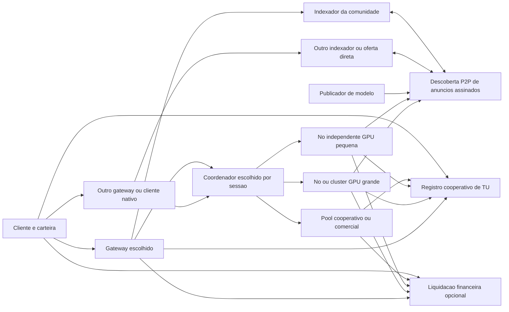

# Rede aberta, modelos da comunidade e mercado de inferência

Direção de produto atualizada em **13/09/2026** por orientação do usuário: qualquer participante pode criar um nó, publicar modelos, oferecer capacidade, consumir a rede e vender inferência. A rede deve continuar útil sem depender da empresa original. A abertura integra a arquitetura do produto, não uma promessa de federação indefinidamente futura.

Esta revisão substitui três restrições anteriores: operador único obrigatório, catálogo global sujeito à aprovação central e ausência de mercado no escopo. O laboratório privado continua uma etapa de teste, não a definição da rede final. A política econômica vigente está no [24](24_CLOSURE_PROGRAM_AND_LAUNCH_GATES.md), com fundamentos cooperativos no 20: contribuição útil gera TU e permite consumo mesmo sem compradores. Mercado é uma modalidade adicional com saldo financeiro separado. O [16](16_TOKEN_ECONOMY_AND_FAIR_DISTRIBUTION.md) detalha remuneração e justiça; o [17](17_TOKEN_POLICY_SIMULATIONS.md) preserva cálculos históricos.

## 1. O que significa ser uma rede como a do Bitcoin

A semelhança desejada é operacional: software de nó aberto, identidade por chaves, adesão sem autorização de uma empresa, comunicação entre participantes, regras verificáveis e possibilidade de trocar a interface ou o operador sem perder a identidade. Criar um nó de inferência não exige operar um validador da rede financeira nem baixar todos os modelos existentes.

Bitcoin combina validação de transações e consenso para evitar gasto duplo. Esse mecanismo não demonstra que um modelo foi carregado corretamente ou que uma resposta de IA está correta. A prova de trabalho descrita no artigo é verificável com hashes; inferência heterogênea requer seu próprio modelo de confiança. Não declarar uma futura “prova de inferência” pronta apenas porque recibos estão numa blockchain. [Artigo original do Bitcoin](https://bitcoin.org/bitcoin.pdf).

**Recomendação comercial, reversível:** reutilizar liquidação existente para depósitos e pagamentos verificáveis, sem criar moeda especulativa ou consenso próprio. O registro de TU é independente da receita e da integração financeira: o 22 seleciona CometBFT para a bancada. A hipótese de laboratório com quatro validadores independentes e quorum de três é federada, com admissão de validadores definida; não equivale a validação permissionless como Bitcoin. O [24](24_CLOSURE_PROGRAM_AND_LAUNCH_GATES.md) seleciona x402 batch-settlement/EVM, Base Sepolia e USDC de teste para a bancada comercial; contrato concreto, finalidade, facilitadores e custo ainda exigem qualificação. Caso o usuário escolha token nativo negociável, abrir uma trilha explícita de consenso, distribuição, segurança econômica e governança; não acrescentar um ticker à contabilidade antiga e chamá-la de descentralizada. Consenso tem hipóteses e custos próprios. [Documentação de consenso Ethereum](https://ethereum.org/en/developers/docs/consensus-mechanisms/).

## 2. Papéis independentes

O [24](24_CLOSURE_PROGRAM_AND_LAUNCH_GATES.md) consolida a economia vigente e o contrato comercial inicial: um vendedor responde pela rota completa, com subcontratos financiados para seus componentes. Gateways e adaptadores continuam intercambiáveis quando qualificados; x402 é a primeira referência opcional, não uma rede financeira obrigatória para TU. Não prometer divisão atômica de fundos entre moedas ou cadeias distintas.

| Papel | Pode ser operado por | Responsabilidade | Não recebe automaticamente |
|---|---|---|---|
| Nó de inferência | Qualquer participante com runtime compatível | Executar ofertas que escolheu aceitar, sob limites locais | Direito de emitir saldo ou controlar todos os modelos |
| Publicador de modelo | Autor ou distribuidor autorizado | Manifesto, artefatos, licença, runtime e interface | Execução em máquinas alheias sem aceite |
| Indexador de ofertas | Comunidade, empresa ou usuário | Descobrir e organizar anúncios assinados | Autoridade sobre todas as ofertas ou sobre o saldo |
| Gateway de API | Qualquer operador | Interface HTTP, seleção autorizada de ofertas, medição e suporte | Exclusividade do cliente ou da liquidação |
| Coordenador de rota | Cliente, pool ou operador escolhido | Contratar os componentes necessários a uma sessão A/B/C | Domínio sobre os recursos que não contratou |
| Pool cooperativo | Grupo de participantes | Contratar READY sob orçamento de emissão/capacidade e oferecer resgate em TU | Emissão ilimitada ou conversão automática em dinheiro |
| Verificador/árbitro | Parte selecionada no contrato | Verificar evidências e resolver o escopo contratado de disputas | Garantia criptográfica universal de correção de IA |
| Registro de serviço | Validadores e regras de serviço escolhidos | Emissão cooperativa autorizada, holds exclusivos, consumo e estorno em TU | Prova física universal da GPU ou poder de converter TU em dinheiro |
| Liquidação financeira | Rede financeira e contratos escolhidos | Depósito, exclusão de gasto duplo, transferências e retirada conforme regras | Acesso a prompts, pesos ou poder de decidir qualidade por si só |

Uma pessoa pode acumular papéis, mas as permissões e o conflito de interesses continuam visíveis. O dono de um gateway não precisa possuir GPUs. O dono de uma GPU pode atender diretamente clientes ou escolher pools. Rodar indexador ou gateway não exige GPU.

## 3. Qualquer modelo pode ter uma oferta

O protocolo não contém uma lista global fechada de nomes. A comunidade pode publicar modelos de texto, código, embeddings, reranking, visão, imagem, áudio e outras modalidades de inferência, com interfaces e unidades de cobrança declaradas. A primeira engine e o primeiro endpoint continuam limitados para permitir implementação verificável; adapters ampliam o catálogo sem alterar sua regra de entrada.

“Qualquer modelo” significa **publicação e integração extensíveis**, não disponibilidade imediata de todos os pesos do mundo, licença de redistribuição automática ou capacidade de executar qualquer arquitetura em qualquer GPU.

| Camada | Entrada | Critério para aparecer |
|---|---|---|
| Registro aberto | Manifesto assinado por qualquer publicador, com tamanho e validade limitados | Integridade sintática e política antispam do indexador; publicação não concede selo de qualidade |
| Oferta executável do provedor | Manifesto + runtime + dispositivos/endpoint + termos | Provedor assume sua oferta e apresenta evidências; clientes podem escolher aceitar ofertas experimentais |
| Catálogo qualificado de um gateway/pool | Subconjunto avaliado por aquele operador | Benchmarks, identidade de pesos, funcionalidade, segurança e cobertura explicitados |
| Configuração distribuída C | Grafo, partições, ABI, estados, dispositivos e links | Rota inteira realmente compatível; não dividir um arquivo em pedaços e declarar inferência distribuída |

O usuário pode importar um manifesto/oferta diretamente sem depender do indexador padrão. Indexadores podem filtrar spam e seu próprio catálogo; não revogam a existência de um modelo em todos os peers. Rótulos de qualificação devem identificar quem avaliou, o método, a revisão e a validade.

Um publicador inclui `model_id`, digest/revisão, licença e origem, modalidade, schemas de entrada/saída, limites, tokenizer quando aplicável, engine/adapter, artefatos, custos de memória, código necessário e evidências. Pesos gated ou proprietários exigem acesso legítimo do operador; nenhum modelo é disponibilizado pela rede por simples menção ao seu nome.

Runtime de terceiros é instalado somente por opção do dono do nó. O marketplace não pode enviar código arbitrário junto com uma requisição de chat. Imagens/plugins têm digest, permissões e política local de aceitação. Nós que preferirem só runtimes qualificados podem continuar assim; outros podem hospedar seu próprio backend, anunciando o escopo experimental. Ferramentas de agentes continuam no ambiente do consumidor.

## 4. Arquitetura sem um servidor obrigatório



Chaves são criadas localmente; a identidade de serviço vincula-se ao transporte por assinatura com validade e domínio. Um vínculo de pagamento é adicional e só é necessário ao modo comercial. Anúncios possuem número de sequência, prazo, limites, preços, referência de configuração e assinatura. Gossip/DHT e múltiplos bootstrap peers dão descoberta; importação de peers/ofertas conhecidas evita tornar um domínio DNS obrigatório. A DHT fornece descoberta, não saldo ou prova de que a GPU existe. [libp2p Kademlia DHT](https://docs.libp2p.io/concepts/discovery-routing/kaddht/).

Ofertas podem exigir autenticação, limite de carga e escolha de confiança do próprio provedor. Entrada aberta no protocolo não obriga todo gateway a atender todo cliente. Um gateway pode operar API keys e conta convencional para conveniência, mas a chave do nó/carteira e as ofertas não pertencem a esse banco.

Cada gateway ou pool pode reutilizar NestJS/PostgreSQL/Redis do plano inicial para sua operação. PostgreSQL registra projeções, filas, contratos, recibos e contabilidade daquele operador. **Não é a autoridade global de saldo.** TU compartilhado depende do registro cooperativo acordado; dinheiro depende da liquidação financeira. Um banco comprometido não pode criar saldo aceito por outros operadores. Recibos de contribuição autorizam emissão somente quando verificados e dentro de orçamento global de serviço.

Contratos e assinaturas vinculam modo cooperativo/comercial, rede, partes, modelo, unidade, teto, nonce, prazo e política de disputa. O modo comercial acrescenta contrato de liquidação e ativo; o modo cooperativo referencia orçamento/hold e registro de TU. Assinatura tipada ajuda a tornar os campos inequívocos; não fornece proteção de replay sozinha. [EIP-712](https://eips.ethereum.org/EIPS/eip-712).

## 5. Ganhos cooperativos e receitas comerciais

A origem do TU cooperativo é **capacidade útil contratada e verificada**, sob teto de emissão e cobertura conservadora do [20](20_COOPERATIVE_ECONOMY_AND_ELASTIC_LIMITS.md). A rede não exige entrada de dinheiro para contratar READY ou permitir consumo em TU. Hospedar um modelo sem reserva útil aprovada continua sem dar direito automático à emissão global.

| Modalidade | Ganho do nó | Consumo |
|---|---|---|
| Reserva cooperativa | TU existentes e emissão complementar por tempo útil verificado | Consumo recompõe reserva até alvo e queima restante; regra do 22 |
| Reserva comercial | Pagamento de disponibilidade financiado pelo contratante | Pagamento ao detentor da reserva e serviços declarados |
| Oferta comercial sob demanda | Pagamento da chamada aceita | Transferência financeira ao provider e serviços declarados |

A mesma alocação/intervalo não recebe emissão cooperativa integral e pagamento comercial integral. Recursos distintos podem atender modalidades distintas dentro dos limites locais e do pool. Na cooperação não há bônus por autochamada; o provider já recebe por READY.

TU usa `coop_network_id` e microTU. Saldo financeiro usa `payment_unit_id` e unidades atômicas do ativo. Ambos têm proteção contra gasto duplo; não são somados, convertidos ou usados como fallback um do outro. TU permite consumir outros modelos disponíveis a suas tarifas, sem promessa de dinheiro ou capacidade imediata.

Ganhos comerciais podem ser gastos em ofertas que aceitem a mesma unidade financeira ou retirados conforme contrato e compromissos. Custódia de gateway e pagamentos convencionais são conveniências opcionais, com responsabilidades explícitas. Crédito cooperativo não vira depósito real. Token nativo negociável continua uma decisão distinta.

Ausência de compradores não significa baixa demanda: usuários cooperativos também consomem. Quando há capacidade compatível ociosa, ampliar limites temporários conforme o 20, sem nova emissão, mudança automática de preço ou direito acumulado de ocupar o pico.

### Como repartir uma chamada

Exemplo fictício exclusivamente comercial de **100 unidades de pagamento**, com preço total aceito antecipadamente:

| Destino | Unidades de pagamento | Regra |
|---|---:|---|
| Provedores de inferência | 90 | Dividir a parcela entre componentes segundo contrato e custo útil da rota |
| Gateway/roteamento | 6 | Taxa visível do operador escolhido; acesso direto pode ter outra composição |
| Verificação/liquidação operacional | 2 | Custo contratado; taxas externas não podem aparecer sem teto |
| Reserva de reembolso/continuidade | 2 | Pertence ao fundo identificado e às regras publicadas; não é lucro automaticamente |
| **Total** | **100** | Não adicionar bônus ou royalty fora desse total sem nova cotação |

A proporção 90/6/2/2 é hipótese para comparação, não taxa global obrigatória nem remuneração já oferecida. Cada oferta publica composição; gateways competem. Royalty de publicador só existe quando os termos e licença o determinam, com valor explícito e dentro da cotação. Publicar um manifesto não dá automaticamente direito a taxas sobre todo uso de um modelo de terceiros.

Nesta chamada comercial, pagar transfere saldo financeiro. No modo cooperativo, o 22 define circulação e queima do consumo aceito. Depósito/retirada muda o estoque interno coberto; pagamento redistribui o mesmo estoque. Patrocínio financeiro transfere fundos existentes. A emissão cooperativa tem orçamento próprio de capacidade e não se soma a este estoque financeiro.

```text
saldo_financiado = saldo_disponivel + saldo_em_escrow + pagamentos/retiradas_pendentes
transferencia_liquidada = parcela_provedores + parcela_gateway + custos + reserva
novo_lease_pago <= saldo_livre_do_financiador_apos_outros_compromissos
```

O primeiro invariante usa a mesma rede/ativo/escala e fotografia, sem contar um estado duas vezes. Contabilidade local precisa conferir os depósitos e eventos finalizados; transferência entre contas internas não altera o total financiado. Capacidade física e cobertura por modelo continuam sendo controles separados do lastro de pagamento.

Grants cooperativos seguem o teto de até 2% da emissão cooperativa total do 20, mesmo com receita monetária zero. Uma campanha financeira separada pode usar receita disponível ou patrocínio; nunca gastar o mesmo fundo em reserva, saque e concessão simultaneamente. As duas regras não são intercambiáveis.

## 6. Sessão comercial e liquidação

1. Cliente consulta indexadores ou importa uma oferta assinada. Compara configuração, preço total, unidade, prazo, dados, reputação, evidência e confiança do verificador.
2. Cliente escolhe oferta ou autoriza um gateway a selecionar dentro de filtros e teto. Alias não permite trocar pesos, precisão, região ou privacidade silenciosamente.
3. Provedor/coordenador confirma recursos e assina aceitação. Cliente reserva valor no mecanismo de liquidação; recursos ficam em Prepare com prazo. Nenhum pedido inicia com depósito não confirmado ou gasto concorrentemente em outra sessão.
4. Para uma rota C, o coordenador obtém aceites dos componentes e termos de remuneração. Compromisso de pagamento é particionado dentro do teto; não duplicado por stage.
5. Execução ocorre fora da blockchain. Medição acumulada, recibos e aceites usam IDs, nonces, seq e limites. Não publicar um registro financeiro por token gerado nem enviar prompt à rede financeira.
6. Ao concluir/cancelar, liquidar o uso aceito e liberar o restante. As regras de falha são fixadas na oferta. Serviço qualificado pode oferecer estorno integral de tentativa interrompida usando a reserva indicada; não prometer esse estorno para qualquer contrato independente.
7. Em divergência, aplicar árbitro/mecanismo e janela previamente escolhidos. Se o cliente retiver assinatura de um serviço entregue, não existe solução mágica: limitar trabalho sem confirmação, usar lotes pequenos/canais financiados e medir o risco residual. Se o provedor mentir, sua assinatura não prova qualidade; evidência e garantias contratuais são necessárias.

Canais ou vouchers são otimizações a qualificar, não um cheque genérico reutilizável. Usar depósito por contraparte/canal ou exclusão de gasto demonstrável; assinatura com nonce sozinha não impede gastar o mesmo saldo em dois providers. Provedor pode encerrar canal e cobrar dentro do limite acordado por uma via que não dependa do gateway original. Prazo de contestação, disponibilidade de dados, monitoramento e retirada unilateral precisam ser testados antes de valor real.

O laboratório começa com liquidação simples em rede de teste, valores sem mercado e verificador explicitamente identificado. Custo de microtransações e finalização decidirão se canais/batching são necessários. Uma solução que exige o único servidor da empresa para fechar saldo falha no critério de descentralização, mesmo que publique hashes numa blockchain.

## 7. Preço menor e remuneração justa

Preço resulta da concorrência entre ofertas e do custo total útil, não de emissão de tokens que mascara despesa. GPU ociosa pode ter custo de oportunidade diferente de um cluster dedicado, mas energia, desgaste, falhas, download, rede, estado, liquidação e suporte continuam existindo.

Para estimar uma oferta, separar custo físico e operacional por unidade de trabalho `C`, fração de taxas `f` e margem pretendida sobre receita `m`. Um cálculo ilustrativo é `preço_mínimo = C / (1 − f − m)`, quando `f+m<1`, sem contar o mesmo custo novamente em `C` e `f`. Não é previsão de lucro; uso real, preço de energia e ocupação precisam ser medidos.

Exemplo sem cotação de mercado: `C=0,40`, `f=10%`, `m=20%` produz preço mínimo aproximado de `0,57143` na unidade escolhida. Se o comprador só aceita 0,50, aquela oferta não sustenta os mesmos custos e margem. Hardware maior não deve receber mais somente por seu preço de compra; sua vantagem precisa aparecer no trabalho útil contratado.

Exibir comparação de APIs apenas para o mesmo modelo/revisão ou com a diferença de qualidade explícita, carga, contexto, cache, latência e sucesso. Incluir taxa de liquidação, gateway e eventual conversão. “Sempre mais barata” não é um compromisso tecnicamente justificável. O produto permite encontrar ofertas mais baratas quando os custos e o serviço comparável sustentarem esse preço.

## 8. Justiça numa rede sem identidade central

Entrada livre e pagamentos por contrato reduzem o poder de um único operador. Não eliminam Sybil: criar várias chaves é barato, portanto “uma carteira, um voto” e “uma carteira, uma quota grátis” não são garantias de justiça.

Pools podem manter rotação de admissão e fila por participante conhecido, sem dar peso ao saldo. O limite de 5% de oportunidades para novos participantes do 16 é uma política opcional do pool, dentro do orçamento, não emissão global por cadastro. Ofertas comerciais podem vender concorrência reservada; isso compra um serviço definido e não poder de controlar toda a rede.

Reputação é evidência assinada de transações e avaliações, com origem e método, não um número universal impossível de contestar. Clientes escolhem quem consideram confiável. Volume autofinanciado pode fabricar reputação aparente; não gerar subsídios só por movimentação. Verificadores não devem aceitar o próprio provedor como árbitro independente sem avisar o consumidor.

Contribuidores pequenos devem poder vender capacidade compatível sem depósito obrigatório para apenas criar nó ou anúncio. Ofertas com garantias podem exigir caução limitada por contrato; mostrar alternativa sem garantia, com risco e público apropriados. Não impor stake alto universal como atalho de qualidade.

## 9. Descentralização que precisa ser demonstrada

| Teste de aceitação | Resultado exigido | Limite explícito |
|---|---|---|
| Criar nó novo sem backend da empresa | Chave local, publicação e contratação via peers alternativos | Compatibilidade e aceitação da contraparte continuam necessárias |
| Desligar indexador/gateway padrão | Outro indexador/gateway ou oferta direta inicia nova sessão | Sessão em streaming pode precisar reinício conforme contrato |
| Operador original desaparece | Carteira/ofertas próprias e valores finalizados continuam verificáveis; retirada via caminho independente | Falha da rede de liquidação continua um risco distinto |
| Gateway tenta inventar saldo | Peers recusam TU sem emissão/hold autorizados ou dinheiro sem fundos finais | Registro de serviço, liquidação e respectivas chaves exigem auditoria |
| Dois gateways tentam gastar o mesmo saldo | Hold cooperativo exclusivo ou canal financeiro reservado impede sobreposição | Confirmações/finalidade e partições precisam de teste |
| Publicar modelo novo | Registro e oferta independentes do catálogo qualificado padrão | Ser publicável não demonstra execução ou qualidade |
| Recibos falsos ou cliente não coopera | Perda limitada ao contrato/garantia, disputa e evidência visíveis | Não alegar verificação universal de modelos arbitrários |
| Escolher outro cliente/provedor | Protocolo, exportação, identidade e unidade portáveis | Custódia opcional de gateway é um serviço distinto e deve ser rotulada |

Múltiplos servidores controlados pela mesma empresa não satisfazem esses testes. TU depende da governança e disponibilidade do registro de serviço; contratos comerciais dependem da liquidação financeira escolhida. RPC único, sequenciador, chaves de upgrade, pausas administrativas e ativos com controle de emissor devem ser avaliados na seleção. A arquitetura não elimina essas dependências por usar a palavra “descentralizada”. O laboratório BFT federado do 20 precisa demonstrar admissão, rotação, independência e resistência à censura; qualquer pessoa criar nó de inferência não concede automaticamente voto de validador.

## 10. Sequência de construção

Manter F0 de modelos/GPU/WAN e adicionar bancada de identidade aberta, descoberta e liquidação. O primeiro protótipo da rede aberta precisa de pelo menos três operadores independentes, dois gateways/indexadores intercambiáveis, dois modelos distintos e uma oferta comunitária importada sem aprovação da empresa. Modelo gigante C continua uma linha técnica própria; mercado A/B não prova sua viabilidade.

Demonstrar primeiro cooperação sem compradores: qualificação, READY contratado, emissão autorizada, consumo, reembolso e limites elásticos. A integração financeira deve poder ficar desligada sem bloquear esse percurso. Demonstrar separadamente transação comercial com saldo de teste: depósito, oferta, reserva, inferência, repasse, reembolso, retirada e falha do gateway. Só então avançar para piloto comercial limitado, financiado e com regras de suporte/disputa compatíveis com as partes envolvidas. Não adiar as provas de independência do operador para depois de chamar o produto de rede descentralizada.

Os EP10 e EP11 do [12](12_ROADMAP_AND_BACKLOG.md) tornam esses trabalhos obrigatórios para a abertura. A versão atual entrega o plano e simulações, sem implantar cadeia, token, contrato, pagamentos ou software de inferência.
